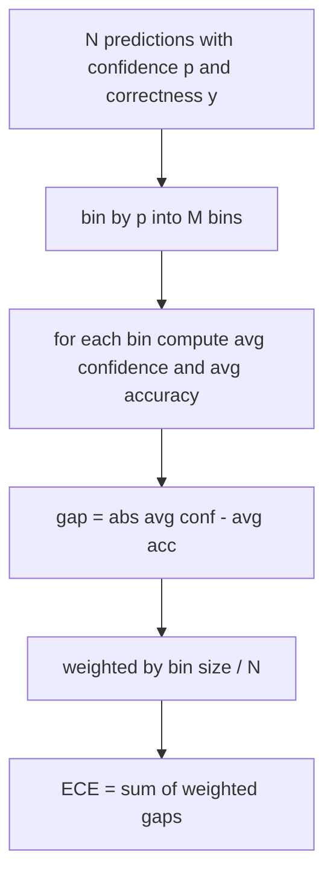
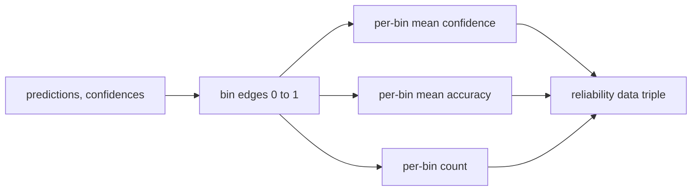

# Zakłopotanie i kalibracja

> Jeśli Twój model twierdzi, że na tysiąc odpowiedzi ma 90% pewności, a sześćset ma rację, oznacza to, że nie jest dobrze skalibrowany. Kalibracja to połowa wiarygodnej oceny. Druga połowa to zakłopotanie, które mówi, czy model uważa, że ​​przedstawiony tekst jest w ogóle wiarygodny.

**Typ:** Kompilacja
**Języki:** Python
**Wymagania wstępne:** Faza 19 Podstawy ścieżki B, lekcje 70 i 71
**Czas:** ~90 min

## Cele nauczania

- Oblicz złożoność na poziomie tokena w wstrzymanym korpusie na podstawie ujemnych prawdopodobieństw logarytmicznych tokenu dostarczonych przez adapter modelu.
- Oblicz oczekiwany błąd kalibracji (ECE) klasyfikatora lub ocenę wielokrotnego wyboru na podstawie przewidywanych prawdopodobieństw podzielonych na grupy.
- Oblicz wynik Briera (średni kwadratowy błąd względem wskaźnika poprawności) i wyjaśnij, kiedy robi to, czego nie robi ECE.
- Zbuduj dane diagramu niezawodności potrzebne do wykreślenia krzywej zaufania do dokładności.
- Podłącz wszystkie trzy do uprzęży eval, aby biegacz mógł dołączyć numery `perplexity`, `ece` i `brier` do raportu modelowego.

## Co mówi ci zakłopotanie

Zakłopotanie to wykładniczy średni ujemny logarytm wiarygodności na token. Niżej jest lepiej. Zakłopotanie wynoszące jeden oznacza, że ​​model przypisuje prawdopodobieństwo jeden każdemu rzeczywistemu żetonowi. Zakłopotanie związane z rozmiarem słownictwa oznacza, że ​​model jest jednolity i niczego się nie nauczył. Liczby rzeczywiste mieszczą się pomiędzy: mocny model bazowy na rok 2026 na WikiText-103 mieści się w przedziale od ośmiu do dwunastu. Zły na tym samym tekście ma pięćdziesiąt plus.

Uprząż sama w sobie nie oblicza logarytmicznego prawdopodobieństwa. Pochodzą one z adaptera modelu. Uprząż agreguje: pobiera listę prawdopodobieństw dziennika na token, listę zliczeń tokenów na sekwencję i zwraca zakłopotanie korpusu.

```python
def perplexity(neg_log_probs, token_counts):
    total_nll = sum(neg_log_probs)
    total_tokens = sum(token_counts)
    return math.exp(total_nll / total_tokens)
```

Implementacja obsługuje przypadki brzegowe o zerowym znaczniku i zapewnia, że ujemne prawdopodobieństwa logarytmiczne są nieujemne. Częstym błędem jest zapominanie o negacji: adapter zwracający `log p` zamiast `-log p` powoduje zamieszanie poniżej jedności, co jest niemożliwe. Funkcja łapie to jako naruszenie umowy.

## Co mierzy ECE

Oczekiwany błąd kalibracji grupuje przewidywania według ich pewności w ustalonej liczbie przedziałów, a następnie mierzy średnią różnicę między pewnością a dokładnością w przedziałach, ważoną rozmiarem przedziału.



Standardowa formuła wykorzystuje dziesięć pojemników o równej szerokości w `[0, 1]`. Implementacja obsługuje dowolną dodatnią liczbę całkowitą. Udostępniamy parametr `bins`, aby biegacz mógł wybrać pomiędzy konwencją publikowania (10) a konwencją porównania (15).

ECE jest obciążone liczbą pojemników i wielkością próbki. Mając dziesięć przedziałów i sto przewidywań, nie można odróżnić 0,02 ECE od przypadkowego szumu. Implementacja zwraca liczbę zapełnionych pojemników wraz z ECE, dzięki czemu biegacz może odmówić zgłoszenia pojedynczej liczby w przypadku zbyt małej liczby próbek.

## Co wynik Briera robi, a czego nie ECE

ECE dba tylko o średnie luki. Model, który jest zbyt pewny w połowie kategorii, a niedostateczny w drugiej połowie, może mieć niski poziom ECE, a jednocześnie jest słabo skalibrowany lokalnie. Wynik Briera mierzy kwadratowy błąd w stosunku do prawdziwego wyniku przewidywania, więc bezpośrednio karze za rozprzestrzenianie się.

W przypadku wyników binarnych Brier to `mean((p_i - y_i)^2)`. Rozkłada się na niezawodność, rozdzielczość i niepewność. Obliczamy wynik i rozkład. Biegacz zgłasza skalar, ale rejestruje rozkład dla pulpitu nawigacyjnego.

```python
def brier(p, y):
    return float(np.mean((p - y) ** 2))
```

## Dane diagramu niezawodności

Diagram niezawodności przedstawia przewidywaną pewność względem dokładności empirycznej w każdym przedziale. Przekątna jest idealną kalibracją. Funkcja zwraca trzy tablice: średnią pewność na przedział, średnią dokładność na przedział i liczbę na przedział. Kod kreślący znajduje się poniżej; ta lekcja kończy się na kształcie danych.



Zwrócona krotka jest tym, czego potrzebuje warstwa wywołująca, aby narysować wykres lub obliczyć niestandardowy wariant ECE (adaptacyjny ECE, przemiatający ECE itp.). Zwracamy tablice numpy, więc dalszy kod nie musi być konwertowany.

## Źródła zaufania

Uprząż nie zakłada, że pewność pochodzi z softmax. Akceptuje dowolną liczbę w `[0, 1]` na prognozę. W przypadku zadań wielokrotnego wyboru naturalna pewność wynosi `softmax over option log-likelihoods`. W przypadku tekstu swobodnego naturalną pewnością jest prawdopodobieństwo zgłoszone przez model lub wykładnicza średniego logarytmicznego prawdopodobieństwa. Funkcja eval po prostu zużywa liczbę. Skąd się to bierze, jest zadaniem adaptera.

## Przypadki Edge

- Wszystkie przewidywania są błędne: ECE to średnia pewność, Brier jest wysoka, zakłopotanie to wszystko, co model myśli o tekście.
- Wszystkie przewidywania są prawidłowe z dużą pewnością: ECE bliskie zeru, Brier bliskie zeru.
- Idealnie niepewny predyktor przy p=0,5: ECE wynosi 0,5 minus dokładność, Brier wynosi 0,25 minus składnik korygujący.
- Puste dane wejściowe: ECE, Brier i zwracana niezawodność `0.0` (lub tablice wypełnione zerami). Perplexity zwraca `NaN` dla przypadku z tokenem zerowym. Żadna z tych ścieżek nie generuje ostrzeżenia; biegacz sprawdza wartości i decyduje, czy zgłosić, czy pominąć.

Przypadki te są uwzględniane w testach. Prawdziwy model na prawdziwym benchmarku w nie nie trafi, ale adapter buggy lub malutka próbka tak, a biegacz nie powinien się rozbić.

## Załatwić

Kalibracja nie jest metryką dla poszczególnych zadań, jak F1. Jest to raport dotyczący poszczególnych modeli. Biegacz gromadzi `(confidence, correct)` pary w całej ewaluacji i jednorazowo oblicza dane ECE, Briera i niezawodności. Zakłopotanie jest obliczane na podstawie wyciągniętego korpusu tekstowego, niezależnie od punktacji poszczególnych zadań.

Interfejs to:

```python
report = CalibrationReport.from_predictions(confidences, correct)
report.ece          # float
report.brier        # float
report.reliability  # tuple of three numpy arrays
report.populated_bins  # int
```

`PerplexityResult.from_token_nll(neg_log_probs, token_counts)` zwraca zakłopotanie i średni prawdopodobieństwo ujemnego logarytmu na token.

## Czego ta lekcja nie robi

Nie wywołuje modelu. Nie implementuje softmax. Nie szacuje zaufania na podstawie tokenów wyjściowych; to jest zadanie adaptera. Nie wykonuje skalowania temperatury ani skalowania Platta; są to poprawki post-hoc, które dotyczą innej lekcji. Celem tej lekcji jest uczynienie trzech liczb (zakłopotania, ECE, Briera) wiarygodnymi i powtarzalnymi.

## Jak odczytać kod

`main.py` definiuje `perplexity`, `expected_calibration_error`, `brier_score`, `reliability_diagram` i `CalibrationReport` / `PerplexityResult` klasy danych. Demo opiera się na przewidywaniach syntetycznych, w których znana jest podstawowa prawda: model dobrze skalibrowany, model nadmiernie pewny i niedostateczny. Testy w `code/tests/test_calibration.py` przypinają każdy przypadek brzegowy plus wartości referencyjne dla syntetycznych predyktorów.

Przeczytaj `main.py` od góry do dołu. Kolejność funkcji jest skalarna do wektora w celu raportu. Każda funkcja ma krótką dokumentację zawierającą obliczenia i kontrakt.

## Idziemy dalej

Kalibracja jest najczęściej ignorowaną osią w opublikowanych ewaluacjach. Większość rankingów podaje jedną wartość dokładności i uznaje ją za wykonaną. Model, który wygrywa pod względem dokładności i przegrywa w Brierze, jest gorszym wdrożeniem produkcyjnym niż model, który uzyskuje kilka punktów mniej pod względem dokładności, ale rzetelnie podaje swoją niepewność. Po przygotowaniu instalacji kalibracyjnej dodaj skalowanie temperatury na odłożonym wycinku walidacyjnym, ponownie oblicz ECE i obserwuj, jak szczelina się kurczy. To osobna lekcja, ale podłoga tu żyje.