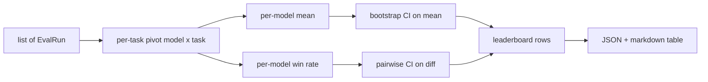
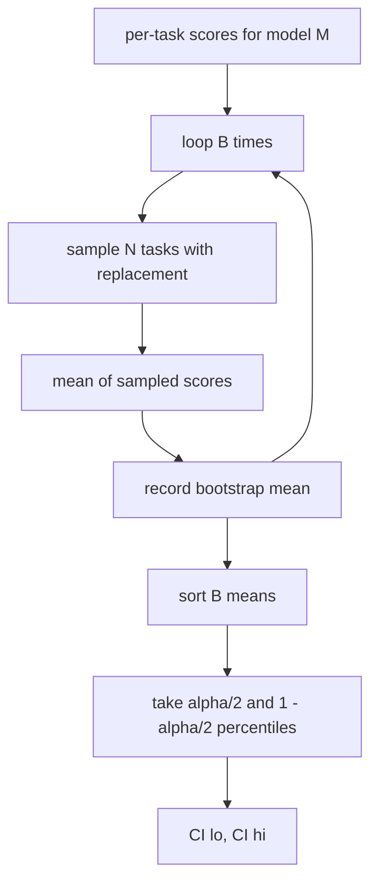

# Leaderboard Aggregation

> Scores per task are easy. Rankings by model across heterogeneous tasks are hard. Statistical significance on a leaderboard of a thousand predictions is the part everyone skips. This lesson does not skip it.

**Type:** Capstone
**Languages:** Python
**Prerequisites:** Phase 19 Path B Foundations, Lessons 70, 71, 73
**Time:** ~90 min

## Learning Objectives

- Aggregate single-task scores across multiple models and multiple tasks into an ordered per-model row.
- Normalize heterogeneous scores so pass rates and BLEU scores don't incorrectly dominate the sum.
- Rank models by mean and win rate, and explain when each is the correct summary.
- Compute bootstrap confidence intervals on the mean score for a model and on pairwise differences.
- Output the leaderboard as a JSON report and as a markdown table that the runner in Lesson 75 can paste into a CI comment.

## Input Shape

The aggregator consumes a list of `EvalRun` records:

```python
@dataclass
class EvalRun:
    model_id: str
    task_id: str
    metric_name: str
    score: float          # in [0, 1]
    category: str
```

The runner in Lesson 75 emits one record per `(model, task)` pair. The aggregator does not care how the score was produced. It expects normalization has already occurred: every score is in `[0, 1]`.

## Output Shape

Three tables come out:



A leaderboard row contains: `model_id`, `mean_score`, `mean_ci_lo`, `mean_ci_hi`, `win_rate`, `tasks_completed`, and an optional `categories` map of per-category means.

## Normalization

If one task scores in `[0, 1]` and another scores in `[0, 100]`, the second quietly dominates the mean. The aggregator checks that every input score falls in `[0, 1]` and refuses to run otherwise. The fix exists upstream: the metric should already return a fraction. Lessons 71 through 73 enforce this contract.

## Mean vs Win Rate

The two ranking systems serve different goals.

Mean score is the average of scores per task for one model. This is the headline number leaderboards report. It is sensitive to outliers and task imbalance.

Win rate counts how often a model beats every other model on the same task. For each task, the model with the highest score gets a win (ties split). Win rate is wins divided by tasks the model scored on. It is less sensitive to outliers and scale differences, but loses magnitude information.

```python
def win_rate(model_id, runs_by_task, all_models):
    wins, total = 0, 0
    for task_id, runs in runs_by_task.items():
        scores = {r.model_id: r.score for r in runs if r.model_id in all_models}
        if model_id not in scores:
            continue
        total += 1
        best = max(scores.values())
        if scores[model_id] >= best:
            wins += 1
    return wins / total if total else 0.0
```

The harness reports both. The runner in Lesson 75 defaults to ranking by mean; the markdown column for win rate is there in case the user prefers it.

## Bootstrap Confidence Intervals

Per-model means get a confidence interval estimated by bootstrap resampling over tasks. We resample task IDs with replacement, compute the mean of the resampled set, repeat `B` times, and take the percentile interval at level `alpha`.



For pairwise comparisons, we bootstrap the task-by-task difference `score_A - score_B`, take the percentile interval, and report it. The user reads whether the interval excludes zero. If it does, the difference is significant at alpha. If it does not, the leaderboard treats the models as tied.

The low-level helpers (`bootstrap_mean_ci`, `bootstrap_pairwise_diff`) default to `B=1000`; the public aggregators (`aggregate`, `pairwise_diffs`) default to `B=500` so the demo and tests run fast. The default alpha is 0.05. The lesson keeps the bootstrap pure numpy, no scipy.

## Categories

If `EvalRun.category` is set, the aggregator also reports the mean by category. This is a column in the JSON per-model ranking: `math`, `reasoning`, `code`, `safety`. It lets the runner detect if a model is broadly good but abysmal at code, a detail the headline mean hides.

## Markdown Rendering

The leaderboard renders as a markdown table:

```text
| Rank | Model | Mean | 95% CI | Win rate | Tasks |
|------|-------|------|--------|----------|-------|
| 1    | gpt   | 0.78 | 0.74-0.82 | 0.62 | 50 |
| 2    | claude| 0.75 | 0.71-0.79 | 0.34 | 50 |
| 3    | random| 0.10 | 0.07-0.13 | 0.04 | 50 |
```

The table is sorted by mean score. CI is rendered to two decimal places. Long model IDs are truncated at twenty characters.

## What This Lesson Does Not Do

It does not call models. It does not call the metric layer. It does not implement adaptive ECE or other calibration variants; that is Lesson 73. It does not implement task weighting. Every task counts equally here. Production leaderboards weight tasks; we leave the hook open in a `weight` field but ignore it in the aggregator. Add weighting in a follow-up if needed.

## How to Read the Code

`main.py` defines `EvalRun`, `LeaderboardRow`, `aggregate`, `bootstrap_mean_ci`, `bootstrap_pairwise_diff`, and `render_markdown`. The demo builds a synthetic suite of three models and twelve tasks, aggregates, and prints the leaderboard and pairwise differences table. Tests in `code/tests/test_leaderboard.py` pin the bootstrap, the markdown render, win rate edge cases, and empty input behavior.

Read `main.py` top to bottom. Data shape (EvalRun, LeaderboardRow) comes first, then the aggregator, then the bootstrap, then the rendering. Every function has a contract.

## Going Further

The natural next step is paired task significance instead of unpaired bootstrap. If model A and B both ran the exact same hundred tasks, the paired bootstrap on task-by-task differences is the proper test, which we implement. Beyond that is hierarchical bootstrap that respects task families (math problems are not independent of each other; an arithmetic failure pattern applies to ten of them). That's a follow-up. The goal of this lesson is to get the floor right so your eval reports a number you can defend.
