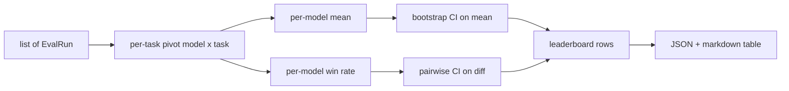
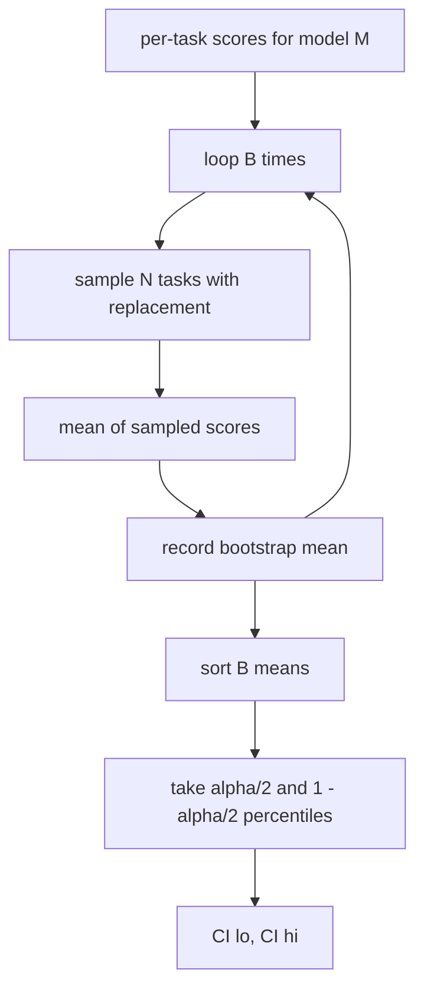

# Agregacja rankingów

> Wyniki za zadanie są łatwe. Rankingi według modelu w przypadku heterogenicznych zadań są trudniejsze. Znaczenie statystyczne w tabeli liderów zawierającej tysiąc przewidywań to część, którą wszyscy pomijają. Ta lekcja tego nie pomija.

**Typ:** Kompilacja
**Języki:** Python
**Wymagania wstępne:** Faza 19 Podstawy ścieżki B, lekcje 70, 71, 73
**Czas:** ~90 min

## Cele nauczania

- Agreguj wyniki poszczególnych zadań w wielu modelach i wielu zadaniach w uporządkowany wiersz dla poszczególnych modeli.
- Normalizuj heterogeniczne wyniki, tak aby współczynniki zdawalności i wartości BLEU nie miały nadmiernego wpływu na sumę.
- Oceń modele według średniej i współczynnika wygranych oraz wyjaśnij, kiedy każdy z nich jest właściwym podsumowaniem.
- Oblicz przedziały ufności bootstrap na średnim wyniku dla modelu i na różnicach parami.
- Wyprowadź tabelę wyników jako raport JSON i jako tabelę przecen, którą biegacz z lekcji 75 może wkleić do komentarza CI.

## Kształt danych wejściowych

Agregator zużywa listę rekordów `EvalRun`:

```python
@dataclass
class EvalRun:
    model_id: str
    task_id: str
    metric_name: str
    score: float          # in [0, 1]
    category: str
```

Biegacz w lekcji 75 emituje jeden rekord na parę `(model, task)`. Agregator nie dba o to, w jaki sposób powstał wynik. Oczekuje, że normalizacja już nastąpiła: każdy wynik znajduje się w `[0, 1]`.

## Dane wyjściowe

Wychodzą trzy tabele:



Wiersz tabeli liderów zawiera: `model_id`, `mean_score`, `mean_ci_lo`, `mean_ci_hi`, `win_rate`, `tasks_completed` i opcjonalną `categories` mapę średniej dla poszczególnych kategorii.

## Normalizacja

Jeśli jedno zadanie uzyska wynik w `[0, 1]`, a drugie w `[0, 100]`, drugie po cichu dominuje w średniej. Agregator sprawdza, czy każdy wynik wejściowy mieści się w `[0, 1]` i w przeciwnym razie odmawia uruchomienia. Poprawka istnieje wcześniej: metryka powinna już zwracać ułamek. Lekcje od 71 do 73 egzekwują tę umowę.

## Średnia i współczynnik wygranych

Obydwa systemy rankingowe służą różnym celom.

Średni wynik to średnia wyników na zadanie dla jednego modelu. Jest to raport z rankingami liczbowymi nagłówków. Jest wrażliwy na wartości odstające i nierównowagę zadań.

Współczynnik wygranych liczy, jak często model pokonuje każdy inny model w tym samym zadaniu. W każdym zadaniu wygrywa model z najwyższym wynikiem (podział remisowy). Wskaźnik wygranych jest równy wygranym podzielonym przez liczbę zadań, dla których model uzyskał wynik. Jest mniej wrażliwy na wartości odstające i różnice w skali, ale traci informacje.

```python
def win_rate(model_id, runs_by_task, all_models):
    wins, total = 0, 0
    for task_id, runs in runs_by_task.items():
        scores = {r.model_id: r.score for r in runs if r.model_id in all_models}
        if model_id not in scores:
            continue
        total += 1
        best = max(scores.values())
        if scores[model_id] >= best:
            wins += 1
    return wins / total if total else 0.0
```

Uprząż zgłasza oba. Biegacz z lekcji 75 domyślnie zajmuje średnią pozycję; kolumna przecen dla współczynnika wygranych jest tam, na wypadek gdyby użytkownik tak wolał.

## Przedziały ufności Bootstrap

Średnie dla poszczególnych modeli mają przedział ufności oszacowany na podstawie ponownego próbkowania metodą bootstrap po zadaniach. Próbkujemy ponownie identyfikatory zadań poprzez zamianę, obliczamy średnią z ponownie próbkowanego zestawu, powtarzamy `B` razy i przyjmujemy przedział percentylowy na poziomie `alpha`.



W przypadku porównań parami ładujemy różnicę między zadaniami `score_A - score_B`, przyjmujemy przedział percentylowy i raportujemy go. Użytkownik odczytuje, czy przedział wyklucza zero. Jeśli tak, różnica jest znacząca na poziomie alfa. Jeżeli tak nie jest, tabela wyników traktuje modele jako remisowe.

Pomocnicy niskiego poziomu (`bootstrap_mean_ci`, `bootstrap_pairwise_diff`) domyślnie mają wartość `B=1000`; publiczne agregatory (`aggregate`, `pairwise_diffs`) domyślnie używają `b=500`, więc demonstracja i testy przebiegają szybko. Domyślna alfa to 0,05. Lekcja utrzymuje, że bootstrap jest czysty numpy, bez scipy.

## Kategorie

Jeśli ustawiono `EvalRun.category`, agregator raportuje również średnią według kategorii. To jest kolumna w każdym rankingu z informacją: `math`, `reasoning`, `code`, `safety`. Pozwala biegaczowi wykryć, czy model jest ogólnie dobry, ale słaby w kodzie, co jest informacją, którą ukrywa nagłówek.

## Renderowanie Markdown

Tabela liderów jest renderowana jako tabela przecen:

```text
| Rank | Model | Mean | 95% CI | Win rate | Tasks |
|------|-------|------|--------|----------|-------|
| 1    | gpt   | 0.78 | 0.74-0.82 | 0.62 | 50 |
| 2    | claude| 0.75 | 0.71-0.79 | 0.34 | 50 |
| 3    | random| 0.10 | 0.07-0.13 | 0.04 | 50 |
```

Tabela jest posortowana według średniego wyniku. CI jest renderowany z dokładnością do dwóch miejsc po przecinku. Długie identyfikatory modeli są obcinane do dwudziestu znaków.

## Czego ta lekcja nie robi

Nie obsługuje modeli. Nie wywołuje warstwy metrycznej. Nie implementuje adaptacyjnego ECE ani innych wariantów kalibracji; to jest lekcja 73. Nie implementuje ona ważenia zadań. Każde zadanie liczy się tutaj tak samo. Zadania wagowe w tabelach wyników produkcji; zostawiamy ten hak otwarty w polu `weight`, ale ignorujemy go w agregatorze. Jeśli zajdzie taka potrzeba, dodaj wagę na kolejnej lekcji.

## Jak odczytać kod

`main.py` definiuje `EvalRun`, `LeaderboardRow`, `aggregate`, `bootstrap_mean_ci`, `bootstrap_pairwise_diff` i `render_markdown`. Demo buduje syntetyczny zestaw trzech modeli i dwunastu zadań, agreguje i drukuje tabelę liderów oraz tabelę różnic parami. Testy w `code/tests/test_leaderboard.py` przypinają pasek ładowania początkowego, renderowanie przecen, przypadki graniczne współczynnika wygranych i zachowanie pustych danych wejściowych.

Przeczytaj `main.py` od góry do dołu. Kształt danych (EvalRun, LeaderboardRow) jest na pierwszym miejscu, następnie agregator, na trzecim bootstrap, a na końcu renderowanie. Każda funkcja ma określony kontrakt.

## Idziemy dalej

Naturalnym następnym krokiem jest znaczenie sparowanych zadań zamiast niesparowanego ładowania początkowego. Jeśli zarówno model A, jak i B wykonały te same sto zadań, odpowiednim testem jest sparowany bootstrap dotyczący różnic między zadaniami, który wdrażamy. Poza tym potrzebny jest hierarchiczny pasek startowy, który uwzględnia rodziny zadań (problemy matematyczne nie są od siebie niezależne; wzorzec błędów arytmetycznych dotyczy dziesięciu z nich). To kontynuacja. Celem tej lekcji jest prawidłowe ustawienie podłogi, tak aby funkcja eval podała liczbę, której możesz obronić.