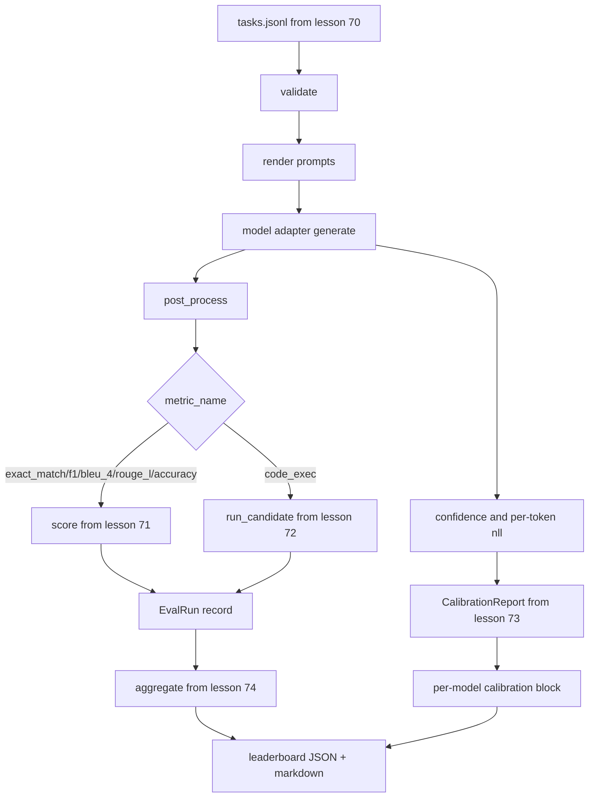

# End-to-End Eval Runner

> Five plumbing lessons, one lesson to glue them. The runner reads the task spec from Lesson 70, calls a model via adapter, scores with Lessons 71 and 72, attaches a calibration report from Lesson 73, and prints the leaderboard from Lesson 74. The demo self-terminates.

**Type:** Capstone
**Languages:** Python
**Prerequisites:** Phase 19 Path B Foundations, Lessons 70-74
**Time:** ~90 min

## Learning Objectives

- Define a `ModelAdapter` interface that any model (mock, local, API) can fulfill with a small method surface.
- Run an eval over a JSONL fixture file with parallel task execution in a worker pool.
- Compose the metric layer (exact_match, F1, BLEU-4, ROUGE-L, code_exec) with the calibration layer in one pass.
- Emit per-model `EvalRun` records and feed them directly into the leaderboard aggregator.
- Output both a JSON report and a markdown table; self-terminating with zero exit on clean run, non-zero on validation or runtime failure.

## The Pipeline



The runner is the integration point. Every lesson from 70 to 74 provides one module stacked by the runner. The runner duplicates no logic from those modules: it imports them.

## The Adapter Interface

The adapter is the seam connecting the harness to any model. The interface is intentionally small.

```python
class ModelAdapter:
    model_id: str

    def generate(self, prompt: str, task: TaskSpec) -> Generation: ...
```

`Generation` is a dataclass carrying:

- `text`: the model's output in freeform
- `confidence`: a float in `[0, 1]` representing the model's reported answer likelihood
- `token_nll`: an optional list of negative log probabilities for generated tokens
- `token_count`: an optional int of generated token count

The mock adapters in the runner module provide three variants: `RuleBasedAdapter` (deterministic, nearly perfect), `NoisyAdapter` (overconfident, frequently wrong), and `BiasedAdapter` (good at one category, terrible at another). The demo runs all three against the Lesson 70 fixture.

## Parallel Execution

The runner uses a `concurrent.futures.ThreadPoolExecutor` to run tasks for each model in parallel. The default worker count is the minimum of eight and the task count. Threads are sufficient because the bottleneck for real model calls is network I/O. The code-exec path spawns its own subprocess inside the task, and the executor just blocks waiting.

For deterministic testing, the runner exposes `run_eval(adapters, tasks, parallel=False)` so tests can pin execution order.

## The Single-Pass Scoring Loop

For each task:

1. Render the prompt (few-shot prefix plus prompt body).
2. Call the adapter and await generation.
3. Post-process the generation according to the task rule.
4. Dispatch to the metric layer.
5. Produce an `EvalRun` record with score and metric metadata.
6. Append the `(confidence, correct)` pair to the calibration buffer.

The `correct` signal is `score >= 1.0` for exact-match style metrics (`exact_match`, `accuracy`, `code_exec`) and `score >= 0.5` for graded metrics. The threshold lives in `_correct_from_score` and the runner does not expose a public override.

## Aggregation

When every task yields an outcome, the runner calls `aggregate` and `pairwise_diffs` from Lesson 74, and `CalibrationReport.from_predictions` from Lesson 73. The output is a single JSON envelope:

```json
{
  "leaderboard": [...],
  "pairwise": [...],
  "calibration": {
    "model_id_a": {"ece": 0.04, "brier": 0.10, "populated_bins": 8, ...},
    ...
  },
  "summary": {
    "tasks": 10,
    "models": 3,
    "wall_seconds": 1.2
  }
}
```

The runner also prints the markdown table to stdout so a human can paste the result into a PR review.

## The Self-Terminating Demo

The demo runs the three mock adapters across the ten fixture tasks from Lesson 70. Wall time should be under ten seconds. The exit code is zero on a clean run.

Clean run criteria are:

- Every task validated under Lesson 70.
- Every task scored by Lessons 71 and 72.
- Calibration report aggregated under Lesson 73 with no errors.
- Leaderboard ranked the rule-based adapter strictly above the noisy adapter.

If any of these break, the runner exits non-zero with a structural error in the JSON envelope.

## What This Lesson Does Not Do

It does not call a real model. It does not implement API key flow or rate limit handling. It does not implement streaming or partial generation; the adapter returns one generation per call. It does not do retries or caching. Those concerns belong in the adapter layer; the runner is metric-agnostic and provider-agnostic.

## How to Read the Code

`main.py` is the integration. It imports from the other five lesson modules via a small `_load_sibling` helper that resolves them by relative path. The dataclasses `Generation`, `EvalReport`, and `ModelAdapter` are defined locally. The mock adapters are at the bottom of the file.

Read `main.py` top to bottom. Scan the imports, then look at `run_eval`, then `_score_one`, then the adapters. The demo at the end is the entry point.

Tests in `code/tests/test_runner.py` hook up the adapter interface, the single-pass loop, parallel vs sequential equivalence, the calibration buffer, and the JSON envelope shape.

## Going Further

This runner is the floor. A production eval system adds: a result cache keyed by `(task_id, model_id, model_version)`, a cost ledger tracking dollars and tokens per run, a retry layer that backs off from rate limits, sampling rules for pass-at-k tasks, and a streaming output format for long suites. Every one of those is an isolated concern that wraps the runner without changing the metric or aggregation layers. That decoupling is the point of the contract.

Add an adapter for a real provider once the mocks pass. Pick one with a free tier, write thirty lines of glue, and watch the leaderboard light up. Then add a second provider and let the harness do the work.
