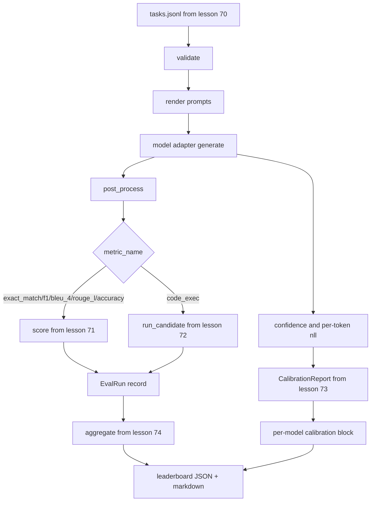

# Kompleksowy biegacz ewaluacyjny

> Pięć lekcji hydrauliki, jedna lekcja ich klejenia. Biegacz czyta specyfikację zadania z lekcji 70, wywołuje model poprzez adapter, ocenia lekcje 71 i 72, dołącza raport z kalibracji z lekcji 73 i wyświetla tabelę wyników z lekcji 74. Demo kończy się samoczynnie.

**Typ:** Kompilacja
**Języki:** Python
**Wymagania wstępne:** Faza 19 Podstawy ścieżki B, lekcje od 70 do 74
**Czas:** ~90 min

## Cele nauczania

- Zdefiniuj interfejs `ModelAdapter`, który może spełnić każdy model (próbny, lokalny, API) przy małej powierzchni metody.
- Uruchom ewaluację na pliku JSONL urządzenia z równoległym wykonaniem zadania w puli procesów roboczych.
- Skomponuj warstwę metryczną (exact_match, F1, BLEU-4, ROUGE-L, code_exec) z warstwą kalibracyjną w jednym przejściu.
- Emituj rekordy `EvalRun` poszczególnych modeli i przesyłaj je bezpośrednio do agregatora rankingów.
- Wygeneruj zarówno raport JSON, jak i tabelę przecen; samozakończające się z wyjściem zerowym przy czystym przebiegu, niezerowym w przypadku sprawdzania poprawności lub awarii środowiska wykonawczego.

## Rurociąg



Biegacz jest punktem integracji. Każda lekcja od 70 do 74 zawiera jeden moduł ułożony przez biegacza. Runner nie powiela żadnej logiki z tych modułów: importuje je.

## Interfejs adaptera

Adapter stanowi szew łączący cholewkę z dowolnym modelem. Interfejs jest celowo mały.

```python
class ModelAdapter:
    model_id: str

    def generate(self, prompt: str, task: TaskSpec) -> Generation: ...
```

`Generation` to klasa danych zawierająca:

- `text`: wynik modelu w dowolnej formie
- `confidence`: liczba zmiennoprzecinkowa w `[0, 1]` reprezentująca prawdopodobieństwo odpowiedzi zgłoszone przez model
- `token_nll`: opcjonalna suma ujemnych prawdopodobieństw logarytmicznych dla wygenerowanych tokenów
- `token_count`: opcjonalna liczba wygenerowanych tokenów

Próbne adaptery w module runner oferują trzy wersje: `RuleBasedAdapter` (deterministyczny, prawie idealny), `NoisyAdapter` (zbyt pewny siebie, często błędny) i `BiasedAdapter` (dobry w jednej kategorii, fatalny w innej). Demo obejmuje wszystkie trzy w ramach lekcji 70.

## Wykonanie równoległe

Runner używa `concurrent.futures.ThreadPoolExecutor` do równoległego uruchamiania zadań dla każdego modelu. Domyślna liczba pracowników jest mniejsza z ośmiu i liczby zadań. Wątki są wystarczające, ponieważ wąskim gardłem dla wywołań prawdziwego modelu są wejścia/wyjścia sieciowe. Ścieżka code-exec powoduje utworzenie własnego podprocesu wewnątrz zadania, a wykonawca planuje jedynie oczekiwanie.

W przypadku testów deterministycznych moduł uruchamiający udostępnia `run_eval(adapters, tasks, parallel=False)`, aby testy mogły ustalić kolejność wykonywania.

## Pętla punktacji jednoprzebiegowej

Dla każdego zadania:

1. Wyrenderuj zachętę (przedrostek składający się z kilku strzałów i treść podpowiedzi).
2. Zadzwoń do adaptera i umów się na połączenie.
3. Przetwórz generację zgodnie z regułą zadania.
4. Wysyłka do warstwy metrycznej.
5. Utwórz rekord `EvalRun` z metadanymi wyników i metryk.
6. Dołącz parę `(confidence, correct)` do bufora kalibracyjnego.

Sygnał `correct` to `score >= 1.0` dla wskaźników w stylu dokładnego dopasowania (`exact_match`, `accuracy`, `code_exec`) i `score >= 0.5` dla wskaźników stopniowanych. Próg znajduje się w `_correct_from_score`, a moduł uruchamiający nie udostępnia publicznego zastąpienia.

## Agregacja

Gdy każde zadanie przyniesie wynik, moduł uruchamiający wywołuje funkcje `aggregate` i `pairwise_diffs` z lekcji 74 oraz `CalibrationReport.from_predictions` z lekcji 73. Wynikiem jest pojedyncza koperta JSON:

```json
{
  "leaderboard": [...],
  "pairwise": [...],
  "calibration": {
    "model_id_a": {"ece": 0.04, "brier": 0.10, "populated_bins": 8, ...},
    ...
  },
  "summary": {
    "tasks": 10,
    "models": 3,
    "wall_seconds": 1.2
  }
}
```

Biegacz zapisuje również tabelę przecen na standardowe wyjście, aby użytkownik mógł wkleić wynik do recenzji PR.

## Demo samozakończające się

Demo uruchamia trzy próbne adaptery w dziesięciu zadaniach związanych z urządzeniami z lekcji 70. Czas ściany powinien wynosić mniej niż dziesięć sekund. Kod zakończenia wynosi zero w przypadku czystego przebiegu.

Kryteria czystego przebiegu to:

- Każde zadanie sprawdzone w ramach lekcji 70.
- Każde zadanie punktowane w lekcjach 71 i 72.
- Raport z kalibracji zagregowany zgodnie z lekcją 73 bez błędów.
- W tabeli liderów adapter oparty na regułach znajdował się dokładnie nad adapterem losowym.

Jeśli którykolwiek z nich ulegnie uszkodzeniu, moduł uruchamiający zakończy działanie z wartością różną od zera z błędem strukturalnym w kopercie JSON.

## Czego ta lekcja nie robi

Nie nazywa prawdziwego modelu. Nie implementuje przepływu kluczy API ani obsługi limitów szybkości. Nie implementuje przesyłania strumieniowego ani częściowego generowania; adapter zwraca jedną generację na połączenie. Nie wykonuje ponownych prób ani buforowania. Te obawy dotyczą warstwy adaptera; biegacz jest niezależny od metryk i dostawców.

## Jak odczytać kod

`main.py` to integracja. Importuje z pozostałych pięciu modułów lekcji poprzez mały pomocnik `_load_sibling`, który rozwiązuje je według ścieżki względnej. Klasy danych `Generation`, `EvalReport` i `ModelAdapter` są zdefiniowane lokalnie. Próbne adaptery znajdują się na dole pliku.

Przeczytaj `main.py` od góry do dołu. Przejrzyj import, następnie spójrz na `run_eval`, następnie `_score_one` i adaptery. Demo na końcu jest punktem wejścia.

Testy w `code/tests/test_runner.py` podłączają interfejs adaptera, pętlę jednoprzebiegową, równoważność równoległą i sekwencyjną, bufor kalibracyjny i kształt obwiedni JSON.

## Idziemy dalej

Ten biegacz to podłoga. System oceny produkcji dodaje: pamięć podręczną wyników opartą na `(task_id, model_id, model_version)`, księgę kosztów śledzącą dolary i tokeny na przebieg, warstwę ponawiania prób, która wycofuje się z limitów szybkości, zasady próbkowania dla zadań pass-at-k oraz format wyjściowy przesyłania strumieniowego dla długich zestawów. Każdy z nich to pojedynczy problem, który obejmuje biegacza bez zmiany warstw metryk lub agregacji. To oddzielenie jest celem umowy.

Dodaj adapter dla prawdziwego dostawcy po uruchomieniu prób. Wybierz jeden z darmowym poziomem, napisz trzydzieści linii kleju i zobacz, jak rozświetla się tabela wyników. Następnie dodaj drugiego dostawcę i pozwól uprzęży wykonać pracę.