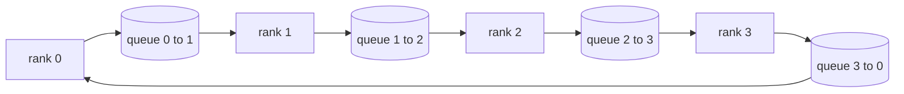

# Collective Ops from Scratch

> The four collective ops that hold distributed training together are allreduce, broadcast, allgather, and reduce_scatter. Every other primitive a training framework offers is a wrapper around these. Build them once on a `multiprocessing.Queue` mesh, verify them against a reference implementation, and the rest of the track becomes plumbing.

**Type:** Capstone
**Languages:** Python
**Prerequisites:** Phase 19 Lessons 42-49 Track C
**Time:** ~90 min

## Learning Objectives

- Implement a ring allreduce in two passes (reduce-scatter then allgather) and prove the communication volume per rank is 2(N-1)/N bytes per element.
- Construct broadcast, allgather, and reduce-scatter from point-to-point sends over `multiprocessing.Queue`.
- Verify every primitive against the `torch.distributed` gloo reference for the same input.
- Defend the choice of ring vs. tree in terms of cluster shape, latency floor, and bandwidth ceiling.

## The Problem

A naive allreduce on N ranks sends the tensor N times to a root and broadcasts N times back out. Bandwidth scales as O(N) per rank, the root bottlenecks, and the wall-clock floor is the slowest link times N. A ring allreduce fragments the tensor into 2(N-1) chunks of size T/N, so the bytes per rank drop to 2T(N-1)/N independent of cluster size. A tree allreduce wins on small N and high-latency links because depth is log2(N) hops instead of 2(N-1). Pick the wrong topology for your cluster shape, and the slowest GPU dictates step time.

Every distributed training framework you read about in this track relies on these four primitives. PyTorch DDP synchronizes gradients via one allreduce per parameter. ZeRO shards optimizer state via reduce_scatter and broadcasts updated params via allgather. FSDP replaces the full forward pass with allgather plus reduce_scatter. Pipeline parallelism needs broadcast for cross-stage activations. If you cannot implement the four collectives, you cannot understand why a training run hangs, why a gradient mismatch appears at scale 3, or why a pipeline bubble doubles when you swap topologies.

## The Concept



### Ring Allreduce in Two Passes

Partition the tensor into N equal chunks indexed 0..N-1. Every rank owns the chunk index matching its rank. Pass 1, reduce-scatter, takes N-1 steps. At step s, rank r sends chunk (r - s) mod N to rank (r + 1) mod N and receives chunk (r - s - 1) mod N from rank (r - 1) mod N, accumulating the received chunk into its local copy. After N-1 steps, rank r owns the complete sum of chunk r. Pass 2, allgather, takes another N-1 steps and rotates the finished chunks around the ring until every rank holds the full sum for every chunk.

| Primitive | Bytes per Rank | Steps | When to Use |
|---------------|--------------|-------|------------|
| Ring Allreduce | 2T(N-1)/N | 2(N-1) | Large T, homogeneous fat-pipe cluster |
| Tree Allreduce | T log2(N) | 2 log2(N) | Small T, or high-latency links |
| Broadcast | T | log2(N) tree | Parameter init, scalar config |
| Allgather | T(N-1)/N | N-1 | Sharded forward, ZeRO unshard |
| Reduce_scatter | T(N-1)/N | N-1 | ZeRO gradient shard |

### The Queue Mesh in place of NCCL

NCCL runs over PCIe and NVLink with hardware offload. You don't have that on a CPU. A `multiprocessing.Queue` per ring edge provides ordered, point-to-point delivery with one producer and one consumer. The reduction happens in userspace, so you pay Python overhead, but the connection pattern is identical to a NCCL ring allreduce. The correctness reasoning for the queue version and a cluster run is the same.

### Verify against Gloo

Every primitive ends with a unit test that compares its output to `torch.distributed` initialized with the gloo backend on the same tensor and world size. If your ring allreduce diverges from gloo by more than float32 epsilon, the test fails. Verification against a reference implementation is non-negotiable; without it, a primitive looks correct right up until step 10000 of a real training run.

## Build It

`code/main.py` implements:

- A `Mesh` class that ties N instances of `multiprocessing.Queue` into a ring and exposes `send(dst, tensor)` and `recv(src)` per rank.
- `ring_allreduce(mesh, rank, world_size, tensor)` operating the two-pass algorithm.
- `broadcast(mesh, rank, world_size, tensor, src)` on a log tree.
- `allgather(mesh, rank, world_size, tensor)` using N-1 rotations.
- `reduce_scatter(mesh, rank, world_size, tensor)` as the first half of allreduce.
- `_gloo_reference(op, world_size, tensor)` which runs the same input through `torch.distributed` with gloo for a byte-equal comparison.

Run it:

```bash
python3 code/main.py
```

Output: a primitive-by-primitive verification table comparing the queue and gloo outputs, followed by a byte-tracker per rank that confirms 2T(N-1)/N scaling.

## Production Patterns in the Wild

Three patterns harden a primitive enough to ship.

**Bucket gradients before reduction.** A 1B parameter model has tens of thousands of gradient tensors. One allreduce per tensor pays the latency floor N times. DDP buckets gradients into ~25MB chunks and issues one allreduce per chunk; small tensors ride the back of large ones. Without bucketing latency overhead dominates the step.

**Overlap communication with computation.** The backward pass computes gradients layer by layer in reverse. When the last layer's gradient is ready, start its allreduce while the next layer continues computing. PyTorch DDP wires this up via bucket-aligned hooks. Overlap halves the apparent communication time when the network has slack.

**Choose ring vs tree by message size, not religion.** NCCL ships a topology detector that picks ring for messages over ~1MB and tree below. The crossover is bandwidth vs latency: above 1MB, the 2T(N-1)/N bandwidth component dominates and ring wins; below 1MB, the log2(N) hop count wins. Hardcoding one topology leaves bandwidth on the table for the wrong message size.

## Use It

Production patterns:

- **PyTorch DDP.** Calls `dist.all_reduce` on bucketed gradients after backward pass. Bucket size is tunable; 25MB default is reasonable on 100Gbit ethernet.
- **DeepSpeed ZeRO.** Issues reduce_scatter for gradient shards, and allgather to reconstruct full parameters before the forward pass. The lesson primitives are the exact calls ZeRO makes.
- **FSDP.** Forward pass starts with an allgather to unshard the layer, does the computation, then reduces via reduce_scatter and drops the unshard. Same primitives, different schedule.

## Ship It

Use the queue mesh primitives in Lessons 77-81. Lesson 77 wires allreduce into DDP. Lesson 78 wires reduce-scatter into ZeRO. Lesson 79 wires broadcast into pipeline activations. Lesson 81 connects all four into an end-to-end demo.

## Exercises

1. Add a tree allreduce variant and switch between ring and tree by message size. Measure the crossover.
2. Add a `recv_timeout_ms` so a deadlocked rank raises a timeout error instead of hanging forever.
3. Replace `multiprocessing.Queue` with TCP sockets for the four primitives. Same tests, real wire.
4. Add a bandwidth instrumentation hook so the per-rank byte tracker logs to JSONL.
5. Compare ring vs tree wall-clock time on 4 ranks for 1KB, 1MB, 16MB tensors. Defend the crossover empirically.

## Key Terms

| Term | What People Say | What It Actually Means |
|------|----------------|--------------------------------------|
| Allreduce | "Sum across ranks" | Every rank has the same reduced tensor after the call |
| Ring | "Fast topology" | N-1 chunks of size T/N rotate around the cycle twice |
| Tree | "Log topology" | Reduction follows a binary tree; depth is log2(N) hops |
| Allgather | "Combine shards" | Every rank ends up with every other rank's shard |
| Reduce_scatter | "Split the sum" | Every rank ends up with the sum of only one chunk |
| Bucket | "Fuse small tensors" | Combine N small allreduces into one large one |

## Further Reading

- [PyTorch Distributed: NCCL Collectives](https://pytorch.org/docs/stable/distributed.html#collective-functions)
- [Horovod ring allreduce paper](https://arxiv.org/abs/1802.05799)
- [NCCL topology and algorithm selection](https://docs.nvidia.com/deeplearning/nccl/user-guide/docs/index.html)
- [Patarasuk and Yuan, Bandwidth Optimal All-reduce Algorithms](https://www.cs.fsu.edu/~xyuan/paper/09jpdc.pdf)
- Phase 10 Lesson 05 - distributed training overview
- Phase 19 Lesson 77 - DDP wired into these primitives
