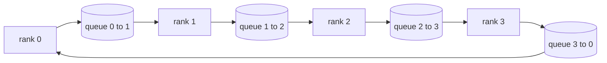

# Operacje zbiorowe od podstaw

> Cztery wspólne operacje, które łączą rozproszone szkolenia, to allreduce, transmitowanie, allgather i redukuj_scatter. Wszystkie inne prymitywne rozwiązania oferowane przez platformę szkoleniową stanowią ich opakowanie. Zbuduj je raz na siatce `multiprocessing.Queue`, zweryfikuj je z implementacją referencyjną, a reszta ścieżki stanie się hydrauliczna.

**Typ:** Kompilacja
**Języki:** Python
**Wymagania wstępne:** Faza 19, lekcje 42-49, ścieżka C
**Czas:** ~90 min

## Cele nauczania

- Zaimplementuj funkcję ring allreduce w dwóch przebiegach (redukcja-rozproszenie, a następnie allgather) i udowodnij, że wolumen komunikacji na rangę wynosi 2(N-1)/N bajtów na element.
- Twórz rozgłaszanie, gromadzenie wszystkich danych i redukcję rozproszenia na podstawie wysyłek punkt-punkt przez `multiprocessing.Queue`.
- Sprawdź każdy element podstawowy pod kątem odniesienia `torch.distributed` gloo dla tego samego wejścia.
- Obrona wyboru pierścienia zamiast drzewa pod względem kształtu klastra, minimalnego opóźnienia i pułapu przepustowości.

## Problem

Naiwna redukcja allreduce na N rangach wysyła N razy tensor do pierwiastka i rozgłasza N razy z powrotem. Przepustowość skaluje się jako O(N) na rangę, korzeń staje się wąskim gardłem, a najniższy zegar ścienny to najwolniejsze łącze razy N. Wszystko w pierścieniu redukuje to do 2 (N-1) fragmentów o rozmiarze T/N, więc bajty na rangę spadają do 2T(N-1)/N niezależnie od rozmiaru klastra. Drzewo allreduce wygrywa na małych N i łączach o dużym opóźnieniu, ponieważ głębokość wynosi log2(N) przeskoków zamiast 2(N-1). Wybierz niewłaściwą topologię dla kształtu klastra, a najwolniejszy procesor graficzny dyktuje czas kroku.

Każda rozproszona platforma szkoleniowa, o której przeczytasz w tej ścieżce, opiera się na tych czterech elementach podstawowych. PyTorch DDP synchronizuje gradienty za pomocą jednego allreduce na każdy parametr. ZeRO sharduje stan optymalizatora poprzez redukcję_scatter i rozgłasza zaktualizowane parametry poprzez allgather. FSDP zamienia pełne przesyłanie do przodu na allgather plus zmniejszenie_rozproszenia. Równoległe potoki wymagają transmisji w celu aktywacji pomiędzy grupami scen. Jeśli nie możesz wdrożyć czterech kolektywów, nie możesz zrozumieć, dlaczego szkolenie się zatrzymuje, dlaczego niedopasowanie gradientu pojawia się na poziomie 3 lub dlaczego bańka rurociągu podwaja się podczas zamiany topologii.

## Koncepcja



### Zadzwoń i zmniejsz wszystko w dwóch przejściach

Podziel tensor na N równych części o indeksie 0..N-1. Każda ranga posiada indeks fragmentu równy swojej randze. Przejście 1, redukcja-rozproszenie, wykonanie N-1 kroków. W kroku s ranga r wysyła porcję (r - s) mod N do rangi (r + 1) mod N i odbiera porcję (r - s - 1) mod N z rangi (r - 1) mod N, gromadząc odebraną porcję w swojej lokalnej kopii. Po N-1 krokach ranga r jest właścicielem pełnej sumy części r. Pass 2, allgather, wykonuje kolejne N-1 kroki i obraca gotowe kawałki wokół pierścienia, aż każdy stopień będzie zawierał pełną sumę dla każdego kawałka.

| Prymitywny | Bajty na rangę | Kroki | Kiedy używać |
|---------------|--------------|-------|------------|
| Pierścień allreduce | 2T(N-1)/N | 2(N-1) | Duże T, jednorodne skupisko grubej rury |
| Drzewo allreduce | T log2(N) | 2 log2(N) | Małe T lub łącza o dużym opóźnieniu |
| Transmisja | T | drzewo log2(N) | Init parametru, konfiguracja skalarna |
| Wszystkozbierz | T(N-1)/N | N-1 | Sharded do przodu, ZeRO unshard |
| Zmniejsz_rozproszenie | T(N-1)/N | N-1 | Odłamki gradientu Zero |

### Siatka kolejek zastępująca NCCL

NCCL działa poprzez PCIe i NVLink z redukcją obciążenia sprzętowego. Na procesorze tego nie masz. `multiprocessing.Queue` na krawędź pierścienia zapewnia zamówioną dostawę z punktu do punktu u jednego producenta i jednego konsumenta. Redukcja odbywa się w przestrzeni użytkownika, więc płacisz za koszty ogólne Pythona, ale wzór połączeń jest identyczny jak w przypadku pierścienia NCCL allreduce. Powód dotyczący poprawności wersji kolejki i zachowania klastra jest następujący.

### Sprawdź względem gloo

Każdy prymityw kończy się testem jednostkowym, który porównuje jego dane wyjściowe z `torch.distributed` zainicjowanym za pomocą backendu gloo na tym samym tensorze i w tym samym rozmiarze świata. Jeśli Twój pierścień allreduce odbiega od gloo o więcej niż float32 epsilon, test zakończy się niepowodzeniem. Weryfikacja w oparciu o implementację referencyjną nie podlega negocjacjom; bez tego prymityw wygląda poprawnie aż do kroku 10000 prawdziwego przebiegu treningowego.

## Zbuduj to

`code/main.py` implementuje:

- klasa `Mesh`, która łączy N instancji `multiprocessing.Queue` w pierścień i udostępnia `send(dst, tensor)` i `recv(src)` na rangę.
- `ring_allreduce(mesh, rank, world_size, tensor)` obsługujący algorytm dwuprzebiegowy.
- `broadcast(mesh, rank, world_size, tensor, src)` na drzewie logarytmicznym.
- `allgather(mesh, rank, world_size, tensor)` przy użyciu obrotów N-1.
- `reduce_scatter(mesh, rank, world_size, tensor)` jako pierwsza połowa allreduce.
- `_gloo_reference(op, world_size, tensor)`, który uruchamia te same dane wejściowe przez `torch.distributed` z gloo dla porównania na równych bajtach.

Uruchom to:

```bash
python3 code/main.py
```

Dane wyjściowe: tabela weryfikacyjna poszczególnych prymitywów porównująca wyjścia kolejek i gloo, po której następuje licznik bajtów według rang, który potwierdza skalowanie 2T(N-1)/N.

## Wzorce produkcji na wolności

Trzy wzory utwardzają prymityw na tyle, że można go wysłać.

**Gradienty zbiorcze przed redukcją.** Model z parametrami 1B ma dziesiątki tysięcy tensorów gradientu. Jedna redukcja allreduce na tensor powoduje N razy dolną granicę opóźnienia. DDP segmenty gradienty dzieli na porcje o wielkości ~25 MB i wydaje po jednym allreduce na segment; małe tensory poruszają się po grzbiecie dużych. Bez uwzględnienia narzutu opóźnienia dominuje krok.

**Komunikacja pokrywa się z obliczeniami.** Wstecznie oblicza gradienty warstwa po warstwie w odwrotnej kolejności. Gdy gradient ostatniej warstwy będzie gotowy, rozpocznij jego zmniejszanie, podczas gdy następna warstwa będzie kontynuować obliczenia. PyTorch DDP łączy to za pomocą haków przystosowanych do wiadra. Nakładanie się zmniejsza o połowę widoczny czas komunikacji, gdy sieć ma luzy.

**Wybieraj pierścień lub drzewo według rozmiaru wiadomości, a nie religii.** NCCL dostarcza detektor topologii, który wybiera pierścień dla wiadomości powyżej ~1 MB i drzewa poniżej. Zwrotnica to zależność przepustowości od opóźnienia: powyżej 1 MB dominuje składnik przepustowości 2T(N-1)/N i wygrywa pierścień; poniżej 1 MB, wygrywa liczba przeskoków log2(N). Zakodowanie na stałe jednej topologii powoduje utratę przepustowości w przypadku wiadomości o niewłaściwym rozmiarze.

## Użyj tego

Wzory produkcyjne:

- **PyTorch DDP.** Wywołuje `dist.all_reduce` na gradientach segmentowych po przejściu wstecz. Rozmiar łyżki można regulować; domyślne 25 MB jest rozsądne w przypadku sieci Ethernet 100 Gbit.
- **DeepSpeed ​​ZeRO.** Problemy z redukcją_scatter dla gradientów fragmentów i allgather w celu zrekonstruowania pełnych parametrów przed przesłaniem dalej. Podstawowe elementy lekcji to dokładnie te same wywołania, które wykonuje ZeRO.
- **FSDP.** Przekazywanie rozpoczyna się od allgather w celu oddzielenia warstwy, dokonuje obliczeń, następnie zmniejsza za pomocą funkcji redukuj_scatter i odrzuca unshard. Te same elementy pierwotne, inny harmonogram.

## Wyślij to

Użyj prymitywów siatki kolejek z lekcji 77-81. Lekcja 77 Wszystkie przewody są redukowane do DDP. Lekcja 78 łączy redukcję rozproszenia w Zero. Lekcja 79. Łączy transmisję do aktywacji rurociągów. Lekcja 81 łączy wszystkie cztery elementy w kompleksowe demo.

## Ćwiczenia

1. Dodaj wariant drzewa allreduce i przełączaj się między pierścieniem a drzewem według rozmiaru wiadomości. Zmierz skrzyżowanie.
2. Dodaj `recv_timeout_ms`, aby zablokowana ranga wyświetlała błąd terminu końcowego, zamiast zawieszać się na zawsze.
3. Zastąp `multiprocessing.Queue` gniazdami TCP dla czterech elementów podstawowych. Te same testy, prawdziwy drut.
4. Dodaj zaczep do oprzyrządowania przepustowości, aby licznik bajtów poszczególnych rang rejestrował się w formacie JSONL.
5. Porównaj czas zegara ściennego pierścienia z czasem drzewa na 4 szeregach dla tensorów o rozmiarach 1KB, 1MB, 16MB. Broń skrzyżowania empirycznie.

## Kluczowe terminy

| Termin | Co ludzie mówią | Co to właściwie oznacza |
|------|----------------|--------------------------------------|
| Allredukcja | „Suma według rang” | Po wywołaniu każda ranga ma ten sam zredukowany tensor |
| Pierścień | „Szybka topologia” | Kawałki N-1 o rozmiarze T/N okrążają cykl dwukrotnie |
| Drzewo | „Topologia dziennika” | Redukcja następuje po drzewie binarnym; głębokość wynosi log2(N) przeskoków |
| Wszystkozbierz | „Połącz fragmenty” | Każda ranga kończy się odłamkiem każdej innej rangi |
| Zmniejsz_rozproszenie | „Podziel sumę” | Każda ranga kończy się sumą tylko jednej części |
| Wiadro | „Bezpiecznik małych tensorów” | Połącz N małych wszystkich sprowadza się do jednego dużego |

## Dalsze czytanie

- [PyTorch dystrybuowany: kolektywy NCCL](https://pytorch.org/docs/stable/distributed.html#collective-functions)
– [Dokument Horovod ring allreduce](https://arxiv.org/abs/1802.05799)
- [Topologia NCCL i wybór algorytmu](https://docs.nvidia.com/deeplearning/nccl/user-guide/docs/index.html)
- [Patarasuk i Yuan, Algorytmy zmniejszania optymalnej przepustowości] (https://www.cs.fsu.edu/~xyuan/paper/09jpdc.pdf)
- Faza 10 Lekcja 05 - przegląd szkoleń rozproszonych
- Faza 19, lekcja 77 - DDP podłączony do tych prymitywów