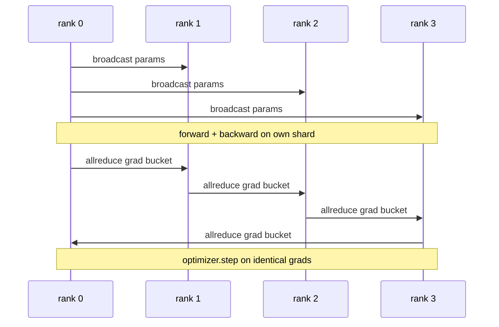

# Data Parallel DDP from Scratch

> DistributedDataParallel is a wrapper around allreduce. Wrap the model, broadcast initial parameters from rank 0 so every rank starts identical, install a backward hook on each parameter that fires an allreduce on the gradient, and the rest is gradient descent. The entire pattern is 200 lines.

**Type:** Capstone
**Languages:** Python
**Prerequisites:** Phase 19 Lessons 42-49 Track C
**Time:** ~90 min

## Learning Objectives

- Wire a `DistributedDataParallel`-shaped wrapper that broadcasts initial parameters and reduces gradients after the backward pass.
- Spawn N CPU ranks via `torch.multiprocessing.spawn` against a gloo backend with a file-based rendezvous.
- Prove gradient synchronization is correct by training the same model on the same data sequentially and showing byte-for-byte parameter equivalence at each step.
- Defend the use of buckets (fusing gradients) and overlap (communicating while computing backward) as the two changes that take toy DDP to production DDP.

## The Problem

A 1 billion parameter model with 12GB of activations won't fit comfortably on a single consumer GPU. Even if it fits, training takes weeks. Data parallel splits the batch across N ranks, each rank computes forward and backward on its slice, and at every step, the gradients of every rank are summed so all N copies remain identical. The optimizer steps on the summed gradient.

Without gradient synchronization, N replicas diverge at step 2. The model is no longer "one model trained on more data", it's N separate models that happen to share initial weights. With gradient synchronization done poorly (one allreduce per parameter, no overlap, no bucketing), the network bottlenecks, and GPUs idle waiting for the wire. The art of DDP is making the gradient synchronization almost free relative to compute. Canonical PyTorch DDP accomplishes this by bucketing gradients, overlapping allreduce with the next layer's backward, and using NCCL on NVLink. We can do all three on CPU with gloo and extract the same lessons.

## The Concept



### Three Ops DDP Needs

| Stage | Collective | Why |
|-------|-----------|-----|
| Start | broadcast from rank 0 | Every rank starts with identical parameters |
| After backward | allreduce every grad | The optimizer acts on the mean gradient |
| Sometimes | broadcast buffers | Batchnorm running stats stay synchronized |

### Why Mean and Not Sum

An Allreduce-SUM divided by world_size yields the mean gradient. The mean is invariant to world_size: a learning rate tuned on one rank works on four ranks because the magnitude of the gradient per step doesn't shift. Allreduce-SUM without division forces you to retune learning rate every time you alter cluster size. DDP wraps SUM and divides; do the same in the lesson.

### Why Bucket Gradients

A Transformer has thousands of parameter tensors. One allreduce per tensor pays the Gloo latency floor thousands of times. DDP groups gradients into ~25MB buckets and issues one allreduce per bucket. The same total bytes cross the wire, but the latency is amortized across the bucket. For a tiny lesson model, we bucket everything into one; the structure is what carries over.

### Why Pin the Seed

Every rank must call `torch.manual_seed(seed + rank)` for shuffling, but `torch.manual_seed(seed)` for parameter initialization. A single shared seed means every rank sees the same batch order (defeating data parallel); a rank-specific seed for parameters means the starting params disagree by a float epsilon, and gradient synchronization no longer keeps replicas identical. Get the seed pattern right or the parameter equivalence test fails at step 1.

## Build It

`code/main.py` implements:

- `MiniMLP`: a 3-layer MLP small enough to converge in seconds, large enough to expose the wiring.
- `DistributedDataParallel(model, world_size)`: broadcasts params at construction, returns a wrapper whose `sync_grads` divides the allreduce sum by world_size.
- `worker(rank, world_size, ...)`: the full training loop with `torch.distributed` init via gloo, forward, backward, sync, step.
- `_reference_single_process_loop(...)`: trains the same model on the same data sequentially on one rank, used by the test for byte-equal parameter equivalence after every step.

Run it:

```bash
python3 code/main.py
```

Output: a step-by-step training table comparing the single-process loss and parameter checksum against the DDP run across 4 ranks. Both paths produce identical loss curves to a float epsilon, proving gradient synchronization is correct.

## Production Patterns in the Wild

Three patterns harden DDP enough to ship.

**Find unused parameters.** Certain forward paths skip parameters conditionally (early exit, mixture of experts router). The skipped parameters get no gradient, but the DDP hook waiting to fire the bucket still expects them, and the reduce deadlocks. `find_unused_parameters=True` tells DDP to walk the graph before reducing to see which params received grads. The cost is a graph traversal per step, so leave it off unless you branch forward.

**Static graph optimization.** When the forward pass is stable across steps, `static_graph=True` lets DDP precompute the bucket schedule. The optimization matters at scale: the precomputation saves a few ms per step, which compounds over 10k steps.

**Gradient accumulation needs care.** Accumulating gradients over K microbatches without syncing each microbatch yields a 10x throughput gain. DDP exposes `no_sync()` as a context manager that suppresses the allreduce after backward. Forget the manager and you reduce K times for free; throughput falls through the floor.

## Use It

Production patterns:

- **PyTorch DDP.** The canonical implementation. `torch.nn.parallel.DistributedDataParallel(model)` wires up the bucketing, overlap, and no_sync context.
- **HuggingFace Accelerate.** Adds a launcher that handles `torchrun` env vars and wraps the model. Same DDP under the hood.
- **Megatron-LM Data Parallel.** Interleaves DDP with tensor parallel for large models; the data parallel component is the identical allreduce-after-backward pattern.

## Ship It

Lesson 78 (ZeRO sharding) replaces the allreduce per parameter with a reduce_scatter so each rank only stores its shard of optimizer state. Lesson 81 connects DDP with ZeRO into an end-to-end demo.

## Exercises

1. Add gradient buckets of a configurable size and measure the speedup compared to one allreduce per parameter on a deeper model.
2. Implement `no_sync()` as a context manager and verify gradient accumulation matches a single-process baseline over K microbatches.
3. Add a `find_unused_parameters` mode where the forward pass randomly skips one of the MLP layers; without the flag, the run should deadlock.
4. Swap gloo for `torch.distributed.barrier()`-only synchronization to feel the difference between an allreduce-backed and a barrier-backed sync.
5. Measure gradient synchronization overhead as a fraction of step time for batch sizes 1, 16, 256, and explain the scaling.

## Key Terms

| Term | What People Say | What It Actually Means |
|------|----------------|--------------------------------------|
| DDP | "Data parallel" | A wrapper that broadcasts params and allreduces grads every step |
| Bucket | "Fuse grads" | Group N small allreduces into one large one |
| Overlap | "Hide the wire" | Issue the allreduce while later layers are still computing backward |
| no_sync | "Accumulate" | Skip the allreduce after backward to accumulate a gradient |
| find_unused | "Forward branch" | Detect params with no grad before reducing |

## Further Reading

- [PyTorch DistributedDataParallel docs](https://pytorch.org/docs/stable/generated/torch.nn.parallel.DistributedDataParallel.html)
- [PyTorch DDP internal tutorial](https://pytorch.org/tutorials/intermediate/ddp_tutorial.html)
- [Li et al., PyTorch Distributed: Experiences on Accelerating Data Parallel Training](https://arxiv.org/abs/2006.15704)
- Phase 19 Lesson 76 - the collectives that DDP relies on
- Phase 19 Lesson 78 - ZeRO sharding replaces the allreduce per parameter with a reduce_scatter
