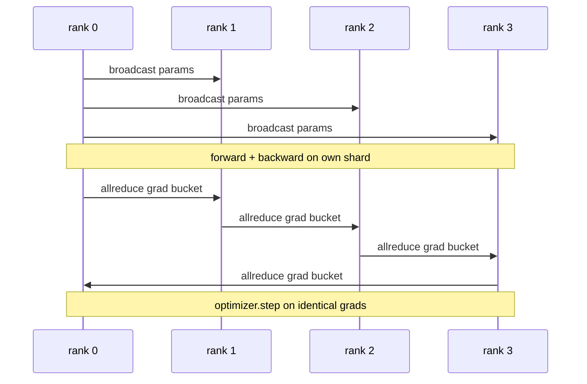

# Dane równoległe DDP od podstaw

> DistributedDataParallel to dodatek do allreduce. Owiń model, rozgłaszaj początkowe parametry od rangi 0, aby każda ranga zaczynała się identycznie, zainstaluj hak wsteczny na każdym parametrze, który powoduje zmniejszenie całego gradientu, a reszta to opadanie gradientu. Cały wzór ma 200 linii.

**Typ:** Kompilacja
**Języki:** Python
**Wymagania wstępne:** Faza 19, lekcje 42-49, ścieżka C
**Czas:** ~90 min

## Cele nauczania

- Podłącz opakowanie w kształcie `DistributedDataParallel`, które rozgłasza parametry początkowe i zmniejsza gradienty po przejściu do tyłu.
- Spawn N CPU plasuje się na poziomie `torch.multiprocessing.spawn` w stosunku do backendu gloo z spotkaniem opartym na plikach.
- Udowodnij poprawność synchronizacji gradientów, trenując ten sam model na tych samych danych sekwencyjnie i pokazując równoważność parametrów w poszczególnych krokach.
- Bronić stosowania segmentów (łączenie gradientów) i nakładania się (komunikacja podczas odtwarzania wstecz) jako dwóch zmian, które zmieniają działający DDP w produkcyjny DDP.

## Problem

Model z 1 miliardem parametrów i 12 GB aktywacji nie zmieści się na jednym konsumenckim GPU. Nawet jeśli pasuje, szkolenie zajmuje tygodnie. Dane równoległe dzielą partię na N rang, każda ranga oblicza postęp i wstecz na swoim fragmencie, a na każdym kroku gradienty każdej rangi są sumowane, więc wszystkie N kopii pozostaje identycznych. Optymalizator wykonuje kroki na zsumowanym gradiencie.

Bez synchronizacji gradientowej N replik różni się w kroku 2. Model nie jest już „jednym modelem wytrenowanym na większej liczbie danych”, jest to N oddzielnych modeli, które tak się składa, że ​​mają wspólne wagi początkowe. Przy źle wykonanej synchronizacji gradientów (jedno zmniejszenie na parametr, brak nakładania się, brak buforowania) sieć stanowi wąskie gardło, a procesory graficzne są bezczynne i czekają na podłączenie. Sztuka DDP sprawia, że ​​synchronizacja gradientów jest prawie swobodna w stosunku do obliczeń. Kanoniczny PyTorch DDP osiąga to poprzez łączenie gradientów, nakładanie allreduce z następną warstwą wstecz i używanie NCCL w NVLink. Możemy wykonać wszystkie trzy na procesorze za pomocą gloo i wyciągnąć te same wnioski.

## Koncepcja



### Trzy operacje potrzebne DDP

| Scena | zbiorowe | Dlaczego |
|-------|-----------|-----|
| Rozpocznij | transmisja z rangi 0 | Każda ranga zaczyna się od tych samych parametrów |
| Po wstecz | allredukcja każdego stopnia | Na średni gradient wpływa optymalizator |
| Czasami | transmisja buforów | Statystyki działania Batchnorm pozostają zsynchronizowane |

### Dlaczego oznacza, a nie sumę

Allreduce-SUM podzielona przez world_size daje średni gradient. Średnia jest niezmienna dla world_size: szybkość uczenia się dostrojona do jednego poziomu działa w czterech stopniach, ponieważ wielkość gradientu na krok nie zmienia się. Allreduce-SUM bez podziału zmusza do ponownego dostrojenia szybkości uczenia się za każdym razem, gdy zmieniasz rozmiar klastra. DDP zawija SUMę i dzieli; zrób to samo na lekcji.

### Dlaczego gradienty kubełkowe

Transformator ma tysiące tensorów parametrów. Jedna redukcja allreduce na tensor pokrywa próg opóźnienia Gloo tysiące razy. DDP grupuje gradienty w segmenty o wielkości ~25 MB i wydaje po jednym allreduce na każdy segment. Ta sama całkowita liczba bajtów przemieszcza się w sieci, ale opóźnienie jest amortyzowane w całym wiadrze. W przypadku małego modelu lekcji grupujemy wszystko w jednym wiadrze; struktura jest tym, co się przenosi.

### Po co przypinać ziarno

Każda ranga musi wywołać `torch.manual_seed(seed + rank)` w celu tasowania, ale `torch.manual_seed(seed)` w celu inicjacji parametru. Pojedynczy wspólny materiał siewny oznacza, że ​​każda ranga widzi tę samą kolejność partii (pokonując równoległość danych); ziarno specyficzne dla rangi dla parametrów oznacza, że ​​parametry początkowe nie zgadzają się w przypadku float epsilon, a synchronizacja gradientu nie powoduje już, że repliki są identyczne. Uzyskaj prawidłowy wzór nasion, w przeciwnym razie test równoważności parametrów zakończy się niepowodzeniem w kroku 1.

## Zbuduj to

`code/main.py` implementuje:

- `MiniMLP`: 3-warstwowy MLP wystarczająco mały, aby uzyskać zbieżność w ciągu kilku sekund i wystarczająco duży, aby odsłonić okablowanie.
- `DistributedDataParallel(model, world_size)`: rozgłasza parametry w czasie konstruowania, zwraca opakowanie, którego `sync_grads` dzieli skumulowane gradacje z sumą allreduce przez rozmiar_świata.
- `worker(rank, world_size, ...)`: pełna pętla treningowa z `torch.distributed` init poprzez gloo, do przodu, do tyłu, synchronizacja, krok.
- `_reference_single_process_loop(...)`: trenuje ten sam model na tych samych danych sekwencyjnie w jednej randze, używanej przez test pod kątem równoważności parametrów równych bajtom po każdym kroku.

Uruchom to:

```bash
python3 code/main.py
```

Dane wyjściowe: tabela szkoleniowa dla poszczególnych kroków porównująca straty w pojedynczym procesie i sumę kontrolną parametrów z przebiegiem DDP na 4 poziomach. Obie ścieżki tworzą identyczne krzywe strat dla pływającego epsilon, co dowodzi, że synchronizacja gradientu jest prawidłowa.

## Wzorce produkcji na wolności

Trzy wzory wzmacniają DDP na tyle, że można go wysłać.

**Znajdź nieużywane parametry.** Niektóre ścieżki przesyłania dalej pomijają parametry warunkowo (wczesne wyjście, router złożony z ekspertów). Pominięte parametry nie mają gradientu, ale hak DDP gotowy do użycia wiadra nadal na nie czeka i redukuje zakleszczenia. `find_unused_parameters=True` mówi DDP, aby przed redukcją sprawdził, które parametry otrzymały gradienty. Koszt to przejście po wykresie na krok, więc zostaw go, chyba że Twoje gałęzie do przodu.

**Optymalizacja wykresu statycznego.** Gdy forward jest stabilny w poszczególnych krokach, `static_graph=True` umożliwia DDP wstępne obliczenie harmonogramu segmentu. Optymalizacja ma znaczenie na dużą skalę: wstępne obliczenia pozwalają zaoszczędzić kilka ms na krok, co przekłada się na 10 000 kroków.

**Akumulacja gradientu wymaga ostrożności.** Gromadzenie gradientów w K mikropartii bez synchronizowania każdej mikropartii zapewnia 10-krotność wydajności. DDP udostępnia `no_sync()` jako menedżera kontekstu, który wstrzymuje allreduce po cofnięciu. Zapomnij o menedżerze, a zmniejszysz K razy za darmo; przepustowość spada do podłogi.

## Użyj tego

Wzory produkcyjne:

- **PyTorch DDP.** Implementacja kanoniczna. `torch.nn.parallel.DistributedDataParallel(model)` łączy segmentowanie, nakładanie się i kontekst no_sync.
- **HuggingFace Accelerate.** Dodaje program uruchamiający, który obsługuje `torchrun` env vars i zawijanie modelu. Ten sam DDP pod maską.
- **Równoległe dane Megatron-LM.** Łączy DDP z równoległym tensorem dla dużych modeli; element równoległy do ​​danych jest tym samym wzorcem zmniejszania po wstecznym.

## Wyślij to

Lekcja 78 (fragmentowanie ZeRO) zastępuje allreduce dla każdego parametru redukcją_scatter, więc każda ranga przechowuje tylko swój fragment stanu optymalizatora. Lekcja 81 łączy DDP z ZeRO w kompleksowe demo.

## Ćwiczenia

1. Dodaj segmenty gradientów o konfigurowalnym rozmiarze i zmierz przyspieszenie w porównaniu z jedną redukcją na parametr w głębszym modelu.
2. Zaimplementuj `no_sync()` jako menedżera kontekstu i sprawdź, czy akumulacja gradientów odpowiada linii bazowej pojedynczego procesu w K mikropartach.
3. Dodaj tryb `find_unused_parameters`, w którym przesyłanie do przodu czasami pomija jedną z warstw MLP; bez flagi bieg powinien się zablokować.
4. Zamień gloo na synchronizację tylko `torch.distributed.barrier()`, aby poczuć różnicę między synchronizacją opartą na allreduce a synchronizacją opartą na barierach.
5. Zmierz narzut synchronizacji gradientu jako ułamek czasu kroku dla partii o rozmiarach 1, 16, 256 i wyjaśnij skalowanie.

## Kluczowe terminy

| Termin | Co ludzie mówią | Co to właściwie oznacza |
|------|----------------|--------------------------------------|
| DDP | „Dane równoległe” | Opakowanie rozgłaszające parametry i zmniejszające gradacje w każdym kroku |
| Wiadro | „Stopnie bezpieczników” | Grupa N mała wszystko redukuje się do jednego dużego |
| Nakładanie się | „Ukryj połączenie” | Wydaj polecenie allreduce, podczas gdy późniejsze warstwy nadal obliczają wstecz |
| brak_sync | „Akumuluj” | Pomiń allreduce po cofnięciu w celu akumulacji gradientu |
| znajdź_nieużywane | „Oddział do przodu” | Wykryj parametry bez gradacji przed redukcją |

## Dalsze czytanie

- [Dokumentacja PyTorch DistributedDataParallel](https://pytorch.org/docs/stable/generated/torch.nn.parallel.DistributedDataParallel.html)
— [Poradnik dotyczący wewnętrznego modułu PyTorch DDP](https://pytorch.org/tutorials/intermediate/ddp_tutorial.html)
- [Li i in., PyTorch Distributed: Experiences on Accelerating Data Parallel Training](https://arxiv.org/abs/2006.15704)
- Faza 19, Lekcja 76 - kolektywy, na których opiera się DDP
- Faza 19, Lekcja 78 - Fragmentowanie ZeRO zastępuje allreduce dla każdego parametru przez redukcję_rozproszenia