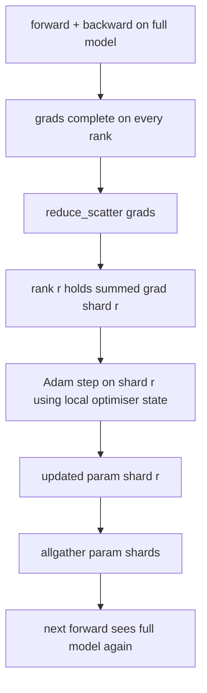

# ZeRO Optimizer State Sharding

> Adam keeps two moment estimates per parameter, both in float32. A 7B parameter model holds 56GB of optimizer state. ZeRO Stage 1 shards this across N ranks; every rank holds 1/N of the optimizer. After a local step, updated parameter shards are broadcast, each rank reconstructs the full model, and the next step begins. The win is a linear drop in memory on the largest single allocation in the training stack.

**Type:** Capstone
**Languages:** Python
**Prerequisites:** Phase 19 Lessons 42-49 Track C
**Time:** ~90 min

## Learning Objectives

- Shard optimizer state (first moment, second moment, fp32 master copy) across N ranks so each rank owns 1/N.
- Use reduce_scatter to deliver each rank only the summed gradients of its shard, then allgather to broadcast updated parameter shards back out.
- Calculate the memory savings table for Stage 1, Stage 2, Stage 3 vs vanilla DDP.
- Defend the choice of Stage 1 vs Stage 2 vs Stage 3 based on model size and bandwidth budget.

## The Problem

Vanilla DDP replicates everything: parameters, gradients, and optimizer state are fully present on every rank. For a 7B parameter model in fp16, that's 14GB of parameters, 14GB of gradients, and 28GB of optimizer state per rank. Optimizer state is the largest term and the easiest to shard, because it is only touched during the step, not during forward or backward.

ZeRO Stage 1 breaks the optimizer state into chunks. Every rank holds 1/N of the Adam moments. After backward, instead of an allreduce giving the entire gradient to every rank, ZeRO does a reduce_scatter, so each rank receives only the summed gradient of its shard. The rank applies the optimizer step to its shard of the master parameters. The updated parameter shards are then allgathered back so every rank has the full model for the next forward pass. Optimizer memory drops by N. Network traffic per step is the same as DDP: one reduce_scatter plus one allgather equals one allreduce in bandwidth. Memory wins, bandwidth stays flat.

## The Concept



### The ZeRO Stages

| Stage | What is Sharded | Memory per Rank | Comm per Step |
|-------|----------------|--------------------------------|--------------|
| DDP | nothing | params + grads + optim | 1x allreduce |
| ZeRO-1 | optimizer state | params + grads + optim/N | 1x reduce_scatter + 1x allgather |
| ZeRO-2 | optim + grads | params + grads/N + optim/N | 1x reduce_scatter + 1x allgather |
| ZeRO-3 | optim + grad + params | params/N + grads/N + optim/N | 1x allgather per layer + 1x reduce_scatter per layer |

Stage 1 is the cheapest win because optimizer state dominates the budget. Stage 2 requires gradient shard accumulation logic but bandwidth is the same. Stage 3 (FSDP) pays a per-layer communication tax on every forward and backward pass to win the parameter shard memory drop. The lesson implements Stage 1 fully.

### The Memory Math, Real Numbers

For a model with P parameters trained with Adam in mixed precision:

| Term | Vanilla | ZeRO-1 | Why |
|------|---------|--------|-----|
| fp16 params | 2P bytes | 2P bytes | needed for forward |
| fp16 grads | 2P bytes | 2P bytes | needed for backward |
| fp32 master copy | 4P bytes | 4P/N bytes | only optim uses it |
| fp32 first moment | 4P bytes | 4P/N bytes | only optim uses it |
| fp32 second moment | 4P bytes | 4P/N bytes | only optim uses it |
| Total | 16P bytes | 4P + 12P/N bytes |   |

At N=8: vanilla 16P, ZeRO-1 5.5P, a 65% drop. At N=64: vanilla 16P, ZeRO-1 4.19P, a 74% drop.

### Why reduce_scatter Beats allreduce-then-shard

An allreduce gives every rank the full summed gradient. If you only need shard r, (N-1)/N of the reduced gradient is wasted on rank r. A reduce_scatter delivers exactly the shard each rank owns; the bytes per rank is the same as allreduce (because allreduce is reduce_scatter + allgather) but the second half is replaced by the parameter shard allgather later. The network wire is identical to DDP, the memory is sharded.

## Build It

`code/main.py` implements:

- `flatten_params(module)` and `unflatten_into(module, flat)` which pack the model's parameters into a single contiguous tensor and unpack them back. The flat layout makes sharding by rank a simple slice.
- `ZeroOptimizer(model, world_size, rank, lr)` which owns the rank's shard of the master copy and Adam moments.
- `step()` which runs reduce_scatter on the flat gradient, applies Adam to the rank's shard, and allgathers the updated parameters back.
- A demo that trains a 3-layer MLP for 20 steps and prints the memory budget per step alongside a vanilla DDP baseline.

Run it:

```bash
python3 code/main.py
```

Output: loss per step and a memory table showing ZeRO-1 holds 1/N of the optimizer state per rank compared to the full DDP copy.

## Production Patterns in the Wild

Three patterns harden ZeRO enough to ship.

**Sharded checkpoints matter.** ZeRO-1 optimizer state is sharded across ranks; a checkpoint must record which rank owns what. Lesson 80 builds a sharded checkpoint manifest that resumes ZeRO on the same world size. Without this, saved state is unreadable on restart.

**It's about mixed precision.** ZeRO is a mixed precision technique; the fp32 master copy is what gets sharded. Running ZeRO without mixed precision pays a memory tax for the fp32 master without the corresponding fp16 forward win. Production runs always combine ZeRO with autocast or bf16 weights.

**Stage 1 is a nearly free win.** Communication is identical to DDP in bandwidth. Memory savings are linear in N. The only cost is bookkeeping the optimizer shard. Production stacks default to Stage 1 unless parameter shard memory is also a problem; then Stage 2 or 3 swap communication for memory.

## Use It

Production patterns:

- **DeepSpeed ZeRO.** The reference implementation. `deepspeed_config.json` chooses Stage 1/2/3 and partition sizes.
- **PyTorch FSDP.** The native equivalent. `ShardingStrategy.SHARD_GRAD_OP` is ZeRO-2; `FULL_SHARD` is ZeRO-3.
- **HuggingFace Accelerate.** Wraps DeepSpeed and FSDP under a unified config.

## Ship It

Lesson 79 (pipeline parallelism) is an orthogonal axis of sharding: instead of sharding optimizer state across the same model, pipeline shards the model layers across ranks. Lesson 81 composes DDP + ZeRO into an end-to-end demo.

## Exercises

1. Extend to ZeRO-2 by sharding gradients: each rank keeps only the gradient for its shard, achieved by zeroing out the non-shard portion after backward.
2. Add a memory profiler that prints actual fp32 byte usage on rank 0 vs the predicted formula.
3. Measure wall-clock time per step of vanilla DDP vs ZeRO-1 and break down into forward, backward, and communication.
4. Implement gradient clipping in ZeRO-1: the L2 norm must be computed across all shards by an allreduce of the local squared norm.
5. Implement "naive ZeRO" via allreduce instead of reduce_scatter and measure the wire time difference. Defend the reduce_scatter choice with numbers.

## Key Terms

| Term | What People Say | What It Actually Means |
|------|----------------|--------------------------------------|
| ZeRO-1 | "Shard optim" | Every rank holds 1/N of the fp32 master + Adam moments |
| ZeRO-2 | "Grads too" | Every rank also discards non-shard grads after reduce_scatter |
| ZeRO-3 | "Shard params" | Every rank holds 1/N of the fp16 params; allgather per layer on forward |
| Master copy | "fp32 weights" | The high-precision parameter copy optimizer updates act upon |
| Reduce_scatter | "Split the sum" | Deliver each rank only its summed gradient |

## Further Reading

- [Rajbhandari et al., ZeRO: Memory Optimizations Toward Training Trillion Parameter Models](https://arxiv.org/abs/1910.02054)
- [DeepSpeed ZeRO documentation](https://www.deepspeed.ai/tutorials/zero/)
- [PyTorch FSDP documentation](https://pytorch.org/docs/stable/fsdp.html)
- Phase 19 Lesson 76 - the reduce_scatter and allgather primitives this relies on
- Phase 19 Lesson 80 - sharded checkpointing, which ZeRO state must use
