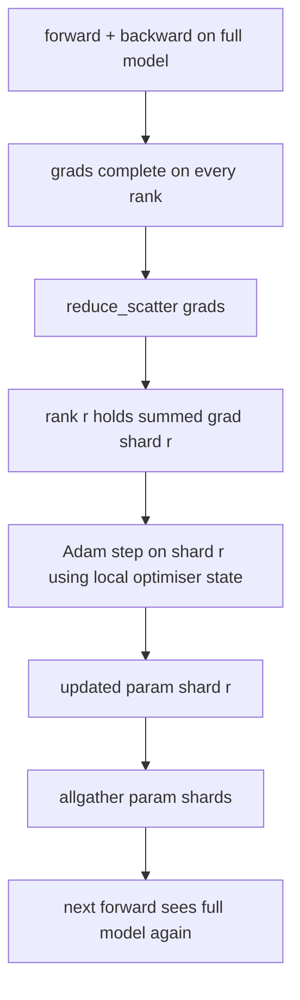

# Fragmentowanie stanu optymalizatora ZeRO

> Adam przechowuje dwa oszacowania momentu na parametr, oba w float32. Model z parametrami 7B zawiera 56 GB stanu optymalizatora. Odłamki etapu 1 ZeRO obejmują N rang; każda ranga posiada 1/N optymalizatora. Po kroku lokalnym zaktualizowane fragmenty parametrów są transmitowane, każda ranga rekonstruuje pełny model i rozpoczyna się następny krok. Wygraną jest liniowy spadek pamięci w największej pojedynczej alokacji na stosie szkoleniowym.

**Typ:** Kompilacja
**Języki:** Python
**Wymagania wstępne:** Faza 19, lekcje 42-49, ścieżka C
**Czas:** ~90 min

## Cele nauczania

- Stan optymalizatora Shard (pierwszy moment, drugi moment, kopia główna fp32) na N rangach, więc każda ranga posiada 1/N.
- Użyj funkcji redukuj_scatter, aby dostarczyć każdej rangi tylko sumę gradientów jej fragmentu, a następnie allgather, aby rozesłać z powrotem zaktualizowane fragmenty parametrów.
- Oblicz tabelę oszczędności pamięci dla etapu 1, etapu 2, etapu 3 w porównaniu z waniliowym DDP.
- Bronić wyboru etapu 1, etapu 2 i etapu 3 w oparciu o rozmiar modelu i budżet na przepustowość.

## Problem

Vanilla DDP replikuje wszystko: parametry, gradienty i stan optymalizatora są obecne w całości na każdej randze. Dla modelu z parametrami 7B w fp16 oznacza to 14 GB parametrów, 14 GB gradientów i 28 GB stanu optymalizatora na rangę. Stan optymalizatora jest terminem największym i najłatwiejszym do podzielenia na kawałki, ponieważ dotyka się go tylko podczas kroku, a nie podczas przewijania do przodu lub do tyłu.

Etap 1 ZeRO przerywa stan optymalizatora. Każda ranga zawiera 1/N momentów Adama. Po cofnięciu, zamiast zmniejszać cały gradient i wykonywać działania lokalne, ZeRO redukuje_rozpraszanie, więc każda ranga otrzymuje tylko zsumowany gradient swojego fragmentu. Ranga stosuje krok optymalizatora do fragmentu parametrów głównych. Zaktualizowane fragmenty parametrów są następnie ponownie gromadzone, dzięki czemu każda ranga ma pełny model dla następnego ataku. Pamięć optymalizatora zmniejsza się o N. Ruch sieciowy na krok jest taki sam jak w przypadku DDP: jedno zmniejszenie_rozproszenia plus jedno allgather równa się jednemu zmniejszeniu ze względu na przepustowość. Pamięć wygrywa, przepustowość utrzymuje się.

## Koncepcja



### Etapy ZeroRO

| Scena | Co jest podzielone | Pamięć na rangę | Comm na krok |
|-------|----------------|--------------------------------|--------------|
| DDP | nic | parametry + grads + optymalizacja | 1x wszystkozmniejsz |
| ZeRO-1 | stan optymalizatora | params + grads + optim/N | 1x redukcja_rozproszenia + 1x zebranie |
| ZeRO-2 | optymalna + gradacja | parametry + grads/N + optymal/N | 1x redukcja_rozproszenia + 1x zebranie |
| ZeRO-3 | optim + grad + parametry | params/N + grads/N + optymal/N | 1x allgather na warstwę + 1x redukcja_rozproszenia na warstwę |

Etap 1 jest najtańszym zwycięstwem, ponieważ stan optymalizatora dominuje w budżecie. Etap 2 wymaga logiki akumulacji fragmentów gradientu, ale przepustowość jest taka sama. Etap 3 (FSDP) płaci za komunikację w warstwie za każde przesyłanie do przodu i do tyłu, zyskując spadek pamięci fragmentu parametrów. Lekcja w pełni realizuje etap 1.

### Matematyka pamięciowa, liczby rzeczywiste

Dla modelu z parametrami P trenowanego z Adamem w trybie precyzji mieszanej:

| Termin | Wanilia | ZeRO-1 | Dlaczego |
|------|---------|--------|-----|
| parametry fp16 | 2P bajtów | 2P bajtów | potrzebne do przodu |
| absolwenci FP16 | 2P bajtów | 2P bajtów | potrzebne do tyłu |
| kopia główna FP32 | 4P bajtów | 4 bajty P/N | tylko optyma go używa |
| FP32 pierwsza chwila | 4P bajtów | 4 bajty P/N | tylko optyma go używa |
| fp32 druga chwila | 4P bajtów | 4 bajty P/N | tylko optyma go używa |
| Razem | 16P bajtów | 4P + 12P/N bajtów |   |

Przy N=8: wanilia 16P, ZeRO-1 5,5P, spadek o 65%. Przy N=64: wanilia 16P, ZeRO-1 4,19P, spadek o 74%.

### Dlaczego redukcja_rozproszenia przewyższa wszystkiereduce-then-shard

Allreduce nadaje każdej randze pełny zsumowany gradient. Jeśli potrzebujesz tylko odłamka r, (N-1)/N zmniejszonego gradientu jest marnowane na rangę r. Redukuj_scatter zapewnia dokładnie taki odłamek, jaki posiada każda ranga; bajty na rangę są takie same jak w przypadku allreduce (ponieważ allreduce to redukcja_rozproszenia + allgather), ale druga połowa jest później zastępowana przez fragment parametru allgather. Przewód sieciowy jest identyczny jak DDP, pamięć jest podzielona.

## Zbuduj to

`code/main.py` implementuje:

- `flatten_params(module)` i `unflatten_into(module, flat)`, które pakują parametry modelu w jeden ciągły tensor i rozpakowują z powrotem. Płaski układ sprawia, że ​​sharding według rangi jest prostym wycinkiem.
- `ZeroOptimizer(model, world_size, rank, lr)`, który jest właścicielem fragmentu rangi kopii wzorcowej i chwil Adama.
- `step()`, który uruchamia redukcję_scatter na płaskim gradiencie, stosuje Adama do fragmentu rangi i zbiera z powrotem wszystkie zaktualizowane parametry.
— Demo, które uczy 3-warstwowego MLP w 20 krokach i drukuje budżet pamięci na krok wraz z podstawową linią bazową DDP.

Uruchom to:

```bash
python3 code/main.py
```

Dane wyjściowe: utrata na krok i tabela pamięci pokazująca, że ZeRO-1 przechowuje 1/N stanu optymalizatora w każdym szeregu w porównaniu z pełną kopią DDP.

## Wzorce produkcji na wolności

Trzy wzory utwardzają ZeRO na tyle, że można go wysłać.

**Podzielone punkty kontrolne mają znaczenie.** Stan optymalizatora ZeRO-1 jest podzielony na rangi; punkt kontrolny musi zarejestrować, która ranga jest właścicielem czego. Lekcja 80 tworzy podzielony na fragmenty manifest punktu kontrolnego, który wznawia działanie ZeRO na świecie o tym samym rozmiarze. Bez tego zapisany stan jest nieczytelny przy ponownym uruchomieniu.

**Chodzi o mieszaną precyzję.** ZeRO to technika o mieszanej precyzji; kopia główna FP32 jest tym, co jest podzielone. Uruchamianie ZeRO bez mieszanej precyzji opłaca podatek pamięci na urządzeniu głównym fp32 bez odpowiadającej mu wygranej w przód fp16. Serie produkcyjne zawsze łączą ZeRO z ciężarkami autocast lub bf16.

**Etap 1 to prawie darmowa wygrana.** Komunikacja jest identyczna z DDP pod względem przepustowości. Oszczędności pamięci są liniowe w N. Jedynym kosztem jest księgowanie fragmentu optymalizatora. Stosy produkcyjne domyślnie przechodzą do etapu 1, chyba że pamięć fragmentu parametrów również stanowi problem; następnie etap 2 lub 3 zamienia komunikację na pamięć.

## Użyj tego

Wzory produkcyjne:

- **DeepSpeed ​​ZeRO.** Implementacja referencyjna. `deepspeed_config.json` wybiera stopień 1/2/3 i rozmiary partycji.
- **PyTorch FSDP.** Natywny odpowiednik PyTorch. `ShardingStrategy.SHARD_GRAD_OP` to ZeRO-2; `FULL_SHARD` to ZeRO-3.
- **HuggingFace Accelerate.** Łączy DeepSpeed ​​i FSDP w ramach jednolitej konfiguracji.

## Wyślij to

Lekcja 79 (równoległość potoku) to ortogonalna oś podziału na fragmenty: zamiast dzielenia stanu optymalizatora na fragmenty w tym samym modelu, potok dzieli się na warstwy według rang. Lekcja 81 komponuje DDP + ZeRO w kompleksowym demo.

## Ćwiczenia

1. Rozszerzenie do ZeRO-2 poprzez podział gradientów: każda ranga przechowuje jedynie gradient dla swojego fragmentu, uzyskany poprzez wyzerowanie części niebędącej fragmentem po cofnięciu.
2. Dodaj profiler pamięci, który wypisuje rzeczywiste użycie bajtów fp32 z rangą 0 w porównaniu z przewidywaną formułą.
3. Zmierz czas zegara ściennego na krok waniliowego DDP w porównaniu do ZeRO-1 i rozłóż na do przodu, do tyłu i komunikację.
4. Zaimplementuj obcinanie gradientu w ZeRO-1: normę L2 należy obliczyć dla wszystkich fragmentów poprzez zmniejszenie kwadratu normy lokalnej.
5. Zaimplementuj „naiwne ZeRO” za pomocą allreduce zamiast redukuj_scatter i zmierz różnicę czasu w przewodzie. Broń wyboru „redukuj_rozproszenie” za pomocą liczb.

## Kluczowe terminy

| Termin | Co ludzie mówią | Co to właściwie oznacza |
|------|----------------|--------------------------------------|
| ZeRO-1 | „Odłam optymalizator” | Każda ranga zawiera 1/N mistrza FP32 + momenty Adama |
| ZeRO-2 | „Absolwenci też” | Każda ranga usuwa także gradienty inne niż odłamki po redukcji_rozproszenia |
| ZeRO-3 | „Parametry fragmentu” | Każda ranga zawiera 1/N parametrów fp16; allgather na warstwę w przód |
| Kopia wzorcowa | "wagi FP32" | Parametr o wysokiej precyzji kopiuje aktualizacje optymalizatora |
| Zmniejsz_rozproszenie | „Podziel sumę” | Dostarcz każdej rangi tylko zsumowany gradient |

## Dalsze czytanie

- [Rajbhandari i in., ZeRO: Optymalizacja pamięci w kierunku uczenia modeli o bilionach parametrów](https://arxiv.org/abs/1910.02054)
- [Dokumentacja DeepSpeed ZeRO](https://www.deepspeed.ai/tutorials/zero/)
- [Dokumentacja PyTorch FSDP](https://pytorch.org/docs/stable/fsdp.html)
- Faza 19, Lekcja 76 - redukcja_rozproszenia i zebranie wszystkiego, na czym opiera się ta lekcja
- Faza 19, Lekcja 80 - punkt kontrolny podzielony na fragmenty, z którego musi korzystać stan ZeRO