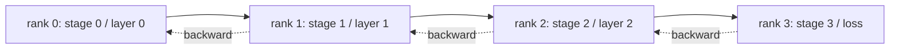

# Pipeline Parallel and Bubble Analysis

> Tensor parallelism splits a matrix across ranks. Pipeline parallelism splits a model across ranks, one stage per rank. Microbatches flow through the pipeline. The empty time at the start and end is the bubble; minimizing it is the whole craft.

**Type:** Capstone
**Languages:** Python
**Prerequisites:** Phase 19 Lessons 42-49 Track C
**Time:** ~90 min

## Learning Objectives

- Partition a sequential model into N stages and simulate a forward pipeline across N ranks.
- Schedule M microbatches across the pipeline using the GPipe schedule (all forward, then all backward) and compute the bubble fraction.
- Compare the bubble to the interleaved 1F1B schedule used in Megatron-LM and PipeDream.
- Defend stage assignment: equal compute per stage matters more than equal parameters per stage.

## The Problem

A 70B parameter model in FP16 takes 140GB for parameters alone. No single consumer GPU holds that. ZeRO-3 shards parameters across ranks, but still needs every rank to gather the full layer for every forward pass, paying log(N) hops per layer. Pipeline parallelism takes a different route: slice the model into N stages and put one stage on each rank. Rank 0 runs layer 1 and passes the activation tensor to rank 1; rank 1 runs layer 2 and hands to rank 2; and so on. The backward pass flows in reverse. Memory drops linearly because each rank only holds one stage; compute is sequential, which is the bubble problem.

The bubble is the idle time at the start of the pipeline (waiting for the first microbatch to reach the last stage) and at the end (waiting for the last microbatch to flow backward). With M microbatches and N stages, the bubble fraction per stage is (N-1)/(M+N-1). At M=8, N=4, that is 27%. At M=64, N=4, it is 4.5%. The bubble shrinks when you have many microbatches per step, which implies small batch sizes per microbatch, a constraint that affects microbatch design.

## The Concept



### The GPipe Schedule

Fill the forward pipeline with all M microbatches before starting the backward pass; then drain backward in reverse. Activations from every microbatch must be held until its backward pass, so memory scales linearly with M. The forward pass takes M+N-1 cycles, the backward takes another M+N-1 cycles. Useful work per stage is 2M cycles; the bubble per stage is 2(N-1) cycles. The bubble fraction is (N-1)/(M+N-1) when every forward and backward pass takes one unit of time. Picking an M much larger than N hides the bubble.

### The 1F1B Schedule

Interleave: as soon as a forward microbatch reaches the last stage, start its backward pass and let it flow back. The schedule alternates one forward and one backward per stage. The bubble is still N-1, but activation memory is bounded by pipeline depth, not microbatch count. Production pipelines use 1F1B (Megatron, PipeDream). The lesson implements GPipe first because it's simpler, and leaves 1F1B as an exercise.

### Why Equal Compute Per Stage Matters

If stage 0 takes 50ms and stage 1 takes 100ms, every cycle is gated by stage 1. The other stages sit idle for 50ms per cycle waiting for stage 1 to free up. Equal parameter count is the wrong axis: transformer compute is dominated by attention plus MLP per layer, but embedding layers have many parameters with little compute. Stage assignment should balance FLOPs per stage, not weights per stage.

### Microbatch vs Batch

The pipeline passes M microbatches of size B each. The effective batch size is M*B. The gradient at the end of the pipeline step is the gradient over M*B combined examples. The bubble fraction depends on M; the optimizer sees M*B. Tuning M means trading bubble (lower at high M) against memory per microbatch (higher activation memory at high M for GPipe).

## Build It

`code/main.py` implements:

- `PipelineStage`: a small `nn.Module` that holds parameters for one stage and exposes `forward(activation)`.
- `Pipeline(stages, num_microbatches)`: orchestrates the GPipe schedule across simulated stages using a simulated wall-clock per stage.
- `bubble_fraction(num_stages, num_microbatches)`: the closed form (N-1)/(M+N-1).
- A 4-stage demo that prints the trace per microbatch and the measured bubble fraction.

Run it:

```bash
python3 code/main.py
```

Output: a Gantt chart by microbatch and the bubble percentage vs the closed-form prediction.

## Production Patterns in the Wild

Three patterns harden pipeline parallel to ship.

**Activation checkpointing pairs with pipeline.** For M microbatches in flight on GPipe, activation memory is M times one microbatch. Activation checkpointing recomputes the forward pass during backward, trading compute for memory; the combination makes pipeline feasible for long sequences.

**Stage balance is measured, not assumed.** Production teams run a profiling pass that measures the actual compute per layer (FLOPs and wall-clock) on target hardware, then partition by that measurement. The Megatron-LM `--num-layers-per-stage` flag accepts a list to allow uneven layer counts when stages have different layer costs.

**Send-receive schedules must avoid deadlock.** A pipeline where every stage sends before it receives deadlocks on the wire. The standard fix is interleaving: even-rank stages send then receive, odd-rank stages receive then send. The lesson's schedule is explicitly ordered so the pattern is visible.

## Use It

Production patterns:

- **Megatron-LM.** The reference for pipeline parallel at scale. Uses 1F1B and supports tensor + pipeline + data parallel composition.
- **DeepSpeed Pipeline.** Integrates with ZeRO; ZeRO-1 + pipeline is a common combination for the largest open models.
- **PyTorch PiPPy.** Native pipeline wrapper for PyTorch, built on `torch.distributed.pipeline.sync.Pipe`.

## Ship It

Lesson 80 stores per-stage parameter shards in a sharded checkpoint. Lesson 81 composes DDP + ZeRO + pipeline into an end-to-end demo (in spirit; in the demo, pipeline is simulated at runtime).

## Exercises

1. Implement 1F1B and verify the bubble fraction matches GPipe but activation memory is bounded.
2. Propose real per-stage times on a deeper model and rebalance the stages using the wall-clock measure.
3. Add gradient accumulation across the pipeline microbatches and verify the gradient equals the equivalent full-batch forward pass gradient.
4. Combine pipeline with activation checkpointing and measure the memory drop vs the compute overhead.
5. Combine pipeline with DDP (each pipeline rank is replicated in a data parallel group) and justify the 2D schedule.

## Key Terms

| Term | What People Say | What It Actually Means |
|------|----------------|--------------------------------------|
| Pipeline | "Depth-parallel model" | One stage per rank, activations pass stage to stage |
| Bubble | "Pipeline idle time" | The (N-1) steps at start + end where some stages have no work |
| Microbatch | "Batch slice" | One forward/backward unit; bubble shrinks as M grows |
| GPipe | "Fill then drain" | All M forward before any backward; high activation memory |
| 1F1B | "Interleaved schedule" | One forward, one backward per stage; bounded activation memory |

## Further Reading

- [Huang et al., GPipe: Efficient Training of Giant Neural Networks](https://arxiv.org/abs/1811.06965)
- [Narayanan et al., PipeDream: Generalized Pipeline Parallelism for DNN Training](https://arxiv.org/abs/1806.03377)
- [Megatron-LM Pipeline Parallel documentation](https://github.com/NVIDIA/Megatron-LM)
- Phase 19 Lesson 76 - the send/recv primitives the schedule uses
- Phase 19 Lesson 78 - ZeRO is orthogonal to pipeline and often combined
