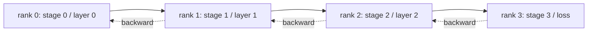

# Analiza równoległa rurociągu i bąbelkowa

> Równoległość tensorowa dzieli macierz na szeregi. Równoległość potoku dzieli model na rangi, po jednym etapie na rangę. Mikropartie przepływają rurociągiem. Pusty czas na początku i na końcu to bańka; minimalizowanie tego to całe rzemiosło.

**Typ:** Kompilacja
**Języki:** Python
**Wymagania wstępne:** Faza 19, lekcje 42-49, ścieżka C
**Czas:** ~90 min

## Cele nauczania

- Podziel model sekwencyjny na N etapów i zasymuluj potok w przód przez N rang.
- Zaplanuj M mikropartów w rurociągu, korzystając z harmonogramu GPipe (napełnianie tylko do przodu, następnie do tyłu) i oblicz frakcję pęcherzyków.
- Porównaj bańkę z przeplatanym harmonogramem 1F1B używanym w Megatron-LM i PipeDream.
- Broń przypisania etapów: równe obliczenia na etap mają większe znaczenie niż równa liczba parametrów na etap.

## Problem

Model z parametrami 70B w FP16 wymaga samych 140 GB parametrów. Żaden konsumencki procesor graficzny tego nie wytrzyma. ZeRO-3 dzieli parametry na kolejne rangi, ale nadal potrzebuje każdej rangi, aby zebrać pełną warstwę dla każdego kroku do przodu, płacąc log(N) przeskoków na warstwę. Równoległość rurociągu przebiega inną trasą: podziel model na N etapów i umieść po jednym etapie w każdym rzędzie. Przejście warstwy 1 kończy się na poziomie 0 i przekazuje tensor aktywacji do poziomu 1; ranga 1 obejmuje warstwę 2 i ręce do rangi 2; i tak dalej. Wstecz płynie w odwrotnym kierunku. Pamięć spada liniowo, ponieważ każda ranga zawiera tylko jeden etap; obliczenia są sekwencyjne, co jest problemem bąbelkowym.

Bąbelek to czas bezczynności na początku rurociągu (oczekiwanie, aż pierwsza mikropartia dotrze do ostatniego etapu) i na końcu (oczekiwanie, aż ostatnia mikropartia ponownie spłynie). W przypadku M mikropartii i N etapów frakcja pęcherzyków na etap wynosi (N-1)/(M+N-1). Przy M=8, N=4 czyli 27%. Przy M=64, N=4 wynosi to 4,5%. Pęcherzyk kurczy się, gdy na krok przypada wiele mikropartii, co oznacza małe rozmiary partii na mikropartię, co jest ograniczeniem wpływającym na projektowanie mikropartii.

## Koncepcja



### Harmonogram GPipe

Napełnij rurociąg do przodu wszystkimi M mikropartiami przed rozpoczęciem cofania; następnie spuść wodę w odwrotnej kolejności. Aktywacje z każdej mikropartii muszą być wstrzymane aż do jej cofnięcia, więc pamięć rośnie liniowo wraz z M. W przód zajmuje cykle M+N-1, w tył kolejne cykle M+N-1. Użyteczna praca na etap to 2 miliony cykli; bańka na etap wynosi 2 (N-1) cykli. Frakcja bąbelkowa wynosi (N-1)/(M+N-1), gdy każde przejście do przodu i do tyłu zajmuje jedną jednostkę czasu. Wybranie M znacznie większego niż N powoduje ukrycie bańki.

### Harmonogram 1F1B

Przeplataj: gdy tylko mikropartia do przodu osiągnie ostatni etap, rozpocznij jej cofanie i pozwól, aby przepływała z powrotem. Harmonogram zmienia się jeden do przodu i jeden do tyłu na każdym etapie. Bąbelek nadal ma wartość N-1, ale pamięć aktywacyjna jest ograniczona głębokością rurociągu, a nie liczbą mikropartii. Rurociągi produkcyjne wykorzystują 1F1B (Megatron, PipeDream). W lekcji najpierw zaimplementowano GPipe, ponieważ jest to prostsze, a 1F1B jako ćwiczenie.

### Dlaczego równe obliczenia na każdym etapie mają znaczenie

Jeżeli stopień 0 trwa 50 ms, a stopień 1 100 ms, każdy cykl jest bramkowany na stopniu 1. Pozostałe stopnie pozostają bezczynne przez 50 ms na cykl w oczekiwaniu na zwolnienie stopnia 1. Równa liczba parametrów to zła oś: w obliczeniach transformatora dominuje uwaga plus MLP na warstwę, a warstwy osadzające mają wiele parametrów, ale niewiele obliczeń. Przydział etapów powinien wyrównywać liczbę FLOPów na etap, a nie wagi na etap.

### Mikropartia kontra partia

Rurociąg przepuszcza M mikropartii o rozmiarze B każda. Efektywna wielkość partii to M*B. Gradient na końcu etapu potoku jest gradientem w połączonych przykładach M*B. Frakcja pęcherzykowa zależy od M; optymalizator widzi M*B. Strojenie M oznacza handel bańką (niższą przy wysokim M) w stosunku do pamięci na mikropartię (wyższa pamięć aktywacji przy wysokim M dla GPipe).

## Zbuduj to

`code/main.py` implementuje:

- `PipelineStage`: mały `nn.Module`, który przechowuje parametry jednego etapu i udostępnia `forward(activation)`.
- `Pipeline(stages, num_microbatches)`: organizuje harmonogram GPipe na symulowanych scenach, używając symulowanego zegara ściennego na każdym etapie.
- `bubble_fraction(num_stages, num_microbatches)`: forma zamknięta (N-1)/(M+N-1).
- 4-etapowe demo, które drukuje ślad dla mikropartii i zmierzoną frakcję pęcherzyków.

Uruchom to:

```bash
python3 code/main.py
```

Dane wyjściowe: wykres Gantta według mikropartii i procent bąbelków w porównaniu z prognozą w formie zamkniętej.

## Wzorce produkcji na wolności

Trzy wzory utwardzają rurociąg równolegle, aby można go było wysłać.

**Punkt kontrolny aktywacji łączy się z potokiem.** W przypadku M mikropartii przesyłanych na GPipe, pamięć aktywacji jest M razy jedna mikropartia. Punkt kontrolny aktywacji ponownie oblicza czas do przodu i do tyłu, zamieniając obliczenia na pamięć; ta kombinacja sprawia, że ​​potok jest wykonalny w przypadku długich sekwencji.

**Równowaga etapów jest mierzona, a nie zakładana.** Zespoły produkcyjne przeprowadzają przebieg profilowania, który mierzy rzeczywistą moc obliczeniową na warstwę (FLOP i zegar ścienny) na docelowym sprzęcie, a następnie dzieli według tego pomiaru. Flaga Megatron-LM `--num-layers-per-stage` akceptuje listę umożliwiającą nierówne liczenie warstw, gdy etapy mają inny koszt warstwy.

**Harmonogram odbioru wysyłania musi unikać zakleszczenia.** Potok, w którym każdy etap jest wysyłany przed odebraniem, powoduje zakleszczenie na kablu. Standardową poprawką jest przeplatanie: etapy o randze parzystej wysyłają najpierw, a następnie odbierają, najpierw odbierają etapy o randze nieparzystej, a następnie wysyłają. Plany lekcji są wyraźnie uporządkowane, więc wzór jest widoczny.

## Użyj tego

Wzory produkcyjne:

- **Megatron-LM.** Odniesienie dla rurociągu równoległego w skali. Używa 1F1B i obsługuje połączenie tensora + potoku + danych równoległych.
- **DeepSpeed ​​Pipeline.** Integruje się z ZeRO; Rurociąg ZeRO-1 + to częsta kombinacja dla największych modeli otwartych.
- **PyTorch Pipe.** Natywne opakowanie potoku dla PyTorch, zbudowane na `torch.distributed.pipeline.sync.Pipe`.

## Wyślij to

Lekcja 80 przechowuje fragmenty parametrów poszczególnych etapów w podzielonym punkcie kontrolnym. Lekcja 81 komponuje potok DDP + ZeRO + w kompleksowej wersji demonstracyjnej (w duchu; w wersji demonstracyjnej potok jest symulowany w czasie wykonywania).

## Ćwiczenia

1. Zaimplementuj 1F1B i sprawdź, czy frakcja bąbelków odpowiada GPipe, ale pamięć aktywacyjna jest ograniczona.
2. Zaproponuj rzeczywisty czas przypadający na etap na głębszym modelu i ponownie zrównoważ etapy za pomocą mierzonego zegarem ściennym.
3. Dodaj akumulację gradientu w mikropartiach rurociągu i sprawdź, czy gradient jest równy gradientowi równoważnej pełnej partii w przód.
4. Połącz potok z punktem kontrolnym aktywacji i zmierz spadek pamięci w porównaniu z kosztem obliczeń.
5. Połącz potok z DDP (każda ranga potoku jest replikowana w grupie równoległej danych) i uzasadnij harmonogram 2D.

## Kluczowe terminy

| Termin | Co ludzie mówią | Co to właściwie oznacza |
|------|----------------|--------------------------------------|
| Rurociąg | „Model równoległy na głębokość” | Jeden etap na rangę, aktywacje przechodzą od etapu do etapu |
| Bańka | „Czas przestoju rurociągu” | (N-1) kroki na początku + na końcu, gdzie na niektórych etapach nie ma pracy |
| Mikropartia | „Kawałek partii” | Jedna jednostka do przodu/do tyłu; bańka kurczy się wraz ze wzrostem M |
| GPipe | „Napełnij, a następnie opróżnij” | Wszystkie M do przodu przed jakimkolwiek powrotem; wysoka pamięć aktywacji |
| 1F1B | „Harmonogram przeplatany” | Jeden do przodu, jeden do tyłu na stopień; ograniczona pamięć aktywacji |

## Dalsze czytanie

- [Huang i in., GPipe: Efficient Training of Giant Neural Networks](https://arxiv.org/abs/1811.06965)
- [Narayanan i in., PipeDream: Generalized Pipeline Parallelism for DNN Training](https://arxiv.org/abs/1806.03377)
- [Dokumentacja równoległa rurociągu Megatron-LM](https://github.com/NVIDIA/Megatron-LM)
- Faza 19, Lekcja 76 - operacje podstawowe wysyłania/odbierania, których używa harmonogram
- Faza 19, Lekcja 78 - ZeRO jest prostopadłe do rurociągu i często połączone