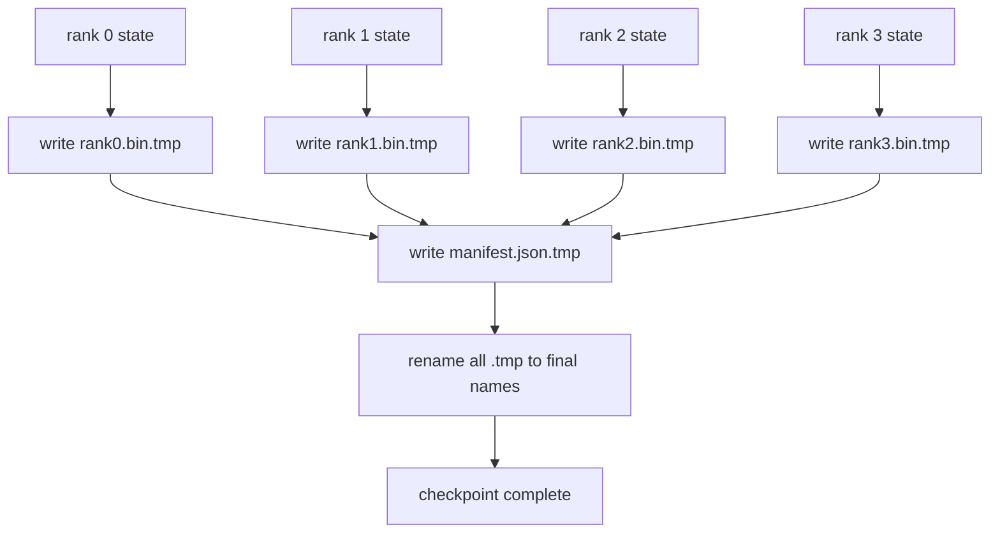

# Sharded Checkpoint and Atomic Resume

> A 70B parameter training job pauses every few hours due to node failure. The checkpoint format decides whether you lose 30 minutes or 30 hours. A sharded checkpoint writes each rank's shard in parallel and records ownership in a manifest. Resume loads each rank's shard from its own file, reconstructs state on the same world size, and the optimizer steps as if nothing happened. Atomic write protects a half-finished checkpoint from poisoning the next resume.

**Type:** Capstone
**Languages:** Python
**Prerequisites:** Phase 19 Lessons 42-49 Track C
**Time:** ~90 min

## Learning Objectives

- Save a multi-rank checkpoint as a per-rank shard file plus a manifest recording which rank owns what.
- Use the atomic write pattern (write to temp path, then rename) so a crash during write never leaves a half-finished checkpoint.
- Resume from the manifest, verifying byte-for-byte state equality for both fp16 params and ZeRO optimizer state on each rank.
- Defend the manifest schema against three failure modes: world size change, shard count mismatch, and partial write.

## The Problem

A vanilla checkpoint reads all parameters and optimizer state to rank 0, gathers it, and writes a single file. For a 70B model, that is 1.1TB of state through one rank's network port. The write blocks every other rank as they idle waiting for gather. The I/O throughput is the slowest single-GPU network link, not the sum. On a real cluster, the gather-and-write step can take longer than the previous hour of training, meaning the job ships less than one checkpoint per training day.

Sharded checkpoints invert the pattern: every rank writes its own shard to its own file in parallel. A manifest records which rank has what, and which shard resumes where. Aggregate write bandwidth scales with the cluster. A 1TB checkpoint that took 4 hours on one rank takes 4 minutes on 64 ranks. Moreover, the manifest provides a contract against incompatible resumes: a world-size change is detectable, partial writes are detectable, and the load path can fail loudly rather than silently using stale data.

## The Concept



### The Manifest Schema

```json
{
  "world_size": 4,
  "step": 1234,
  "wall_clock_seconds": 4521,
  "shards": [
    {"rank": 0, "path": "rank0.bin", "sha256": "...", "param_shard_offset": 0, "param_shard_numel": 65536},
    {"rank": 1, "path": "rank1.bin", "sha256": "...", "param_shard_offset": 65536, "param_shard_numel": 65536}
  ],
  "schema_version": 1
}
```

Three fields are load-bearing. `world_size` makes a resume on a different size fail loudly instead of silently corrupting. `sha256` per shard catches partial or corrupted writes. `param_shard_offset` and `param_shard_numel` per shard let the loader reconstruct a flat parameter tensor in the right position.

### Atomic Write

The standard pattern: write each shard to `<name>.tmp`, write manifest to `manifest.json.tmp`, fsync each, then rename. A POSIX rename on the same filesystem is atomic; either the new file is fully present or the old one is. A crash before the final rename leaves the previous checkpoint as the active one. Without an atomic write, a crash can leave a partial shard with a current manifest pointing at it, and the load corrupts the optimizer state on resume.

### Three Failure Modes the Schema Must Defend Against

| Failure | Symptom | Defense |
|--------|---------|--------|
| World size change | resume on N=8 with N=4 manifest | world_size mismatch in manifest, fail loudly |
| Shard count mismatch | resume sees fewer rank*.bin files than shards in manifest | enumerate shards, verify each exists |
| Partial write | shard file truncated mid-flush | sha256 verification on load |

Every defense rejects a bad load early; the alternative is silent corruption that reveals itself 100 steps later when the loss goes to NaN.

### Why Per-Rank Files Instead of One Big File

Concurrent write to a single file via `O_APPEND` works in POSIX for byte-aligned writes, but in practice, offset-within-a-single-file over MB-sized regions dominates and blocks. Per-rank files have no contention and benefit from striping when the underlying filesystem is parallel (Lustre, GPFS). All production stacks (DeepSpeed, FSDP, NeMo) use per-rank files for this reason.

## Build It

`code/main.py` implements:

- `ShardManifest` dataclass with the schema above plus `to_json`/`from_json`.
- `save_sharded(state_dict_per_rank, dir, step)` which writes the binary state of each rank to its own file using the temp-then-rename atomic pattern, then writes the manifest.
- `load_sharded(dir, expected_world_size)` which reads the manifest, verifies the sha256 of each shard, and returns the per-rank state dicts.
- A round-trip test: build per-rank state, save, load, assert byte equality.

Run it:

```bash
python3 code/main.py
```

Output: 4 shard files and a manifest written, then reloaded with byte-equality verification.

## Production Patterns in the Wild

Three patterns harden a checkpoint enough to ship.

**Async write.** Production stacks issue the checkpoint write in a separate thread or process so training continues. The barrier is at the next checkpoint: do not start the next write until the previous one completes. The DeepSpeed `async_io` flag does exactly this. The lesson keeps the write synchronous so the steps are visible.

**Local fast disk then async upload.** Write to local NVMe (fast), then async upload to S3 or GCS. The two-tier pattern enables fast resume from a checkpoint within the cluster and ships a durable copy out of the cluster for archive. The manifest tracks the local path; the upload manifest tracks the remote path.

**Rotation matters.** Production runs keep the last K checkpoints (usually 3-5) and rotate the oldest out. Without rotation, the disk fills mid-run and the next checkpoint fails. Rotation on the next write deletes the oldest first to clear budget.

## Use It

Production patterns:

- **DeepSpeed Checkpoints.** `deepspeed.save_checkpoint(tag=step)` writes per-rank files and a `latest` file pointing to the active tag.
- **PyTorch FSDP Checkpoints.** `torch.distributed.checkpoint` writes sharded state via a `Planner` that decides the per-rank layout.
- **NeMo.** Wraps DeepSpeed and FSDP with a unified `save_to_checkpoint` API that adds metadata.

## Ship It

Lesson 81 saves a sharded checkpoint of the end-to-end DDP+ZeRO run and reloads it on the same world size to prove the resume contract holds.

## Exercises

1. Add async write: kick off the save in a thread and let the training proceed. Block the next save until the previous finishes.
2. Add a `last_5_steps` rotation: keep the last 5 checkpoints, delete the oldest before writing the new one.
3. Add a CRC-only fast verification path for inner-loop reloads (rotation makes the checkpoint the new active without a full sha256).
4. Add cross-world-size load: balance a shard from N=4 to N=8 by reading the manifest, concatenating, and re-sharding.
5. Add a mock S3 upload (a second directory) and write the upload manifest. Defend the two-tier storage policy.

## Key Terms

| Term | What People Say | What It Actually Means |
|------|----------------|--------------------------------------|
| Sharded checkpoint | "Save-by-rank" | Each rank writes its own shard file in parallel |
| Manifest | "Index" | JSON file recording shard paths, offsets, and sha256 |
| Atomic write | "tmp then rename" | Write to .tmp then POSIX rename so a crash leaves previous file active |
| Partial write | "Truncated shard" | A crash during write corrupts the shard; sha256 catches it |
| Rotation | "Keep last K" | Delete the oldest checkpoint before saving a new one to bound disk use |

## Further Reading

- [DeepSpeed Checkpointing](https://www.deepspeed.ai/tutorials/checkpointing/)
- [PyTorch torch.distributed.checkpoint](https://pytorch.org/docs/stable/distributed.checkpoint.html)
- [POSIX rename atomicity](https://pubs.opengroup.org/onlinepubs/9699919799/functions/rename.html)
- Phase 19 Lesson 78 - ZeRO state that this checkpoint needs to save
- Phase 19 Lesson 81 - the end-to-end demo proves the saved state
