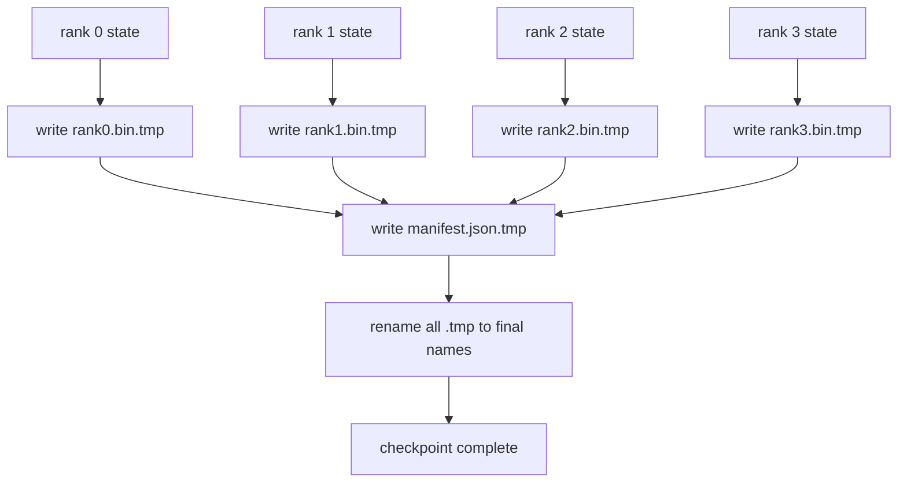

# Rozdrobniony punkt kontrolny i atomowe wznowienie

> Zadanie uczenia parametrów 70B jest wstrzymywane co kilka godzin z powodu awarii węzła. Format punktu kontrolnego decyduje, czy stracisz 30 minut, czy 30 godzin. Podzielony punkt kontrolny zapisuje równolegle fragment każdej rangi i rejestruje własność w manifeście. Resume ładuje fragment każdej rangi z własnego pliku, rekonstruuje stan na tym samym rozmiarze świata, a optymalizator wykonuje kroki tak, jakby nic się nie stało. Zapis atomowy chroni na wpół ukończony punkt kontrolny przed zatruciem następnego CV.

**Typ:** Kompilacja
**Języki:** Python
**Wymagania wstępne:** Faza 19, lekcje 42-49, ścieżka C
**Czas:** ~90 min

## Cele nauczania

- Zapisz punkt kontrolny z wieloma rangami jako plik fragmentu poszczególnych rang oraz manifest rejestrujący, która ranga jest właścicielem czego.
- Użyj atomowego wzorca zapisu (zapisz do ścieżki tymczasowej, a następnie zmień nazwę), aby awaria podczas zapisu nigdy nie powodowała powstania w połowie ukończonego punktu kontrolnego.
- Wznów pracę z manifestu, weryfikując stan równości bajtów dla obu parametrów fp16 i stanu optymalizatora ZeRO na każdej pozycji.
- Chroń schemat manifestu przed trzema trybami awarii: zmianą wielkości światowej, niezgodnością liczby fragmentów i częściowym zapisem.

## Problem

Waniliowy punkt kontrolny odczytuje wszystkie parametry i stan optymalizatora do rangi 0, gromadzi i zapisuje pojedynczy plik. Dla modelu 70B jest to 1,1 TB stanu przez port sieciowy jednej rangi. Zapis blokuje każdą inną rangę, ponieważ są one bezczynne i czekają na zebranie. Przepustowość wejścia/wyjścia to najwolniejsze łącze sieciowe pojedynczego procesora graficznego, a nie suma. W prawdziwym klastrze etap gromadzenia i zapisu może trwać dłużej niż poprzednia godzina szkolenia, co oznacza, że ​​zadanie wysyła mniej niż jeden punkt kontrolny na dzień szkolenia.

Podzielone punkty kontrolne odwracają schemat: każda ranga zapisuje równolegle swój własny fragment do własnego pliku. Rekordy manifestu, które mają rangę i który odłamek jest wznawiany, mogą przywrócić każdy odłamek tam, skąd pochodzi. Zagregowana przepustowość zapisu skaluje się wraz z klastrem. Punkt kontrolny o rozmiarze 1 TB, który trwał 4 godziny w przypadku jednej rangi, zajmuje 4 minuty w przypadku 64 rang. Ponadto manifest zawiera umowę na niezgodne życiorysy: wykrywalna jest zmiana na skalę światową, wykrywalne są częściowe zapisy, a ścieżka ładowania może zawieść głośno, a nie cicho, wykorzystując nieaktualne dane.

## Koncepcja



### Schemat manifestu

```json
{
  "world_size": 4,
  "step": 1234,
  "wall_clock_seconds": 4521,
  "shards": [
    {"rank": 0, "path": "rank0.bin", "sha256": "...", "param_shard_offset": 0, "param_shard_numel": 65536},
    {"rank": 1, "path": "rank1.bin", "sha256": "...", "param_shard_offset": 65536, "param_shard_numel": 65536}
  ],
  "schema_version": 1
}
```

Trzy pola są nośne. `world_size` powoduje, że CV w innym rozmiarze kończy się głośnym niepowodzeniem, a nie dyskretnym uszkodzeniem. `sha256` na fragment przechwytuje częściowe lub uszkodzone zapisy. `param_shard_offset` i `param_shard_numel` na fragment pozwalają modułowi ładującemu zrekonstruować tensor parametrów płaskich we właściwym położeniu.

### Zapis atomowy

Standardowy wzorzec: zapisz każdy fragment do `<name>.tmp`, zapisz manifest do `manifest.json.tmp`, fsync każdy, a następnie zmień nazwę. Zmiana nazwy POSIX w tym samym systemie plików jest niepodzielna; albo nowy plik jest w pełni obecny, albo stary. Awaria przed ostateczną zmianą nazwy powoduje opuszczenie poprzedniego punktu kontrolnego jako aktywnego. Bez zapisu atomowego awaria może pozostawić częściowy fragment z obecnym manifestem, który na niego wskazuje, a obciążenie psuje stan optymalizatora po wznowieniu.

### Trzy tryby awarii, przed którymi schemat musi się bronić

| Porażka | Objaw | Obrona |
|--------|---------|--------|
| Zmiana wielkości świata | wznowić na N=8 z manifestem z N=4 | niezgodność wielkości_świata w manifeście, głośny błąd |
| Niezgodność liczby odłamków | CV widzi mniej plików rang*.bin niż fragmentów w manifeście | wylicz fragmenty, sprawdź, czy każdy istnieje |
| Częściowy zapis | plik fragmentu obcięty w połowie koloru | weryfikacja sha256 przy obciążeniu |

Każda obrona wcześnie odrzuca złe obciążenie; alternatywą jest cicha korupcja, która ujawnia się 100 kroków później, gdy strata trafia do NaN.

### Dlaczego pliki według rang, a nie jeden duży plik

Współbieżny zapis do jednego pliku poprzez `O_APPEND` działa w POSIX w przypadku zapisów wyrównanych do bajtów, ale w praktyce dominuje przesunięcie w obrębie jednego fragmentu obejmującego regiony o rozmiarze MB i blokowanie. Pliki według rang nie mają sobie równych i korzystają z rozłożenia, gdy bazowy system plików jest równoległy (Lustre, GPFS). Z tego powodu wszystkie stosy produkcyjne (DeepSpeed, FSDP, NeMo) korzystają z plików według rang.

## Zbuduj to

`code/main.py` implementuje:

- `ShardManifest` klasa danych z powyższym schematem plus `to_json`/`from_json`.
- `save_sharded(state_dict_per_rank, dir, step)`, który zapisuje stan binarny każdej rangi do własnego pliku przy użyciu atomowego wzorca temp-then-rename, a następnie zapisuje manifest.
- `load_sharded(dir, expected_world_size)`, który odczytuje manifest, weryfikuje sha256 każdego fragmentu i zwraca wskazania stanu według rang.
- Test w obie strony: budowanie stanu według rangi, zapisywanie, ładowanie, potwierdzanie równości bajtów.

Uruchom to:

```bash
python3 code/main.py
```

Dane wyjściowe: 4 pliki fragmentów i zapisany manifest, a następnie ponownie załadowane z weryfikacją równości bajtów.

## Wzorce produkcji na wolności

Trzy wzory wzmacniają punkt kontrolny na tyle, że można go wysłać.

**Zapis asynchroniczny.** Stosy produkcyjne wydają zapis w punkcie kontrolnym w oddzielnym wątku lub procesie, więc szkolenie jest kontynuowane. Bariera znajduje się w następnym punkcie kontrolnym: nie rozpoczynaj kolejnego zapisu, dopóki poprzedni nie zostanie ukończony. Flaga `async_io` DeepSpeed ​​robi dokładnie to. Lekcja zapewnia synchronizację zapisu, dzięki czemu kroki są widoczne.

**Najpierw lokalny szybki dysk, potem przesyłanie asynchroniczne.** Zapis do lokalnego NVMe (szybko), a następnie przesyłanie asynchroniczne do S3 lub GCS. Dwupoziomowy wzorzec umożliwia szybkie wznowienie punktu kontrolnego w klastrze i wysyłanie trwałej kopii poza klaster do archiwum. Manifest prowadzi ścieżkę lokalną; manifest przesyłania zawiera ścieżkę zdalną.

**Rotacja ma znaczenie.** W seriach produkcyjnych utrzymuje się K ostatnich punktów kontrolnych (zwykle 3–5) i obraca się najstarsze. Bez rotacji dysk zapełnia się w połowie i następny punkt kontrolny kończy się niepowodzeniem. Rotacja przy następnym zapisie usuwa najpierw najstarsze, uwalniając budżet.

## Użyj tego

Wzory produkcyjne:

- **Punkty kontrolne DeepSpeed.** `deepspeed.save_checkpoint(tag=step)` zapisuje pliki według rang i plik `latest` wskazujący na aktywny tag.
- **Punkty kontrolne PyTorch FSDP.** `torch.distributed.checkpoint` zapisuje stan fragmentacji za pomocą `Planner`, który decyduje o układzie według rang.
- **NeMo.** Łączy DeepSpeed ​​i FSDP z jednolitym interfejsem API `save_to_checkpoint`, który dodaje metadane.

## Wyślij to

Lekcja 81 zapisuje podzielony punkt kontrolny kompleksowego przebiegu DDP+ZeRO i ładuje go ponownie w tym samym rozmiarze świata, aby udowodnić, że kontrakt wznowienia jest ważny.

## Ćwiczenia

1. Dodaj zapis asynchroniczny: rozpocznij zapisywanie w wątku i pozwól, aby uczenie było kontynuowane. Zablokuj następny zapis do czasu zakończenia poprzedniego.
2. Dodaj rotację `last_5_steps`: zachowaj 5 ostatnich punktów kontrolnych, usuń najstarszy przed zapisaniem nowego.
3. Dodaj szybką ścieżkę weryfikacji zawierającą tylko CRC dla przeładowania pętli wewnętrznej (obrót powoduje zmianę punktu kontrolnego na nowy aktywny bez pełnego sha256).
4. Dodaj obciążenie o rozmiarach obejmujących różne światy: zrównoważenie fragmentu z N=4 do N=8 poprzez odczytanie manifestu, połączenie i ponowne podzielenie na fragmenty.
5. Dodaj plik do fałszywego S3 (drugi katalog) i zapisz manifest przesyłania. Broń dwupoziomowej polityki przechowywania.

## Kluczowe terminy

| Termin | Co ludzie mówią | Co to właściwie oznacza |
|------|----------------|--------------------------------------|
| Rozdrobniony punkt kontrolny | „Oszczędność według rangi” | Każda ranga zapisuje równolegle swój własny plik fragmentu |
| Manifest | „Indeks” | Plik JSON rejestrujący ścieżki fragmentów, przesunięcia i sha256 |
| Zapis atomowy | „tmp, a następnie zmień nazwę” | Zapisz do .tmp, a następnie zmień nazwę POSIX, aby awaria pozostawiła poprzedni plik aktywny |
| Częściowy zapis | „Obcięty fragment” | Awaria podczas zapisu powoduje uszkodzenie fragmentu; sha256 łapie |
| Obrót | „Zachowaj ostatnie K” | Usuń najstarszy punkt kontrolny przed zapisaniem nowego, aby ograniczyć wykorzystanie dysku |

## Dalsze czytanie

- [Punkty kontrolne DeepSpeed](https://www.deepspeed.ai/tutorials/checkpointing/)
- [PyTorch torch.distributed.checkpoint](https://pytorch.org/docs/stable/distributed.checkpoint.html)
- [POSIX zmień nazwę atomowości](https://pubs.opengroup.org/onlinepubs/9699919799/functions/rename.html)
- Faza 19 Lekcja 78 - Stan ZeRO, który ten punkt kontrolny ma zapisać
- Faza 19, Lekcja 81 - kompleksowe demo przedstawia zapisany stan