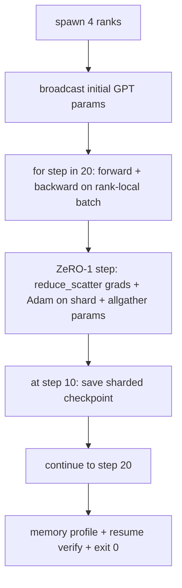

# End-to-End Distributed Training

> Lessons 76 through 80 built one piece each. Here is the ensemble: a small GPT trained on 4 simulated ranks with DDP for gradient sync, ZeRO-1 for optimizer state sharding, and a sharded checkpoint halfway through. The demo runs 20 steps, self-terminates, prints the loss curve alongside the memory profile, and saves a resumable checkpoint.

**Type:** Capstone
**Languages:** Python
**Prerequisites:** Phase 19 Lessons 42-49 Track C
**Time:** ~90 min

## Learning Objectives

- Compose DDP (Lesson 77) plus ZeRO-1 (Lesson 78) plus sharded checkpoints (Lesson 80) into a single training loop.
- Train a 2-layer transformer language model on a small synthetic corpus for 20 steps across 4 simulated ranks.
- Print a loss table per step, a memory profile per rank, and a checkpoint manifest that resumes byte-for-byte equal on the same world size.
- Defend the composition: each piece is independently testable in earlier lessons, and this lesson proves they compose.

## The Problem

The capstone is proof that the pieces fit. Lesson 76 implemented the collectives. Lesson 77 wrapped them in DDP. Lesson 78 sharded optimizer state via reduce_scatter. Lesson 79 analyzed the pipeline. Lesson 80 saved a sharded checkpoint. Every lesson had its own test. A real training run uses all the primitives at once; if the composition is flawed, the loss diverges, the checkpoint refuses to resume, or memory per rank grows when it should shrink.

This lesson builds the end-to-end demo and verifies four invariants: (a) loss drops monotonically over 20 steps within float noise, (b) every rank holds the exact same parameter norm at every step, (c) optimizer memory per rank matches the ZeRO-1 formula 12P/N bytes, and (d) a checkpoint at step 10 reloads byte-for-byte equal on restart. The demo self-terminates: 20 steps, a single command, exit 0.

## The Concept



### The Mini GPT

The model is intentionally tiny: 2 transformer blocks, embed dim 32, 4 attention heads, vocab 64, sequence length 16, batch 4. A few thousand parameters. Big enough to hit every wiring decision (multi-head attention runs the standard masked path; LayerNorm has weights to sync; the LM head is a separate linear projection back to vocab). Small enough that 20 steps on 4 CPU ranks finish in seconds.

### The Composition Rules

| Lesson Piece | What It Owns | What It Leaves to the Loop |
|-------------|-------------|----------------------------|
| DDP Broadcast | Initial parameter synchronization | One call at construction |
| ZeRO-1 Step | Gradient sync, master copy update, parameter broadcast | One call per step replacing optimizer.step |
| Sharded Checkpoint | Persist per-rank state, manifest with sha256 | Called on rank 0 with state gathered via allgather |
| Training Loop | Forward, backward, loss logging | Calls the three above in sequence |

The loop does not know about reduce_scatter or rendezvous files. The ZeRO and Checkpoint modules expose narrow interfaces that the loop calls.

### Why a Mini GPT and Not Just MLP

The MLP in Lesson 77 was enough to verify gradient sync. A mini GPT adds three things: a separate LM head over the vocab (un-tied here for clarity; full GPT typically ties the head to token embedding), a softmax + cross entropy loss (more numerical edge cases than MSE), and asymmetric forward pass (embeddings, then attention, then MLP per layer). Sticking to the MLP for the capstone would hide whether the composition handles LayerNorm correctly or the grad shape of an embedding layer.

### Self-Terminating Means Exit 0

The loop runs 20 steps and exits. No `while True`, no human in the loop, no resume from external state. A capstone that can be left running unattended and found with a complete log on completion is a capstone that proves the system is wired right. If any piece deadlocks, the demo never returns, and a test runner catches it.

## Build It

`code/main.py` implements:

- `MiniGPT`: 2-layer transformer with masked self-attention and separate LM head.
- `make_corpus(seed, total_tokens)`: deterministic next-token prediction data.
- `_train_worker`: spawned per rank; broadcasts initial params, runs the loop, calls ZeRO step, saves a sharded checkpoint at step 10.
- `verify_resume`: after the main run, reloads the step 10 checkpoint in-process and checks the loaded master shards against an in-memory snapshot byte-for-byte.
- `main`: orchestrates the whole demo, prints the loss table, memory profile, and verification result.

Run it:

```bash
python3 code/main.py
```

Output: 20-row loss table, 4-row memory profile per rank, the checkpoint manifest, and a "RESUME VERIFIED" line on success.

## Production Patterns in the Wild

Three patterns complete the composition for real runs.

**Checkpoint every K minutes, not K steps.** Step time varies by sequence length and microbatch count. A 10-minute checkpoint cadence captures the same amount of compute regardless of model size. The lesson relies on steps for simplicity; production uses wall-clock.

**Early detection of divergence.** Production runs add a NaN guard after backward and a loss spike detector; if loss jumps more than 2x in one step, roll back to the previous checkpoint rather than let the optimizer enter a degenerate state. The lesson's loss curve is smooth, so the guard is unused, but the hook belongs there.

**Aggregate memory profiles across ranks.** Per-rank memory differs rank-to-rank in real runs (the rank with the largest pipeline stage holds more activations). Production logs the max across ranks plus the mean; the lesson prints per-rank to show the formula matches.

## Use It

Production patterns:

- **DeepSpeed.** Composes DDP, ZeRO + pipeline + activation checkpointing under a single config. The lesson is a miniature shape of DeepSpeed.
- **PyTorch FSDP.** Native equivalent. `FullyShardedDataParallel` with `ShardingStrategy.SHARD_GRAD_OP` is ZeRO-2.
- **NeMo and Megatron-LM.** Add tensor parallel for the largest models; otherwise the composition has the same shape.

## Ship It

The track concludes here. The six lessons together make a distributed training subsystem that a real team would have built before adopting DeepSpeed; the abstraction is proven against gloo and the failure modes are tested. Phase 17 (infra and production) is where you take this to a real cluster.

## Exercises

1. Add a tensor-parallel attention head split and verify loss matches the single-rank baseline. Two ranks: half the heads per rank, allreduce attention output.
2. Add gradient accumulation across 4 microbatches and prove the gradient equals the single large batch gradient.
3. Add a resume path from step 10 that actually continues training to step 20 and produces the same final loss as the original run.
4. Add metric export (loss, grad norm, step time) to JSONL so the run can be visualized post-hoc.
5. Add a NaN guard that rolls back to the previous checkpoint on a loss spike, and force a spike with a one-step LR multiplier to exercise the rollback.

## Key Terms

| Term | What People Say | What It Actually Means |
|------|----------------|--------------------------------------|
| End-to-end | "Plug it all in" | One run covers every component rather than a unit test per piece |
| Memory profile | "GB per rank" | The bytes held on each rank for params, grads, and optimizer state |
| Resume contract | "Save and load" | Byte-for-byte equal state on every rank after a checkpoint round trip |
| Self-terminating | "Bounded run" | Fixed number of steps, exit 0 on finish, no human in the loop |

## Further Reading

- [DeepSpeed end-to-end training tutorial](https://www.deepspeed.ai/getting-started/)
- [PyTorch FSDP advanced tutorial](https://pytorch.org/tutorials/intermediate/FSDP_advanced_tutorial.html)
- [Megatron-LM training script reference](https://github.com/NVIDIA/Megatron-LM)
- Phase 19 Lessons 76-80 - each component composed by this lesson
- Phase 17 - taking the composition to a real cluster
