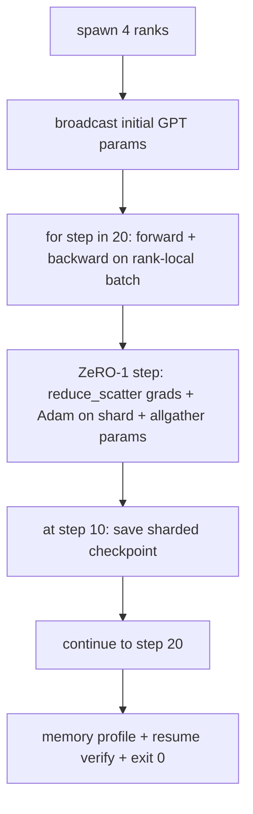

# Kompleksowe szkolenie rozproszone

> Lekcje od 76 do 80 składają się z jednego elementu. Oto zestaw: mały GPT wyszkolony na 4 symulowanych szeregach z DDP do synchronizacji gradientu, ZeRO-1 do fragmentowania stanu optymalizatora i podzielony na fragmenty punkt kontrolny w połowie. Wersja demonstracyjna składa się z 20 kroków, kończy się automatycznie, drukuje krzywą strat wraz z profilem pamięci i zapisuje punkt kontrolny, który można wznowić.

**Typ:** Kompilacja
**Języki:** Python
**Wymagania wstępne:** Faza 19, lekcje 42-49, ścieżka C
**Czas:** ~90 min

## Cele nauczania

- Skomponuj DDP (lekcja 77) plus ZeRO-1 (lekcja 78) plus podzielone punkty kontrolne (lekcja 80) w jedną pętlę treningową.
- Trenuj dwuwarstwowy model języka transformatora na małym syntetycznym korpusie przez 20 kroków w 4 symulowanych szeregach.
- Wydrukuj tabelę strat na krok, profil pamięci na rangę i manifest punktu kontrolnego, który wznawia działanie z równą liczbą bajtów w tym samym rozmiarze świata.
- Broń kompozycji: każdy utwór można niezależnie przetestować na wcześniejszych lekcjach, a ta lekcja udowadnia, że ​​komponują.

## Problem

Zwieńczenie jest dowodem na to, że elementy pasują do siebie. Lekcja 76 wdrożone kolektywy. Lekcja 77 zawinęła je w DDP. Lekcja 78. Stan optymalizatora podzielony na fragmenty za pomocą funkcji redukcji_rozproszenia. Lekcja 79 analizował rurociąg. Lekcja 80 zapisał fragmentowany punkt kontrolny. Każda lekcja miała własny test. Prawdziwy przebieg treningowy wykorzystuje wszystkie elementy podstawowe na raz; jeśli skład jest nieprawidłowy, straty są rozbieżne, punkt kontrolny odmawia wznowienia lub pamięć na rangę rośnie, gdy powinna się zmniejszyć.

Ta lekcja przedstawia kompleksowe demo i weryfikuje cztery niezmienniki: (a) strata zmniejsza się monotonicznie w 20 krokach w obrębie szumu pływakowego, (b) każda ranga ma tę samą normę parametrów na każdym kroku, (c) pamięć optymalizatora na rangę jest równa formule ZeRO-1 12P/N bajtów oraz (d) punkt kontrolny w kroku 10 ładuje ponownie równą liczbę bajtów przy ponownym uruchomieniu. Demo kończy się samoczynnie: 20 kroków, pojedyncze polecenie, wyjście 0.

## Koncepcja



### Mini GPT

Model jest celowo mały: 2 bloki transformatorów, embed dim 32, 4 głowice uwagi, słownictwo 64, długość sekwencji 16, partia 4. Kilka tysięcy parametrów. Wystarczająco duży, aby podjąć każdą decyzję dotyczącą okablowania (uwaga wielu głów przebiega standardową zamaskowaną ścieżką; LayerNorm ma wagi do synchronizacji; głowa LM jest oddzielną liniową projekcją z powrotem do słownictwa). Wystarczająco mały, aby 20 kroków na 4 szeregach procesora zakończyło się w ciągu kilku sekund.

### Zasady kompozycji

| Fragment lekcji | Co posiada | Co pozostawia pętli |
|-------------|-------------|----------------------------|
| Transmisja DDP | Początkowa synchronizacja parametrów | Jedno połączenie w czasie konstrukcji |
| Krok Zero-1 | Synchronizacja gradientu, aktualizacja kopii głównej, transmisja parametrów | Jedno wywołanie na krok zastępujące optymalizator.step |
| Rozdrobniony punkt kontrolny | Utrzymuj stan według rangi, manifestuj za pomocą sha256 | Wywoływany na randze 0 ze stanem zebranym przez allgather |
| Pętla treningowa | Do przodu, do tyłu, rejestrowanie strat | Wywołuje trzy powyższe w kolejności |

Pętla nie wie o plikach redukcji_rozproszenia ani plikach rendezvous. Moduły ZeRO i Checkpoint eksponują wąskie interfejsy, które tworzy pętla.

### Dlaczego mały GPT, a nie tylko MLP

MLP z lekcji 77 wystarczyło do sprawdzenia synchronizacji gradientu. Mały GPT dodaje trzy rzeczy: oddzielny nagłówek LM nad słownictwem (w tej lekcji nie powiązany dla przejrzystości; pełny GPT zazwyczaj wiąże nagłówek z osadzeniem tokena), softmax + entropia krzyżowa jako strata (więcej numerycznych przypadków brzegowych niż MSE) i asymetryczne przesunięcie w przód (osadzenia, następnie uwaga, a następnie MLP na warstwę). Trzymanie się MLP dla zwieńczenia spowodowałoby ukrycie tego, czy kompozycja poprawnie obsługuje LayerNorm lub kształt gradacji warstwy osadzającej.

### Samozakończenie oznacza wyjście 0

Pętla składa się z 20 kroków i kończy się. Nie `while True`, żadnej interwencji człowieka, żadnego CV ze stanu zewnętrznego. Zwieńczeniem, które można pozostawić uruchomione bez nadzoru, a po jego zakończeniu znaleźć kompletny dziennik, jest zwieńczeniem potwierdzającym prawidłowe okablowanie systemu. Jeśli jakikolwiek element utknie w martwym punkcie, demo nigdy nie powróci, a platforma testowa go złapie.

## Zbuduj to

`code/main.py` implementuje:

- `MiniGPT`: transformator 2-warstwowy z zamaskowaną samouwagą i oddzielną głowicą LM.
- `make_corpus(seed, total_tokens)`: deterministyczne dane przewidywania następnego tokenu.
- `_train_worker`: pojawia się według rangi; rozgłasza parametry początkowe, uruchamia pętlę, wywołuje krok ZeRO, zapisuje podzielony punkt kontrolny w kroku 10.
- `verify_resume`: po głównym uruchomieniu ponownie ładuje punkt kontrolny kroku 10 w procesie i sprawdza, czy zapisane fragmenty główne odpowiadają bajtowi po bajcie migawki w pamięci.
- `main`: koordynuje całą demonstrację, drukuje tabelę strat, profil pamięci i wynik weryfikacji.

Uruchom to:

```bash
python3 code/main.py
```

Dane wyjściowe: 20-wierszowa tabela strat, 4-wierszowy profil pamięci na rangę, manifest punktu kontrolnego i wiersz „RESUME VERIFIED” w przypadku powodzenia.

## Wzorce produkcji na wolności

Trzy wzory dopełniają kompozycję na prawdziwe biegi.

**Punkt kontrolny co K minut, a nie co K kroków.** Czas kroku różni się w zależności od długości sekwencji i liczby mikropartii. 10-minutowa kadencja punktu kontrolnego obejmuje te same obliczenia niezależnie od rozmiaru modelu. Dla uproszczenia lekcja opiera się na krokach; produkcja wykorzystuje zegar ścienny.

**Wczesne wykrywanie rozbieżności.** W seriach produkcyjnych dodaje się zabezpieczenie NaN po cofnięciu i detektor szczytów strat; jeśli strata wzrośnie więcej niż 2 razy w jednym kroku, cofnij się do poprzedniego punktu kontrolnego, zamiast pozwolić optymalizatorowi wejść w stan zdegenerowany. Krzywa straty lekcji jest gładka, więc osłona nie jest używana, ale hak pozostaje.

**Agreguj profile pamięci według rang.** Pamięć według rang różni się w zależności od rangi w rzeczywistych uruchomieniach (ranga z największym etapem potoku zawiera więcej aktywacji). Produkcja rejestruje maksimum w szeregach plus średnią; lekcja drukuje według rang, aby pokazać dopasowania formuły.

## Użyj tego

Wzory produkcyjne:

- **DeepSpeed.** Łączy DDP, ZeRO + potok + punkt kontrolny aktywacji w ramach jednej konfiguracji. Lekcja składa się z miniaturowego kształtu DeepSpeed.
- **PyTorch FSDP.** Natywny odpowiednik. `FullyShardedDataParallel` z `ShardingStrategy.SHARD_GRAD_OP` to ZeRO-2.
- **NeMo i Megatron-LM.** Dodaj równoległy tensor dla największych modeli; w przeciwnym razie kompozycja ma ten sam kształt.

## Wyślij to

Pełny utwór kończy się tutaj. Sześć lekcji razem tworzy rozproszony podsystem szkoleniowy, który zbudowałby prawdziwy zespół przed przyjęciem DeepSpeed; abstrakcja została udowodniona przeciwko gloo i przetestowano tryby awarii. Faza 17 (infrastruktura i produkcja) to miejsce, w którym można przenieść to do prawdziwego klastra.

## Ćwiczenia

1. Dodaj tensorowo-równoległy podział głowy uwagi i sprawdź, czy strata odpowiada linii bazowej pojedynczej rangi. Dwie rangi: połowa głów na rangę, wszystkie zmniejszają wydajność uwagi.
2. Dodaj akumulację gradientu w 4 mikropartiach i udowodnij, że gradient jest równy gradientowi jednej dużej partii.
3. Dodaj ścieżkę wznowienia od kroku 10, która faktycznie kontynuuje trening do kroku 20 i powoduje tę samą końcową stratę, co pierwotny bieg.
4. Dodaj eksport metryk (strata, norma gradacyjna, czas kroku) do JSONL, aby można było zwizualizować przebieg po fakcie.
5. Dodaj osłonę NaN, która cofa się do poprzedniego punktu kontrolnego po skoku straty i wymuś skok za pomocą jednostopniowego mnożnika LR, aby wykonać wycofanie.

## Kluczowe terminy

| Termin | Co ludzie mówią | Co to właściwie oznacza |
|------|----------------|--------------------------------------|
| Od końca do końca | „Podłącz to wszystko” | Jeden przebieg obejmuje każdy element, a nie test jednostkowy na sztukę |
| Profil pamięci | „GB na pozycję” | Bajty przechowywane w każdym rankingu dla parametrów, gradów i stanu optymalizatora |
| Wznów umowę | „Zapisz i załaduj” | Stan bajtów równy dla każdej rangi po przejściu w obie strony punktu kontrolnego |
| Samozakończenie | „Bieg ograniczony” | Naprawiono liczbę kroków, wyjście 0 po zakończeniu, brak człowieka w pętli |

## Dalsze czytanie

- [Kompleksowy samouczek szkoleniowy DeepSpeed](https://www.deepspeed.ai/getting-started/)
- [Zaawansowany samouczek PyTorch FSDP](https://pytorch.org/tutorials/intermediate/FSDP_advanced_tutorial.html)
— [Odniesienie do skryptu szkoleniowego Megatron-LM](https://github.com/NVIDIA/Megatron-LM)
- Faza 19, lekcje 76-80 - każdy element tworzony przez tę lekcję
- Faza 17 - przeniesienie kompozycji do prawdziwego klastra