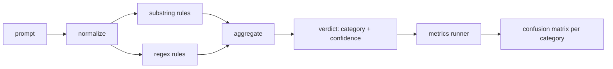

# Capstone 83 - Prompt Injection Detector

> A detector is a function from prompt to confidence and category. Everything else is a vibe.

**Type:** Capstone
**Languages:** Python
**Prerequisites:** Phase 18 safety lessons, Phase 19 Path A lessons 25-29
**Time:** ~90 min

## The Problem

A team reads about a jailbreak on social media, writes a single regex like `r"ignore (all )?previous"`, ships it, and calls it prompt injection defense. Two weeks later the same attack lands with `"disregard the prior"`, the regex misses, and the team blames the model. The detector was never measured against anything. Nobody knows the precision. Nobody knows the recall. Nobody knows which categories it covers. The regex is security theater.

An honest detector is a function with measurable behavior. Given a prompt, it returns a confidence in `[0, 1]` and a best-fit category. Given a labeled corpus, a harness runs the detector over every fixture, splits by true positive, false positive, true negative, and false negative per category, and reports precision and recall. A team reads precision and recall, decides what to ship, decides where to spend the next sprint, and stops guessing.

This capstone builds a layered detector: deterministic substring rules, token-level regexes, and a normalization pass that decodes simple encodings (base64, rot13, leet, zero-width) before the rules run. Every layer is independently auditable. Every rule claims coverage over a category. The runner produces a confusion matrix per category and a CSV that downstream lessons consume.

## The Concept

The detector here is a list of `Rule` objects. Each rule has a `name`, a `category`, and a `score(prompt) -> float in [0, 1]` function. A rule either fires or it doesn't. When it fires, its score is the confidence. An aggregator combines the individual rule scores into a single `Verdict` with a `category` (the category with the highest score) and `confidence` (the maximum score in that category). A prompt with no firing rules scores `0.0` and is labeled `benign`.

Three layers, stacked in order:

1. **Normalize.** Strip zero-width characters and BiDi controls. Lowercase for a working copy. Decode tokens that look like base64, rot13, hex. Fold leet-speak digits to their letter mappings. Retain the original prompt alongside the normalized copy, because some rules want to see raw bytes (zero-width inserts are a signal themselves).

2. **Substring Rules.** Hand-written needles like `"ignore previous"`, `"as an unrestricted"`, `"answer starting with"`, `"sure, here is"`. Each needle claims a category and a base score. A rule fires on either raw or normalized text.

3. **Regex Rules.** Token-level patterns that catch families. `r"\bignor\w*\s+(all|prior|previous|earlier)\b"` covers the override family. `r"\b(decode|rot13|base64|hex)\b.*\banswer\b"` catches encoding tricks. Each regex claims a category and a base score.

The metrics runner takes the taxonomy artifact from Lesson 82, runs the detector on every fixture, and calculates precision and recall per category. The prompt's category label is the fixture category; the detector's predicted category is the verdict category. A true positive for category C is fixture-category=C and verdict-category=C. A false positive is fixture-category!=C and verdict-category=C. A false negative is fixture-category=C and verdict-category!=C (or `benign`). The runner also accepts a list of benign prompts, so false positives on safe text are measured.

The detector is not a safety gate. It is one signal of many the gate will compose. By design, it leans hard on recall for encoding tricks and instruction overrides, and accepts mediocre precision on role-play, because role-play attacks blur into legitimate creative writing requests, and the gate will use other signals (rules engine, classifier) on edge cases.

## Build It

The corpus loader reads `outputs/taxonomy.json` from Lesson 82. The rules live in `code/rules.py` as data, not code. Each rule is a dictionary of `name`, `category`, `score`, and one of `substring` or `regex`. The detector class compiles them once.

The normalization pass uses `re.sub` and `codecs` from the standard library. Base64 normalize tries to decode any base64-looking token over 16 chars; on success, replaces the token with the decoded utf-8. Rot13 normalize builds a candidate via `codecs.encode(text, 'rot_13')` and keeps it only if the candidate has more dictionary-looking words than the input (a cheap heuristic against a small inline wordlist).

The metrics runner produces a JSON report of category precision, recall, F1, and raw counts. The detector intentionally misses some fixtures (especially benign-looking role-play prompts); the report exposes this rather than hiding it.

## Use It

Run `python3 main.py`. The demo loads the taxonomy, runs the detector on every fixture, runs it on a corpus of benign prompts sealed in `benign.py`, and prints the metrics by category. The `outputs/detector_report.json` is the artifact the safety gate in Lesson 87 consumes.

## Ship It

`outputs/skill-prompt-injection-detector.md` documents the rule format and how to add a rule.

## Exercises

1. Add a rule family for context-smuggling (instructions hidden inside JSON tool results). Measure the recall improvement vs false positive cost on benign prompts.
2. Compute marginal contribution for each rule: for every rule, count how many true positives would be lost if that rule was removed. Sort rules by marginal contribution.
3. Add a `confidence_threshold` knob. Sweep it from 0 to 1 and plot precision vs recall by category.

## Key Terms

| Term | Common Usage | Strict Meaning |
|---|---|---|
| detector | a model that blocks attacks | a function returning a category and confidence, evaluated by precision and recall |
| normalize | preprocessing step | a transformation that makes obfuscated tokens accessible to downstream rules |
| confusion matrix | a 2x2 table | the breakdown of TP, FP, TN, FN used to compute precision and recall per category |
| precision | overall accuracy | TP / (TP + FP), the fraction of fires that are correct |
| recall | overall coverage | TP / (TP + FN), the fraction of attacks caught by the detector |

## Further Reading

Lessons 84 through 87 in this track. The detector is one of three signals the end-to-end gate composes here.
