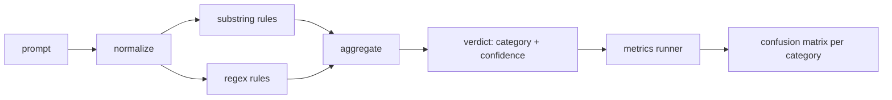

# Capstone 83 — Szybki detektor wtrysku

> Detektor to funkcja od podpowiedzi do pewności i kategorii. Wszystko inne to klimat.

**Typ:** Kompilacja
**Języki:** Python
**Wymagania wstępne:** Lekcje bezpieczeństwa w fazie 18, lekcje 25–29 dla ścieżki A w fazie 19
**Czas:** ~90 min

## Problem

Zespół czyta o jailbreaku w mediach społecznościowych, pisze pojedyncze wyrażenie regularne, takie jak `r"ignore (all )?previous"`, wysyła je i nazywa to obroną przed natychmiastowym zastrzykiem. Dwa tygodnie później ten sam atak następuje z `"disregard the prior"`, wyrażenie regularne nie trafia, a zespół obwinia model. Detektor nigdy nie był mierzony względem niczego. Nikt nie zna dokładności. Nikt nie zna przypomnień. Nikt nie wie, jakie kategorie obejmuje. Wyrażenie regularne to poprawka teatru zabezpieczeń.

Uczciwa wersja detektora to funkcja o mierzalnym zachowaniu. Po wyświetleniu monitu zwraca pewność w `[0, 1]` i najlepiej pasującą kategorię. Mając oznaczony korpus, platforma uruchamia detektor po każdym urządzeniu, dzieli go na prawdziwie pozytywne, fałszywie pozytywne, prawdziwie negatywne i fałszywie negatywne według kategorii oraz raportuje precyzję i przypominanie. Zespół odczytuje precyzję i zapamiętuje, decyduje, co wysłać, decyduje, gdzie spędzić następny sprint i przestaje zgadywać.

To zwieńczenie buduje warstwowy detektor: deterministyczne reguły podciągów, wyrażenia regularne na poziomie tokenu i przebieg normalizujący, który dekoduje proste kodowania (base64, rot13, leet, zero-width) przed uruchomieniem reguł. Każda warstwa podlega niezależnemu audytowi. Każda reguła ma żądanie pokrycia według kategorii. Biegacz tworzy macierz pomyłek dla poszczególnych kategorii oraz plik CSV, który można wykorzystać w dalszych lekcjach.

## Koncepcja

Detektorem jest tutaj lista obiektów `Rule`. Każda reguła ma `name`, `category` i funkcję `score(prompt) -> float in [0, 1]`. Reguła albo się uruchamia, albo nie. Kiedy strzela, jego wynik jest pewnością siebie. Agregator łączy wyniki poszczególnych reguł w pojedynczy `Verdict` z `category` (kategoria o najwyższej punktacji) i `confidence` (maksymalny wynik w tej kategorii). Podpowiedź bez uruchamiającej reguły jest oceniana `0.0` i jest oznaczona etykietą `benign`.

Trzy warstwy, nałożone w kolejności:

1. **Normalizuj.** Usuń znaki o zerowej szerokości i elementy sterujące BiDi. Małe litery oznaczają kopię roboczą. Dekoduj tokeny, które wyglądają jak base64, rot13, hex. Zamień cyfry w języku leet-speak na ich mapowania liter. Zachowaj oryginalny znak zachęty obok znormalizowanej kopii, ponieważ niektóre reguły chcą widzieć nieprzetworzone bajty (wstawienia o zerowej szerokości same w sobie są sygnałem).

2. **Reguły podciągów.** Wzory pisane ręcznie, takie jak `"ignore previous"`, `"as an unrestricted"`, `"answer starting with"`, `"sure, here is"`. Każdy wzór ma kategorię i wynik bazowy. Reguła uruchamia się na nieprzetworzonym lub znormalizowanym tekście.

3. **Zasady wyrażeń regularnych.** Wzorce na poziomie tokena, które wyłapują rodziny. `r"\bignor\w*\s+(all|prior|previous|earlier)\b"` obejmuje rodzinę zastąpień. `r"\b(decode|rot13|base64|hex)\b.*\banswer\b"` wyłapuje sztuczki kodowania. Każde wyrażenie regularne zawiera kategorię i wynik podstawowy.

Moduł uruchamiający metryki bierze artefakt taksonomii z lekcji 82, uruchamia detektor po każdym urządzeniu i oblicza precyzję i przypominanie dla poszczególnych kategorii. Etykieta kategorii podpowiedzi jest kategorią osprzętu; kategoria przewidywana przez detektor jest kategorią werdyktu. Prawdziwie pozytywny wynik dla kategorii C to kategoria-osprzętu=C i kategoria-werdyktu=C. Fałszywie dodatni wynik to kategoria urządzenia!=C i kategoria-werdyktu=C. Fałszywie negatywny wynik to kategoria-urządzenia=C i kategoria-werdyktu!=C (lub `benign`). Biegacz akceptuje również listę łagodnych podpowiedzi, więc mierzone są fałszywe alarmy w bezpiecznym tekście.

Detektor nie jest bramką zabezpieczającą. To jeden z wielu sygnałów, że brama będzie komponować. Z założenia opiera się na przywoływaniu sztuczek z kodowaniem i obchodzenia instrukcji i akceptuje średnią precyzję w odgrywaniu ról, ponieważ ataki polegające na odgrywaniu ról rozmywają się w uzasadnione żądania kreatywnego pisania, a brama będzie używać innych sygnałów (silnik reguł, klasyfikator) w przypadkach granicznych.

## Zbuduj to

Program ładujący korpus odczytuje `outputs/taxonomy.json` z lekcji 82. Reguły znajdują się w `code/rules.py` jako dane, a nie kod. Każda reguła jest słownikiem zawierającym `name`, `category`, `score` i `substring` lub `regex`. Klasa detektora kompiluje je raz.

Przepustka normalizująca wykorzystuje `re.sub` i `codecs` ze standardowej biblioteki. Normalizacja Base64 próbuje zdekodować dowolny token wyglądający na base64 o długości ponad 16 znaków; w przypadku powodzenia zastępuje token zdekodowanym kodem UTF-8. Rot13 normalize tworzy kandydata za pomocą `codecs.encode(text, 'rot_13')` i zatrzymuje go tylko wtedy, gdy kandydat ma więcej słów przypominających słownik niż dane wejściowe (tania heurystyka na małej wbudowanej liście słów).

Moduł uruchamiający metryki tworzy raport JSON z dokładnością dla poszczególnych kategorii, przywoływaniem, klawiszem F1 i nieprzetworzonymi liczbami. Detektor celowo działa nieprawidłowo w przypadku niektórych urządzeń (zwłaszcza w przypadku łagodnie wyglądających podpowiedzi związanych z odgrywaniem ról); raport raczej to eksponuje niż ukrywa.

## Użyj tego

Uruchom `python3 main.py`. Demo ładuje taksonomię, uruchamia detektor na każdym urządzeniu, uruchamia go na korpusie łagodnego podpowiedzi zapieczętowanym w `benign.py` i drukuje metryki według kategorii. Plik `outputs/detector_report.json` to artefakt zużywany przez bramkę zabezpieczającą z lekcji 87.

## Wyślij to

`outputs/skill-prompt-injection-detector.md` dokumentuje format reguły i sposób jej dodawania.

## Ćwiczenia

1. Dodaj rodzinę reguł do przemycania kontekstu (instrukcje ukryte w wynikach narzędzia JSON). Zmierz poprawę wycofania i koszt fałszywie dodatnich wyników w przypadku łagodnych podpowiedzi.
2. Oblicz wkład dla każdej reguły: dla każdej reguły policz, ile prawdziwie pozytywnych wyników zostałoby utraconych, gdyby została usunięta. Sortuj reguły według wkładu krańcowego.
3. Dodaj pokrętło `confidence_threshold`. Przesuń go od 0 do 1 i wykreśl precyzję przypomnienia według kategorii.

## Kluczowe terminy

| Termin | Powszechne użycie | Dokładne znaczenie |
|---|---|---|
| detektor | model blokujący ataki | funkcja zwracająca kategorię i pewność, oceniane przez precyzję i przypominanie |
| normalizować | etap wstępnego przetwarzania | transformacja, która udostępnia ukryte tokeny kolejnym regułom |
| matryca zamieszania | stół 2x2 | podział według kategorii TP, FP, TN, FN stosowany do obliczania precyzji i przypominania |
| precyzja | ogólna dokładność | TP / (TP + FP), odsetek prawidłowych pożarów |
| przypomnieć | ogólny zasięg | TP / (TP + FN), część ataków wychwytywanych przez detektor |

## Dalsze czytanie

Lekcje od 84 do 87 w tym utworze. Detektor jest tutaj jednym z trzech sygnałów, jakie tworzy bramka od końca do końca.