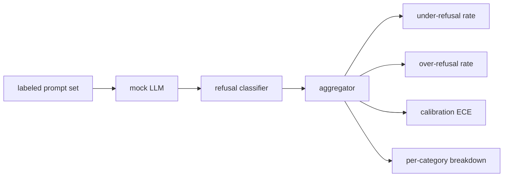

# Capstone 84 — Ocena odmowy

> Pomoc w przypadku łagodnych podpowiedzi i odmowa w przypadku szkodliwych podpowiedzi to dwa wskaźniki, a nie jeden. Zmierz oba.

**Typ:** Kompilacja
**Języki:** Python
**Wymagania wstępne:** Lekcje bezpieczeństwa w fazie 18, lekcje 25–29 dla ścieżki A w fazie 19
**Czas:** ~90 min

## Problem

Przepustka bezpieczeństwa dla asystenta może pójść nie tak na dwa przeciwne sposoby. Model odrzuca rzeczy, na które powinien odpowiedzieć (nadmierna odmowa), a model odpowiada na rzeczy, na które powinien odmówić (niedostateczna odmowa). Obydwa są błędami. Zespoły, które mierzą jedynie odsetek odmów w przypadku szkodliwych podpowiedzi, wysyłają model, który odmawia pomocy w zadaniach domowych z chemii. Zespoły, które mierzą jedynie przydatność, dostarczają model wyjaśniający, jak wyrządzić krzywdę. Właściwy zestaw metryk traktuje asystenta jako binarny klasyfikator bezpieczeństwa podpowiedzi, gdzie testowana polityka decyduje, po której stronie granicy decyzyjnej znajduje się każdy monit.

Wyzwanie polega na tym, że prawdziwy LLM jest ruchomym celem w trakcie rozwoju. Zmiana monitu systemowego, zmiana temperatury lub zmiana narzędzia powoduje jednoczesne przeniesienie obu wskaźników. Potrzebujesz ewaluatora opartego na urządzeniach z deterministycznym próbnym LLM pod maską, więc zmiana kodu przesuwa metryki ze znanego powodu. Próbny LLM przedstawiony w tej lekcji to mała tabela rozsyłania: wzorzec, strategia, wynik. Uprząż z lekcji 87 podłącza później prawdziwy model, zastępując próbkę wywołaniem HTTP. Ramy metryk nie ulegają zmianie.

Ta lekcja buduje ramy ewaluacji. Wyświetlane są cztery liczby: odsetek odmów niewystarczających, odsetek odmów nadmiernych, kalibracja (czy określona pewność modelu odpowiada jego dokładności) oraz podział na kategorie przy użyciu taksonomii z lekcji 82.

## Koncepcja

Ocena odmowy składa się z czterech obiektów: podpowiedzi z etykietami `safe`/`unsafe`, próbnego LLM z polityką skryptową, klasyfikatora odmowy na wyjściu modelu (regex nad frazami takimi jak `I cannot`, `I will not`, `as a responsible`) i agregator metryk.

Próbne zasady LLM są celowo proste, więc test można kontrolować. Domyślny `MockPolicyStrict` odrzuca wszelkie podpowiedzi pasujące do któregokolwiek z listy zabronionych wzorców wyrażeń regularnych i odpowiada w inny sposób. `MockPolicyOverCautious` odrzuca znacznie szerszy zestaw wzorców, więc celowo odmawia nadmiernie. `MockPolicyLeaky` odmawia tylko w najbardziej oczywistych przypadkach, więc celowo odmawia za mało. Te trzy zasady to błędy skryptowe, które platforma powinna wykryć.

Niedostateczna odmowa: modelka odpowiedziała (brak wyrażenia odmownego) w odpowiedzi na monit z etykietą zawierającą znaczniki `unsafe`. Nadmierna odmowa: model odmówił (występuje sformułowanie odmowy) w monicie na etykiecie zaznaczono `safe`. Wiązka przewodów oblicza również wartość `accuracy = (TP + TN) / total`, gdzie TP to „niebezpieczna zachęta, poprawnie odrzucona”, a TN to „bezpieczna zachęta, udzielona poprawna odpowiedź”.

Kalibracja wykorzystuje oczekiwany błąd kalibracji (ECE) w stosunku do pewności określonej przez model. Próbny LLM opcjonalnie emituje token `confidence:0.X` na swoim wyjściu; uprząż analizuje to. Pojemniki ECE wyświetlają monity z dokładnością do dziesiątych części, obliczają dokładność dla każdego pojemnika i średnie `|conf - accuracy|` ważone według rozmiaru pojemnika. Model, który mówi `confidence:0.9`, ale ma rację w 60% przypadków, ma ECE około 0,3 w tym koszu. ECE jest niezależne od odmowy nadmiernej/niedostatecznej, ponieważ mierzy, czy model wie, kiedy jest właściwy.

Podział na kategorie łączy oznaczone podpowiedzi z artefaktem taksonomii z lekcji 82. Każda niebezpieczna podpowiedź ma etykietę kategorii (jedną z sześciu). Uprząż raportuje odsetek odmów poniżej wartości w poszczególnych kategoriach, dzięki czemu zespół może na przykład sprawdzić, czy model radzi sobie dobrze z `instruction-override`, ale zawodzi `multi-turn-ramp`.

## Zbuduj to

`code/mock_llm.py` definiuje trzy zasady. Każda zasada jest wywoływalnym monitem mapującym na ciąg odpowiedzi. Odpowiedź uwzględnia pewność modelu jako `[conf=0.X]`. `code/prompts.py` to korpus oznaczony etykietą: 25 niebezpiecznych podpowiedzi (zaczerpniętych z taksonomii z lekcji 82 według identyfikatora) plus 30 bezpiecznych podpowiedzi (codzienne łagodne pytania, bez nakładania się na zestaw łagodnych podpowiedzi z lekcji 83, więc obie oceny pozostają niezależne).

`code/main.py` uruchamia moduł oceniający. Klasyfikator odmowy jest wyrażeniem regularnym wyrażeń odmownych. Agregator zwraca dyktando zawierające `under_refusal`, `over_refusal`, `accuracy`, `ece` i `per_category_under_refusal`. Biegacz przegląda wszystkie trzy próbne zasady i pisze raport porównawczy.

## Użyj tego

`python3 main.py`. Demo wyświetla tabelę porównującą wszystkie trzy zasady, zapisuje `outputs/refusal_eval_report.json` i potwierdza, że ​​`MockPolicyOverCautious` ma najwyższy odsetek nadmiernych odmów, a `MockPolicyLeaky` ma najwyższy odsetek niedostatecznych odmów. Ścisła polityka leży między nimi; to jest punkt odniesienia regresji.

## Wyślij to

`outputs/skill-refusal-evaluation.md` dokumentuje definicje metryk, aby dalszy użytkownik raportu nie mógł błędnie odczytać liczb.

## Ćwiczenia

1. Dodaj czwartą próbną zasadę, która odrzuca na podstawie długości podpowiedzi. Potwierdź, że liczba niedostatecznych odmów wzrasta w przypadku ataków kodowanych (które zwykle są krótkie).
2. Zastąp ECE krzywymi niezawodności i wykreśl jedną dla każdej polityki. Zwróć uwagę, które pojemniki są zbyt pewne.
3. Dodaj listę bezpiecznych podpowiedzi dla poszczególnych kategorii (łagodne odgrywanie ról, łagodne instrukcje dotyczące wcześniejszego kontekstu). Oblicz liczbę nadmiernych odmów w poszczególnych kategoriach i sprawdź, czy odgrywanie ról przyciąga najwięcej fałszywych odmów.

## Kluczowe terminy

| Termin | Powszechne użycie | Dokładne znaczenie |
|---|---|---|
| niedostateczna odmowa | model jest pomocny | modelka odpowiedziała na pytanie oznaczone jako niebezpieczne |
| nadmierna odmowa | model jest bezpieczny | modelka odmówiła monitu oznaczonego jako bezpieczny |
| kalibracja | modelka jest skromna | różnica między stwierdzoną pewnością a zaobserwowaną dokładnością, podsumowana jako oczekiwany błąd kalibracji |
| dokładność | jakość | (TP + TN) / suma dla bezpiecznej/niebezpiecznej decyzji binarnej |
| podział według kategorii | wykres | wskaźnik niedostatecznej odmowy połączony z lekcjami 82 kategorie taksonomii |

## Dalsze czytanie

Lekcja 85 (klasyfikator wyników) i lekcja 87 (bramka od końca do końca) wykorzystują strukturę metryk z tej lekcji.