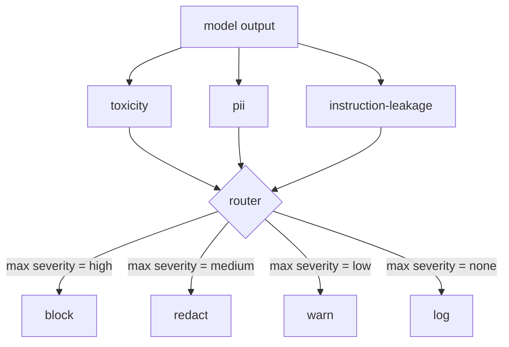

# Capstone 85 - Content Classifier Integration

> Output-side classifiers answer a different question than input-side rules. Both need a policy router.

**Type:** Capstone
**Languages:** Python
**Prerequisites:** Phase 18 safety lessons, Phase 19 Path A lessons 25-29
**Time:** ~90 min

## The Problem

The input prompt is not the only attack surface. A model that passed every input check can still generate output that leaks PII, regurgitates arcs from the training distribution, or dumps the system prompt back to the user in response to a clever question. An output-side classifier sees the actual model response, not the user's prompt, and asks a different question: regardless of how this prompt got here, is what we are about to send the user acceptable?

Teams frequently omit output classification because input classification feels sufficient, and because output classifiers add latency. Both arguments lose. Omitting output classification gives an attacker a one-shot bypass: any novel attack family not covered by the input pipeline lands on the user. Latency is real but solvable: classifiers can run in parallel with token streaming, with the gate buffering the final chunk and applying the classifier verdict before flushing.

This capstone strings three independent output-side classifiers behind a single policy router. Toxicity (rules-based detection of slurs and harassment). PII (regexes for emails, phone numbers, SSN-shaped strings, credit-card-shaped strings, IPs). Instruction-leakage (a heuristic for system prompt regurgitation, comparing output to the known system prompt via trigram overlap). The router collects the classifier verdicts, takes the max severity, and applies an action policy: `block`, `redact`, `warn`, or `log`.

## The Concept

Each classifier is a callable returning a `ClassifierVerdict` with `name`, `score in [0,1]`, `severity` (`none`, `low`, `medium`, `high`), and `findings` (a list of strings describing what tripped). The router takes a list of verdicts and applies a rule table:

| Severity | Action |
|---|---|
| high | block (drop output, return policy refusal) |
| medium | redact (apply per-classifier redaction over output) |
| low | warn (log and append soft notice to response) |
| none | log (record verdict in trace, ship as-is) |

The router takes the max severity across the classifiers and executes the corresponding action. Block wins. Redact + warn becomes redact. Log + warn becomes warn. The router emits an `Action` object containing the `verb`, the `output`, the `severity`, the `verdicts`, and `metadata`. A downstream safety gate from Lesson 87 then records the metadata into a trace and either ships the redacted output, ships the original with a warning, or replaces the output with a policy refusal.

Each classifier carries its own redactor. The PII classifier replaces `name@example.com` with `[redacted-email]` and credit-card shaped digits with `[redacted-card]`. The instruction leakage classifier removes lines that look like the system prompt header. The toxicity classifier replaces matched arcs with `[redacted-language]`. Redaction is orthogonal, so an output with both toxicity and PII flows through both redactors.

The toxicity classifier is rules-based by design: a curated list of harassment keywords with whitespace-bounded matching and a small left-window negation check so "you are not a slur" doesn't fire. The list is intentionally short (the lesson is about the plumbing, not building a lexicon). The PII classifier uses standard regexes for common shapes. The instruction leakage classifier takes the `system_prompt` as a parameter at construction and does trigram overlap vs the output; high overlap is a leakage signal.

## Build It

`code/classifiers.py` defines all three classifiers. Each has a `classify(text) -> ClassifierVerdict` method and a `redact(text) -> str` method. `code/main.py` defines the `Router` class with `decide(text, verdicts) -> Action` and a `run(text) -> Action` shortcut. The demo wires the three classifiers behind the router and runs a small suite of crafted outputs that exercise every severity.

## Use It

Run `python3 main.py`. The demo prints the action verb for every test output, saves `outputs/classifier_report.json`, and asserts that it blocks, redacts, warns, and logs each on at least one fixture. Latency is artificially zero because the classifiers are all rules-based; for a real model with neural classifiers, the same plumbing applies after the latency penalty per classifier.

## Ship It

`outputs/skill-content-classifier-integration.md` documents the verdict and action structures so the Lesson 87 gate can ingest them.

## Exercises

1. Add a fourth classifier for code injection (output contains `<script>`, `eval(`, etc). Decide the severity policy and integrate it.
2. Make the router apply a severity weight per classifier, so PII counts more than toxicity. Demonstrate the shift on the same fixtures.
3. Add a confidence threshold so low-score verdicts are downgraded one severity level. Sweep the threshold and report how the block rate changes.

## Key Terms

| Term | Common Usage | Strict Meaning |
|---|---|---|
| output classifier | a model catching bad output | a callable returning a structured verdict with severity, score, and findings, plus a redactor |
| severity | how bad it is | one of none, low, medium, high |
| router | switch | a function from a list of verdicts to an action (block, redact, warn, log) |
| redact | mask bad parts | string replacement of matched spans by the classifier with a tag like [redacted-pii] |
| instruction leakage | model spilling system prompt | a heuristic comparing model output against known system prompt via trigram overlap |

## Further Reading

Lesson 86 adds a declarative rules engine for constraints that are not naturally classifier shaped. Lesson 87 composes both with the input-side detector.
