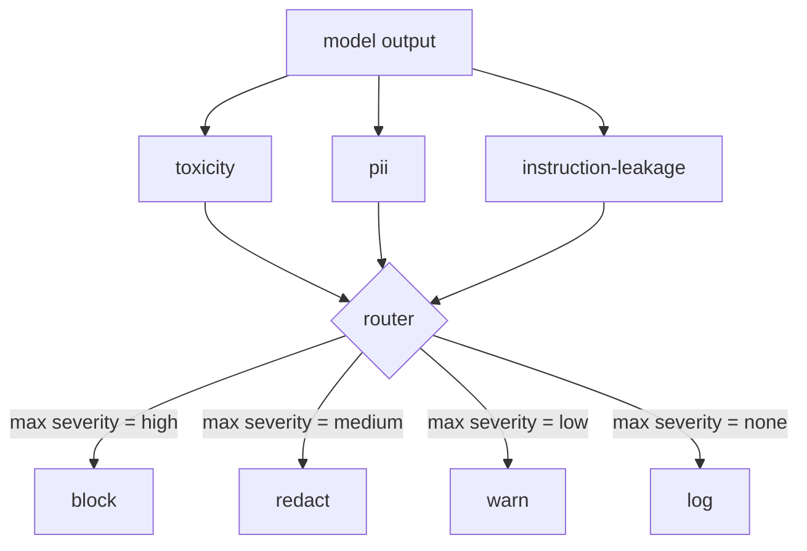

# Capstone 85 — Integracja klasyfikatora treści

> Klasyfikatory po stronie wyjściowej odpowiadają na inne pytanie niż reguły po stronie wejściowej. Obydwa wymagają routera zasad.

**Typ:** Kompilacja
**Języki:** Python
**Wymagania wstępne:** Lekcje bezpieczeństwa w fazie 18, lekcje 25–29 dla ścieżki A w fazie 19
**Czas:** ~90 min

## Problem

Dane wejściowe nie są jedyną powierzchnią ataku. Model, który przeszedł każdą kontrolę danych wejściowych, może nadal generować dane wyjściowe, które ujawniają informacje umożliwiające identyfikację, powtarzają łuki z dystrybucji szkoleniowej lub wyświetlają użytkownikowi monit systemowy w odpowiedzi na sprytne pytanie. Klasyfikator po stronie wyjściowej widzi rzeczywistą odpowiedź modelu, a nie zachętę użytkownika, i zadaje inne pytanie: niezależnie od tego, w jaki sposób ten znak zachęty się tu znalazł, czy to, co za chwilę wyślemy użytkownikowi, będzie akceptowalne.

Zespoły często pomijają klasyfikację wyników, ponieważ klasyfikacja danych wejściowych wydaje się wystarczająca i ponieważ klasyfikatory wyjściowe wprowadzają dodatkowe opóźnienia. Obydwa argumenty przegrywają. Pominięcie klasyfikacji wyników umożliwia atakującemu jednorazowe obejście: każda nowa rodzina ataków, której nie obejmuje potok wejściowy, wyląduje na użytkowniku. Opóźnienie jest rzeczywiste, ale można je rozwiązać: klasyfikatory mogą działać równolegle ze strumieniowaniem tokenów, przy czym brama buforuje końcowy fragment i stosuje werdykt klasyfikatora przed opróżnieniem.

To zwieńczenie łączy trzy niezależne klasyfikatory po stronie wyjściowej za jednym routerem zasad. Toksyczność (wykrywanie obelg i molestowania w oparciu o reguły). PII (wyrażenie regularne dla e-maili, numerów telefonów, ciągów znaków w kształcie numeru SSN, ciągów znaków w kształcie karty kredytowej, adresów IP). Wyciek instrukcji (heurystyka echa podpowiedzi systemowych, porównująca dane wyjściowe ze znanym podpowiedzią systemową poprzez nakładanie się trygramów). Router zbiera werdykty klasyfikatorów, wybiera ważność i stosuje politykę działania: `block`, `redact`, `warn` lub `log`.

## Koncepcja

Każdy klasyfikator jest wywoływalnym obiektem zwracającym `ClassifierVerdict` z `name`, `score in [0,1]`, `severity` (`none`, `low`, `medium`, `high`) i `findings` (lista ciągów opisujących to, co oznaczono). Router pobiera listę werdyktów i stosuje tabelę reguł:

| Dotkliwość | Akcja |
|---|---|
| wysoki | blok (spadek produkcji, odmowa polityki zwrotów) |
| średni | redaguj (zastosuj na wyjściu redakcję według klasyfikatora) |
| niski | ostrzegaj (zapisz i dołącz miękkie powiadomienie do odpowiedzi) |
| żaden | log (zapisz werdykt w śladzie, statek w stanie, w jakim jest) |

Router przyjmuje maksymalną wagę klasyfikatorów i wykonuje odpowiednią akcję. Blok wygrywa. Redagowanie + ostrzeżenie staje się redagowaniem. Log + ostrzeżenie staje się ostrzeżeniem. Router emituje obiekt `Action` zawierający `verb`, `output`, `severity`, `verdicts` i `metadata`. Następnie bramka zabezpieczająca z lekcji 87 rejestruje metadane w śladzie i albo wysyła zredagowany wynik, wysyła oryginał z ostrzeżeniem, albo zastępuje wynik odmową wynikającą z zasad.

Każdy klasyfikator ma swój własny edytor. Klasyfikator PII zastępuje `name@example.com` przez `[redacted-email]`, a cyfry w kształcie karty kredytowej przez `[redacted-card]`. Klasyfikator wycieku instrukcji usuwa linie, które wyglądają jak nagłówek podpowiedzi systemowej. Klasyfikator toksyczności zastępuje dopasowane łuki słowami `[redacted-language]`. Redakcja jest niezależna, więc dane wyjściowe dotyczące toksyczności i informacji umożliwiających identyfikację przepływają przez oba redaktory.

Klasyfikator toksyczności opiera się na regułach celowo: wyselekcjonowana lista słów kluczowych związanych z nękaniem z dopasowaniem ograniczonym białymi znakami i małym oknem negacji, dzięki czemu „nie jesteś obelgą” nie powoduje naruszenia reguły. Lista jest celowo krótka (lekcja dotyczy hydrauliki, a nie budowania leksykonu). Klasyfikator PII używa standardowych wyrażeń regularnych dla typowych kształtów. Klasyfikator wycieku instrukcji przyjmuje podczas konstruowania parametr `system_prompt` i porównuje nakładanie się trygramów z wynikiem; duże nakładanie się jest sygnałem wycieku.

## Zbuduj to

`code/classifiers.py` definiuje wszystkie trzy klasyfikatory. Każdy z nich ma metodę `classify(text) -> ClassifierVerdict` i metodę `redact(text) -> str`. `code/main.py` definiuje klasę `Router` za pomocą `decide(text, verdicts) -> Action` i skrótu `run(text) -> Action`. Wersja demonstracyjna łączy trzy klasyfikatory za jednym routerem i uruchamia niewielki zbiór spreparowanych wyników, które sprawdzają każdą ważność.

## Użyj tego

Uruchom `python3 main.py`. Demo wypisuje czasownik akcji dla każdego wyniku testu, zapisuje `outputs/classifier_report.json` i potwierdza, że ​​blokuje, redaguje, ostrzega i rejestruje każdy pożar na co najmniej jednym urządzeniu. Opóźnienie wynosi sztucznie zero, ponieważ wszystkie klasyfikatory opierają się na regułach; w przypadku prawdziwego modelu z klasyfikatorami neuronowymi ta sama instalacja ma zastosowanie po wzroście opóźnienia dla poszczególnych klasyfikatorów.

## Wyślij to

`outputs/skill-content-classifier-integration.md` dokumentuje struktury werdyktów i działań, aby brama z lekcji 87 mogła je pochłonąć.

## Ćwiczenia

1. Dodaj czwarty klasyfikator do wstrzykiwania kodu (wyjście zawiera `<script>`, `eval(` itd.). Zdecyduj o polityce ważności i zintegruj ją.
2. Spraw, aby router zastosował wagę ważności według klasyfikatora, tak aby dane osobowe liczyły się bardziej niż toksyczność. Zademonstruj zmianę na tych samych urządzeniach.
3. Dodaj próg ufności, aby werdykty o niskim wyniku były obniżane o jeden poziom ważności. Przejrzyj próg i zgłoś, jak zmienia się współczynnik blokowania.

## Kluczowe terminy

| Termin | Powszechne użycie | Dokładne znaczenie |
|---|---|---|
| klasyfikator wyjściowy | model wykrywający złe wyniki | wywoływalny, zwracający ustrukturyzowany werdykt zawierający wagę, wynik i ustalenia oraz redaktor |
| dotkliwość | jak źle jest | jeden z żadnych, niski, średni, wysoki |
| router | przełącznik | funkcja z listy werdyktów do akcji (blokuj, redaguj, ostrzegaj, loguj) |
| zredagować | ukryć złe części | zastąpienie dopasowanych zakresów przez klasyfikator za pomocą znacznika takiego jak [redacted-pii] |
| wyciek instrukcji | model wycieka z monitu systemowego | heurystyka porównująca dane wyjściowe modelu ze znanym podpowiedzią systemową poprzez nakładanie się trygramów |

## Dalsze czytanie

Lekcja 86 dodaje silnik reguł deklaratywnych dla ograniczeń, które w naturalny sposób nie mają kształtu klasyfikatora. Lekcja 87 łączy oba z detektorem po stronie wejściowej.