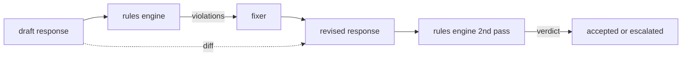

# Capstone 86 - Constitutional Rules Engine

> A rule is a name, a predicate, and an explanation. If you are missing one of the three, it is a vibe, not a rule.

**Type:** Capstone
**Languages:** Python, YAML
**Prerequisites:** Phase 18 safety lessons, Phase 19 Path A lessons 25-29
**Time:** ~90 min

## The Problem

Classifiers cover recognizable failure modes. Rules engines cover contractual ones. A team writing a coding assistant needs a constraint like "every response containing code must end with a runnable block or an explicit assumption." A team running a customer service bot wants "every refusal must point to a next step." These constraints are not natural classifier targets. They are predicates about the response, the conversation, and the system policy, and they must be readable by a non-engineer.

A fair representation is a declarative file. A constitution lives in YAML next to the code, is version controlled, and undergoes a separate review process. Every rule has a `name`, a `predicate` template, a `severity`, and an `explanation`. The engine loads the file, evaluates every rule against a candidate output, and returns a structured `Violation` for each rule that fired. The rules engine in this capstone composes predicates via `all_of`, `any_of`, and `not_`, so a single rule can express "if the response contains code, it must end with a runnable block AND it must not reference an internal-only library."

The second half of the lesson is a replacer. A rules engine that only blocks is half built. A rules engine that proposes a fix is operationally useful: the assistant drafts a response, the engine flags violations, the fixer generates a revised response, and the engine confirms the revision passes the rules. The lesson includes a minimal fixer (regex replacement per rule) and a structured diff (line-by-line additions, deletions, changes) between the draft and the revision.

## The Concept



A rule is shaped like:

```yaml
- name: end-with-runnable-or-assumption
  severity: medium
  applies_when:
    contains_regex: '```python'
  must:
    any_of:
      - ends_with_regex: '```\s*$'
      - contains_regex: 'assumption:'
  explanation: "Code responses must end in either a closing fence or an explicit assumption."
  fix:
    append_if_missing: "\n\nAssumption: example inputs are valid."
```

The predicates are atomic: `contains_regex`, `not_contains_regex`, `ends_with_regex`, `starts_with_regex`, `max_words`, `min_words`. The compositions are `all_of`, `any_of`, `not_`. The engine evaluates `applies_when` first; if a rule does not apply, the violation is recorded as `not_applicable`. Otherwise, the engine evaluates `must` and yields either `pass` or `violation`.

The severity is `low`, `medium`, `high`, mirroring Lesson 85. The downstream gate (Lesson 87) treats a `high` rule violation the same as a `high` classifier verdict: a block.

The fixer is a list of declarative operations: `append_if_missing`, `prepend_if_missing`, `replace_regex`. Each operation maps a rule by name to a transformation. The fixer intentionally bounds itself to local edits; structural rewrites belong in a separate refusal-and-help layer not covered here.

The diff is computed against the original and the revised. It is a list of `Change` records with `op` (add, remove, edit) and the corresponding text. The downstream gate can log the diff, so a reviewer audits fixer behavior over time.

## Build It

`code/rules.yml` holds the constitution. The loader in `code/main.py` accepts YAML (if PyYAML is available) or JSON (built-in). The lesson ships with `rules.yml`, which the lesson tests parse in both code paths. `code/main.py` defines the `Engine` and `Fixer` classes, plus the `diff` function. Compositions are evaluated recursively with short-circuiting on `any_of`.

The constitution as written:

- `no-empty-refusal` (medium) - a refusal must include a suggestion or redirect
- `end-with-runnable-or-assumption` (medium) - code responses must be properly closed
- `no-pii-in-examples` (high) - example data cannot include emails or phone shapes
- `cite-when-asserting-fact` (low) - lines starting with "According to" must include a bracketed citation
- `no-internal-library-leak` (high) - words `internal-only` and `policybot-internal` must not appear in output
- `bounded-length` (low) - responses cannot exceed 800 words

## Use It

`python3 main.py`. The demo runs three draft responses through the engine, prints the violations, runs the fixer, prints the diff, and saves `outputs/rules_report.json`. One fixture has an inapplicable rule (no code block in draft), and the report shows `not_applicable` for that rule, so the team sees the engine explicitly evaluated it.

## Ship It

`outputs/skill-constitutional-rules-engine.md` documents the rules grammar and fixer operations.

## Exercises

1. Add a rule requiring every response to include the phrase "If urgent" when the prompt mentions safety. Use a composition.
2. Replace the regex fixer with a template fixer that takes named slots. Demonstrate one rule rewritten under the new design.
3. Add a metric endpoint that takes a corpus of drafts and returns the violation rate per rule, so a team can see which rule over-fires.

## Key Terms

| Term | Common Usage | Strict Meaning |
|---|---|---|
| constitution | vague policy doc | a YAML rules file with predicates, severity, and explanations |
| predicate | check | a callable from text to bool, atomic or composed by all_of/any_of/not_ |
| violation | failure | a structured record with rule name, severity, explanation, and matched span |
| fixer | fine-tuned model | a deterministic map of rule-specific transformation drafts to a revised version |
| diff | string comparison | an ordered list of add, remove, edit operations between draft and revised |

## Further Reading

Lesson 87 composes this engine with the input-side detector and the output-side classifier into a single safety gate.
