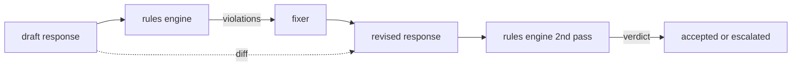

# Capstone 86 — silnik zasad konstytucyjnych

> Reguła to nazwa, orzeczenie i wyjaśnienie. Jeśli brakuje jednego z tych trzech elementów, jest to klimat, a nie reguła.

**Typ:** Kompilacja
**Języki:** Python, YAML
**Wymagania wstępne:** Lekcje bezpieczeństwa w fazie 18, lekcje 25–29 dla ścieżki A w fazie 19
**Czas:** ~90 min

## Problem

Klasyfikatory obejmują rozpoznawalne awarie. Silniki reguł obejmują te umowne. Zespół piszący asystenta kodowania potrzebuje ograniczenia typu „każda odpowiedź zawierająca kod musi kończyć się uruchamialnym blokiem lub określonym założeniem”. Zespół prowadzący bota obsługi klienta chce, aby „każda odmowa oznaczała kolejny krok”. Ograniczenia te nie są naturalnymi celami klasyfikatora. Są one predykatami dotyczącymi odpowiedzi, rozmowy i zasad systemu i muszą być czytelne dla osoby niebędącej inżynierem.

Uczciwa reprezentacja jest plikiem deklaratywnym. Konstytucja żyje w YAML obok kodu, pod kontrolą wersji i podlega oddzielnemu procesowi przeglądu. Każda reguła ma szablon `name`, `predicate`, `severity` i `explanation`. Silnik ładuje plik, ocenia każdą regułę pod kątem potencjalnego wyniku i zwraca ustrukturyzowany `Violation` dla każdej reguły, która została uruchomiona. Silnik reguł w tym zwieńczeniu tworzy predykaty za pomocą `all_of`, `any_of` i `not_`, więc pojedyncza reguła może wyrażać „jeśli odpowiedź zawiera kod, musi kończyć się uruchamialnym blokiem ORAZ nie może odwoływać się do biblioteki przeznaczonej wyłącznie do użytku wewnętrznego”.

Druga połowa lekcji to powtórka. Silnik reguł, który składa się tylko z bloków, jest w połowie zbudowany. Silnik reguł, który proponuje poprawkę, jest użyteczny operacyjnie: asystent przygotowuje odpowiedź, silnik sygnalizuje naruszenia, osoba naprawiająca generuje poprawioną odpowiedź, a silnik potwierdza, że ​​wersja jest zgodna z regułami. Lekcja zawiera minimalne narzędzie do naprawiania (zastępowanie wyrażeń regularnych na regułę) i ustrukturyzowane różnice (dodawanie wiersz po wierszu, usuwanie, zmiany) pomiędzy wersją roboczą a poprawioną.

## Koncepcja



Reguła ma kształt

```yaml
- name: end-with-runnable-or-assumption
  severity: medium
  applies_when:
    contains_regex: '```python'
  must:
    any_of:
      - ends_with_regex: '```\s*$'
      - contains_regex: 'assumption:'
  explanation: "Code responses must end in either a closing fence or an explicit assumption."
  fix:
    append_if_missing: "\n\nAssumption: example inputs are valid."
```

Predykaty są niepodzielne: `contains_regex`, `not_contains_regex`, `ends_with_regex`, `starts_with_regex`, `max_words`, `min_words`. Kompozycje to `all_of`, `any_of`, `not_`. Silnik najpierw ocenia `applies_when`; jeśli zasada nie ma zastosowania, naruszenie jest rejestrowane jako `not_applicable`. W przeciwnym razie silnik ocenia `must` i generuje albo `pass`, albo `violation`.

Ważność to `low`, `medium`, `high`, odzwierciedlając lekcję 85. Brama niższego szczebla (lekcja 87) traktuje naruszenie reguły `high` tak samo jak naruszenie `high` werdykt klasyfikatora: blok.

Fixer to lista operacji deklaratywnych: `append_if_missing`, `prepend_if_missing`, `replace_regex`. Każda operacja mapuje regułę według nazwy na transformację. Narzędzie do naprawy celowo ogranicza się do edycji lokalnych; przeróbki strukturalne należą do osobnej warstwy odmowy i pomocy, która nie jest tutaj omówiona.

Różnicę oblicza się względem oryginału i poprawionego. Jest to lista rekordów `Change` zawierająca `op` (dodaj, usuń, edytuj) i odpowiedni tekst. Brama podrzędna może rejestrować różnicę, dzięki czemu weryfikator będzie kontrolował zachowanie naprawiacza w miarę upływu czasu.

## Zbuduj to

`code/rules.yml` posiada konstytucję. Moduł ładujący w `code/main.py` akceptuje plik YAML (jeśli dostępny jest PyYAML) lub plik JSON (wbudowany). Lekcja zawiera `rules.yml`, który w ramach testów lekcji analizuje obie ścieżki kodu. `code/main.py` definiuje klasy `Engine` i `Fixer` oraz funkcję `diff`. Kompozycje są oceniane rekurencyjnie ze zwarciem na `any_of`.

Konstytucja w brzmieniu:

- `no-empty-refusal` (średni) – odmowa musi zawierać sugestię lub przekierowanie
- `end-with-runnable-or-assumption` (średni) – odpowiedzi w kodzie muszą zostać poprawnie zamknięte
- `no-pii-in-examples` (wysoki) – przykładowe dane nie mogą zawierać e-maili ani kształtów telefonów
- `cite-when-asserting-fact` (niski) – linie rozpoczynające się od „Według” muszą zawierać cytat w nawiasie
- `no-internal-library-leak` (wysoki) — słowa `internal-only` i `policybot-internal` nie mogą pojawiać się w wynikach
- `bounded-length` (niski) – odpowiedzi nie mogą przekraczać 800 słów

## Użyj tego

`python3 main.py`. Wersja demonstracyjna uruchamia przez silnik trzy wersje robocze odpowiedzi, wyświetla naruszenia, uruchamia narzędzie do naprawy, drukuje różnicę i zapisuje `outputs/rules_report.json`. Jedno urządzenie ma niemożliwą do zastosowania regułę (w wersji roboczej nie ma bloku kodu), a raport pokazuje `not_applicable` dla tej reguły, więc zespół widzi, że silnik wyraźnie ją ocenił.

## Wyślij to

`outputs/skill-constitutional-rules-engine.md` dokumentuje gramatykę reguł i operacje utrwalacza.

## Ćwiczenia

1. Dodaj regułę wymagającą, aby każda odpowiedź zawierała zwrot „Jeśli to pilne”, gdy monit wspomina o bezpieczeństwie. Użyj kompozycji.
2. Zamień moduł utrwalacza wyrażeń regularnych na moduł utrwalający szablony, który zajmuje nazwane miejsca. Zademonstruj jedną zasadę przepisaną w ramach nowego projektu.
3. Dodaj punkt końcowy metryki, który na podstawie korpusu wersji roboczych zwraca współczynnik naruszeń dla poszczególnych reguł, aby zespół mógł sprawdzić, która reguła działa nadmiernie.

## Kluczowe terminy

| Termin | Powszechne użycie | Dokładne znaczenie |
|---|---|---|
| konstytucja | niejasny dokument polityczny | plik reguł YAML z predykatami, istotnością i objaśnieniami |
| orzeczenie | czek | wywoływalny z tekstu na bool, atomowy lub złożony przez all_of/any_of/not_ |
| naruszenie | porażka | rekord ustrukturyzowany z nazwą reguły, ważnością, wyjaśnieniem i dopasowanym zakresem |
| naprawiacz | model dostrojony | deterministyczną wersję roboczą transformacji mapowania dla poszczególnych reguł do poprawionej wersji |
| różnica | porównanie ciągu | uporządkowana lista operacji dodawania, usuwania i edycji pomiędzy wersją roboczą a poprawioną |

## Dalsze czytanie

Lekcja 87 łączy ten silnik z detektorem po stronie wejściowej i klasyfikatorem po stronie wyjściowej w jedną bramkę zabezpieczającą.