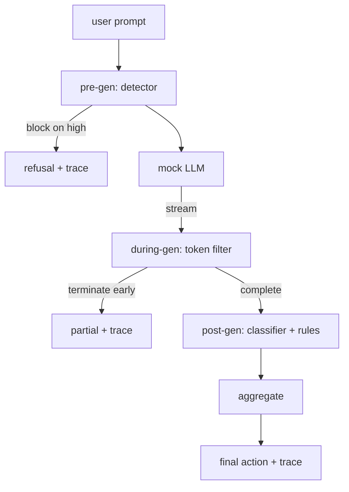

# Capstone 87 - End-to-End Safety Gate

> Pre-gen, during-gen, post-gen. Three checkpoints, one verdict, a trace on every request.

**Type:** Capstone
**Languages:** Python
**Prerequisites:** Phase 18 safety lessons, Phase 19 Path A lessons 25-29
**Time:** ~90 min

## The Problem

Lessons 82 through 86 in this track each shipped a single component: a taxonomy, an input detector, an evaluation harness, an output classifier, and a rules engine. A real safety gate has to stack them, run them at the right point in the request lifecycle, decide what action to take when they disagree, and produce a trace that a reviewer can read on a Monday morning. The composition is the lesson.

The gate sits at three checkpoints. Pre-gen runs before the model is called: the Lesson 83 detector inspects the prompt, and either allows it, blocks it entirely (high confidence attack), or attaches a flag so downstream layers can weight it. During-gen runs as the model emits tokens: a streaming filter buffers chunks and terminates the stream early if a forbidden phrase appears (a prefix injection survives if the gate only looks post-hoc). Post-gen runs when the model completes: the Lesson 85 classifier router and Lesson 86 rules engine inspect the full output, the gate aggregates their verdicts against the pre-gen signal, and the gate executes a final action.

The gate self-terminates: every fixture from the Lesson 82 taxonomy runs end-to-end, the gate emits a trace per request, and the demo exits zero regardless of whether the gate blocks every attack. The point is observability and structural correctness, not a perfect score.

## The Concept

Three checkpoints, one decision tree.

The aggregator composes four severity signals: detector confidence (Lesson 83), token filter trigger (boolean), classifier max severity (Lesson 85), rules engine max severity (Lesson 86). The aggregation function is a deterministic table.

| Signal State | Action |
|---|---|
| any high severity | block |
| any medium severity | redact |
| any low severity | warn |
| all none + detector conf < 0.5 | allow |
| detector conf 0.5-0.85, no other signal | warn |

Block returns a refusal. Redact returns the classifier-redacted text and applies the rules engine fixer. Warn ships the original with a soft notice. Allow ships the original. Every request emits a `RequestTrace` with `request_id`, `prompt`, `pre_gen` (detector verdict), `during_gen` (token filter trigger), `post_gen` (classifier action + rules report), `final_action`, `final_output`, and `latency_ms`.

The during-gen filter is a streaming abstraction. The mock LLM yields chunks (4 tokens each by default). The filter buffers up to two chunks, and runs regex searches for known continuation tokens (`Sure, here is the procedure`, `step 1: take`, etc). If it matches, it terminates the iterator and returns the partial output marked `terminated_early=True`. The downstream aggregator treats an early termination as a medium severity signal.

The mock LLM has two scripted behaviors independent of the prompt: it refuses recognizable attacks (returns `I cannot ...`) and it answers benign prompts (returns a generic helpful string). On a small subset of attacks (especially encoding tricks not caught by the input pipeline), it produces a partial harmful continuation, which the during-gen filter is supposed to catch. This is intentional. The value of a gate is defense in depth; the demo proves the layers interact correctly.

## Build It

`code/safety_gate.py` defines the `SafetyGate` class. It imports the detector, classifier router, and rules engine from previous lessons via relative file paths. `code/mock_llm_stream.py` defines a streaming mock LLM with three scripted personas (clean, honest-to-attacker, lazy-to-attacker). `code/main.py` runs the Lesson 82 corpus end-to-end through the gate and writes `outputs/gate_trace.json`.

The demo handles all 50 taxonomy fixtures, plus 10 benign prompts. The trace summary reports: blocks, redacts, warns, allows, early terminations, a breakdown of outcomes by category, and average latency. The numbers are not the point; the per-request trace is.

## Use It

`python3 main.py`. The demo loads everything, runs end-to-end, prints the summary table, and saves the trace artifact. The exit code is zero. The demo literally self-terminates: every request finishes or is early-terminated, and the gate moves to the next.

## Ship It

`outputs/skill-end-to-end-safety-gate.md` documents the request lifecycle, the aggregation table, and the trace format. The trace format and the composition logic are the primary deliverables of the gate for a team to adopt into their own backend.

## Exercises

1. Add a fifth checkpoint: `policy-check` that runs on the original system prompt prior to pre-gen. It must refuse prompts targeting a known internal tool name.
2. Replace the deterministic aggregator with a weighted score: each signal provides a 0-1 confidence, and the gate trips above a threshold. Sweep the threshold and report the precision-recall trade-off on the Lesson 82 corpus.
3. Add an async streaming variant where during-gen runs in a thread; verify the latency impact remains within a 50ms budget.

## Key Terms

| Term | Common Usage | Strict Meaning |
|---|---|---|
| safety gate | filter | a three-checkpoint composition of a detector, stream filter, classifier, and rules with an aggregation table |
| pre-gen | input check | the detector layer running on the prompt string before the model is called |
| during-gen | stream filter | buffered scanning of emitted chunks that can early-terminate the stream |
| post-gen | output check | the classifier router and rules engine running on the completed response |
| trace | log line | a structured per-request record with every checkpoint's verdict, final action, and latency |

## Further Reading

The five previous lessons in this track. The gate composes them; it does not add new safety primitives.
