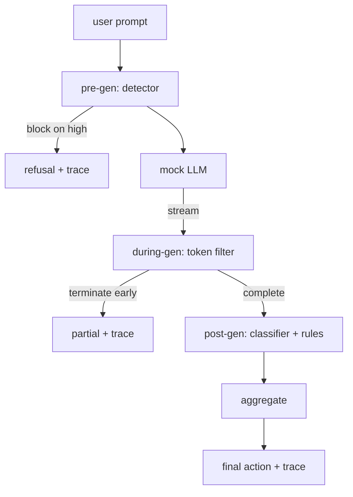

# Capstone 87 — kompleksowa bramka zabezpieczająca

> Przed genem, w trakcie generacji, po generacji. Trzy punkty kontrolne, jeden werdykt, ścieżka audytu na każde żądanie.

**Typ:** Kompilacja
**Języki:** Python
**Wymagania wstępne:** Lekcje bezpieczeństwa w fazie 18, lekcje 25–29 dla ścieżki A w fazie 19
**Czas:** ~90 min

## Problem

Każda z lekcji 82–86 w tej ścieżce zawiera pojedynczy element: taksonomię, detektor danych wejściowych, strukturę oceny, klasyfikator wyników i silnik reguł. Prawdziwa bramka bezpieczeństwa musi je ułożyć, uruchomić we właściwym momencie cyklu życia żądania, zdecydować, jakie działania podjąć, gdy się nie zgadzają, i wygenerować ślad, który recenzent będzie mógł przeczytać w poniedziałek rano. Kompozycja jest lekcją.

Brama znajduje się w trzech punktach kontrolnych. Pregeneracja działa przed wywołaniem modelu: detektor z lekcji 83 sprawdza zachętę i albo ją przepuszcza, albo całkowicie ją blokuje (atak o dużej pewności), albo dołącza flagę, aby kolejne warstwy mogły zważyć. Podczas generowania działa, gdy model emituje tokeny: filtr przesyłania strumieniowego buforuje fragmenty i kończy strumień wcześniej, jeśli pojawi się zabroniona fraza (wstrzyknięcie prefiksu przetrwa to, jeśli brama wygląda tylko post-hoc). Post-generacja działa po zakończeniu modelu: router klasyfikatora z lekcji 85 i silnik reguł z lekcji 86 sprawdzają pełny wynik, bramka agreguje swoje werdykty z sygnałem sprzed generacji i bramka wykonuje ostateczną akcję.

Brama kończy się samoczynnie: każde urządzenie z taksonomii z lekcji 82 jest uruchamiane od końca do końca, brama emituje ślad na każde żądanie, a demonstracja kończy się zerem, niezależnie od tego, czy brama blokuje każdy atak, czy nie. Chodzi o obserwowalność i poprawność strukturalną, a nie o doskonały wynik.

## Koncepcja

Trzy punkty kontrolne, jedno drzewo decyzyjne.

Agregator łączy cztery sygnały ważności: pewność detektora (lekcja 83), wyzwalacz filtra tokenów (wartość logiczna), maksymalna ważność klasyfikatora (lekcja 85), maksymalna ważność silnika reguł (lekcja 86). Funkcja agregująca jest tabelą deterministyczną.

| Stan sygnału | Akcja |
|---|---|
| dowolna wysoka dotkliwość | blok |
| dowolne średnie nasilenie | zredagować |
| każda niska dotkliwość | ostrzegam |
| wszystkie brak + pewność detektora < 0,5 | pozwolić |
| pewność detektora 0,5-0,85, brak innego sygnału | ostrzegam |

Blok zwraca odmowę. Redact dostarcza tekst zredagowany przez klasyfikator i stosuje narzędzie do naprawy silnika reguł. Warn wysyła oryginał z miękkim powiadomieniem. Zezwalaj na wysyłanie oryginału. Każde żądanie emituje `RequestTrace` z `request_id`, `prompt`, `pre_gen` (werdykt detektora), `during_gen` (filtr tokenu wyzwalacz), `post_gen` (akcja klasyfikatora + raport reguł), `final_action`, `final_output` i `latency_ms`.

Filtr podczas generowania jest abstrakcją strumieniową. Próbny LLM daje kawałki (domyślnie 4 tokeny każdy). Filtr buforuje do dwóch fragmentów i uruchamia przeszukiwanie wyrażeń regularnych w poszukiwaniu znanych tokenów kontynuacji (`Sure, here is the procedure`, `step 1: take` itp.). Po dopasowaniu kończy iterator i zwraca częściowe wyjście oznaczone `terminated_early=True`. Agregator niższego szczebla traktuje wcześniejsze zakończenie jako sygnał o średniej ważności.

Próbny LLM ma dwa zachowania wyłączone z podpowiedzi: odrzuca rozpoznawalne ataki (zwraca `I cannot ...`) i odpowiada na łagodne podpowiedzi (zwraca ogólny pomocny ciąg znaków). W przypadku małego podzbioru ataków (zwłaszcza sztuczek związanych z kodowaniem, które nie zostały przechwycone przez potok wejściowy), powoduje to częściową szkodliwą kontynuację, którą powinien przechwycić filtr podczas generowania. To jest zamierzone. Wartość bramki leży w wielowarstwowej obronie; demonstracja pokazuje, że warstwy współdziałają poprawnie.

## Zbuduj to

`code/safety_gate.py` definiuje klasę `SafetyGate`. Importuje detektor, router klasyfikatora i silnik reguł z poprzednich lekcji poprzez względne ścieżki plików. `code/mock_llm_stream.py` definiuje próbny LLM przesyłany strumieniowo z trzema postaciami skryptowymi (czysta, uczciwa dla atakującego, leniwa dla atakującego). `code/main.py` uruchamia korpus lekcji 82 od końca do końca przez bramkę i zapisuje `outputs/gate_trace.json`.

Demo obsługuje wszystkie 50 elementów taksonomii oraz 10 łagodnych podpowiedzi. Podsumowanie śledzenia raportuje: blokuje, redaguje, ostrzega, zezwala, wcześniejsze zakończenie, podział wyników według kategorii i średnie opóźnienie. Liczby nie są najważniejsze; chodzi o ślad na żądanie.

## Użyj tego

`python3 main.py`. Wersja demonstracyjna ładuje wszystko, uruchamia od początku do końca, drukuje tabelę podsumowań i zapisuje artefakt śledzenia. Kod wyjścia to zero. Demo kończy się samoczynnie w dosłownym tego słowa znaczeniu: każde żądanie kończy się lub zostaje wcześniej zakończone, a brama przechodzi do następnego.

## Wyślij to

`outputs/skill-end-to-end-safety-gate.md` dokumentuje cykl życia żądania, tabelę agregacji i format śledzenia. Podstawowym produktem bramki jest format śledzenia i logika kompozycji, które zespół może wykorzystać we własnym zapleczu.

## Ćwiczenia

1. Dodaj piąty punkt kontrolny: `policy-check`, który działa zgodnie z oryginalnym monitem systemowym przed generowaniem wstępnym. Musi odrzucać podpowiedzi kierowane na znaną nazwę narzędzia wewnętrznego.
2. Zastąp agregator deterministyczny wynikiem ważonym: każdy sygnał zapewnia pewność 0-1, a bramka wyłącza się po przekroczeniu progu. Przejrzyj próg i zgłoś kompromis w zakresie precyzji i przypomnienia w korpusie lekcji 82.
3. Dodaj wariant strumieniowania asynchronicznego, w którym podczas generowania działa w wątku; sprawdź, czy wpływ opóźnienia mieści się w budżecie 50 ms.

## Kluczowe terminy

| Termin | Powszechne użycie | Dokładne znaczenie |
|---|---|---|
| bramka zabezpieczająca | filtr | składająca się z trzech punktów kontrolnych detektora, filtru strumieniowego, klasyfikatora i reguł z tabelą agregacji |
| pregeneracja | kontrola wejścia | warstwa detektora działająca w wierszu zachęty przed wywołaniem modelu |
| podczas gen | filtr strumieniowy | buforowane skanowanie wyemitowanych fragmentów, które mogą wcześniej zakończyć strumień |
| post-gen | kontrola wyjścia | router klasyfikatora i silnik reguł działający na ukończonej odpowiedzi |
| ślad | linia logu | ustrukturyzowany rekord na żądanie z werdyktem każdego punktu kontrolnego, końcową akcją i opóźnieniem |

## Dalsze czytanie

Pięć poprzednich lekcji w tym utworze. Brama je tworzy; nie dodaje nowych prymitywów bezpieczeństwa.